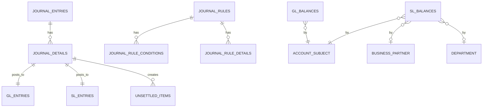
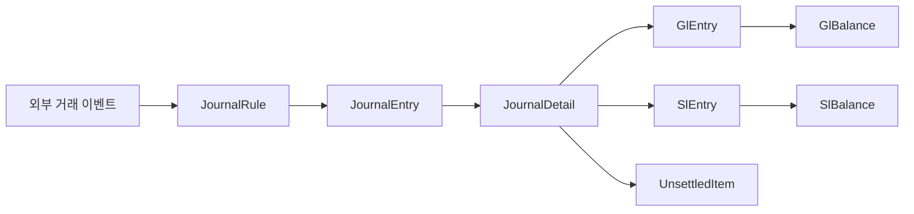

# journal-ledger schema

## 1. 한눈에 보는 구조

## 2. 핵심 엔티티

### 2.1 `journal_entries`

전표 헤더다. 전표번호, 전표일자, 회계일자, 상태, 원천 추적 정보를 가진다.

주요 컬럼:

- `id`
- `slip_no`
- `slip_date`
- `accounting_date`
- `description`
- `status`
- `entry_type`
- `currency_code`
- `exchange_rate`
- `rejection_reason`
- `created_by`
- `audit_user`
- `lineage_source_type`
- `lineage_source_id`

중요 인덱스:

- `slipNo`
- `accountingDate`
- `status`
- `lineageSourceType + lineageSourceId`

### 2.2 `journal_details`

전표 라인이다. 차변/대변, 계정과목, 금액, 부서, 거래처를 가진다.

주요 컬럼:

- `id`
- `journal_entry_id`
- `drcr_type`
- `account_code`
- `amount`
- `base_amount`
- `dept_code`
- `business_partner_code`
- `detail_description`
- `audit_user`

관계:

- N:1 `journal_entries`
- N:1 `account_subject`
- N:1 `department`
- N:1 `business_partner`

### 2.3 `gl_entries`

전기 후 생성되는 총계정원장 상세다. `journal_detail` 1건이 `gl_entry` 1건으로 이어진다.

주요 컬럼:

- `journal_detail_id`
- `account_code`
- `fiscal_year`
- `fiscal_period`
- `posting_date`
- `dr_amount`
- `cr_amount`
- `base_dr_amount`
- `base_cr_amount`
- `lineage_source_type`
- `lineage_source_id`

### 2.4 `sl_entries`

전기 후 생성되는 보조원장 상세다. 거래처와 부서 축이 붙는다.

주요 컬럼:

- `journal_detail_id`
- `account_code`
- `business_partner_id`
- `department_id`
- `fiscal_year`
- `fiscal_period`
- `posting_date`
- `dr_amount`
- `cr_amount`
- `base_dr_amount`
- `base_cr_amount`
- `lineage_source_type`
- `lineage_source_id`

### 2.5 `gl_balances`

일자 기준 GL 잔액 집계 테이블이다.

주요 컬럼:

- `account_subject_id`
- `currency_code`
- `balance_date`
- `period`
- `beginning_balance`
- `debit_amount`
- `credit_amount`
- `ending_balance`

유니크 키:

- `account_subject_id + currency_code + balance_date + period`

### 2.6 `sl_balances`

일자 기준 SL 잔액 집계 테이블이다.

주요 컬럼:

- `account_subject_id`
- `business_partner_id`
- `department_id`
- `currency_code`
- `balance_date`
- `period`
- `beginning_balance`
- `debit_amount`
- `credit_amount`
- `ending_balance`

유니크 키:

- `account_subject_id + business_partner_id + department_id + currency_code + balance_date + period`

### 2.7 `unsettled_items`

미결 항목 추적 테이블이다. 승인 시점에 생성된다.

주요 컬럼:

- `journal_detail_id`
- `account_code`
- `business_partner_code`
- `occurrence_date`
- `original_amount`
- `settled_amount`
- `remaining_amount`
- `status`

상태값:

- `OPEN`
- `PARTIAL`
- `CLEARED`

### 2.8 `journal_rules`

자동 분개 룰 헤더다.

주요 컬럼:

- `rule_code`
- `rule_name`
- `description`
- `valid_from`
- `valid_to`
- `version`
- `is_active`
- `priority`

하위 엔티티:

- `journal_rule_conditions`
- `journal_rule_details`

## 3. 데이터 흐름 관점의 관계

## 4. 초보자용 해석

- `JournalEntry`는 문서 헤더다.
- `JournalDetail`은 실제 차변/대변 라인이다.
- `GlEntry`, `SlEntry`는 전기 후 남는 원장 상세 기록이다.
- `GlBalance`, `SlBalance`는 조회 성능과 기간 집계를 위한 요약본이다.
- `UnsettledItem`은 아직 완전히 상계되지 않은 금액을 추적하는 보조 장치다.
- `JournalRule`은 사람이 매번 수기 입력하지 않도록 이벤트를 전표로 바꾸는 규칙이다.
