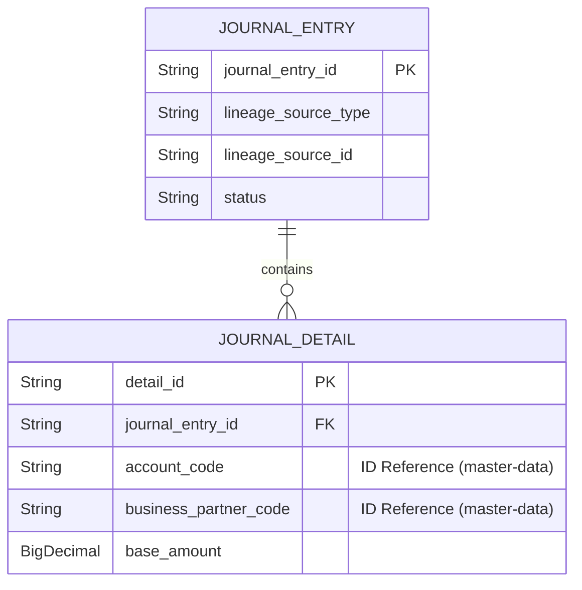

# journal-ledger 스키마 (Schema)

## 엔티티 및 ID 기반 설계 철학

`journal-ledger`의 테이블 구조는 외부 도메인(master-data 등)과의 결합을 끊기 위해 철저한 ID 기반 참조(ID-Based Reference)를 채택하고 있습니다. 또한 데이터 추적성(Lineage)을 확보하는 구조를 가집니다.

## 핵심 테이블

### `journal_entry` (전표 헤더)
- `id` (PK)
- `status` (DRAFT, APPROVED, POSTED 등)
- `lineage_source_type` (출처 시스템 예: "LOAN_EXECUTION")
- `lineage_source_id` (출처 트랜잭션 식별자)

### `journal_detail` (전표 상세 라인)
- `id` (PK)
- `journal_entry_id` (FK)
- `account_code` (마스터 데이터의 계정과목 ID)
- `department_code` (마스터 데이터의 부서 ID)
- `business_partner_code` (마스터 데이터의 거래처 ID)
- `debit_credit_indicator` (차변/대변 구분)
- `base_amount` (기준 통화 금액)

이처럼 다른 모듈의 데이터를 ID 문자열로 저장함으로써, 이 모듈은 멀티 스테이지 Docker 환경 등 분산 시스템에서 독립적으로 확장(Scale-out)될 수 있습니다. 과거 데이터 조회를 위해 master-data의 이력(SCD2) 구조와 결합하여 정확한 시점의 데이터를 재현합니다.