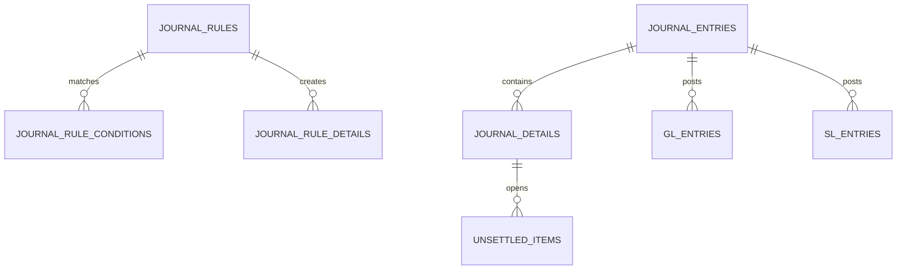

# Journal Ledger 데이터 모델

이 문서는 업무 흐름을 이해하는 데 필요한 핵심 테이블과 소유권을 설명합니다. 실제 DDL 기준은 `core/src/main/resources/db/migration`입니다.

## 핵심 관계



## 전표와 자동분개 규칙

| 테이블 | 역할 | 중요 필드 |
| --- | --- | --- |
| `journal_entries` | 전표 헤더와 상태, 원천 추적 | `slip_no`, `status`, `accounting_date`, `created_by`, `approved_by`, `audit_user`, lineage 필드 |
| `journal_details` | 차변/대변 라인 | `account_code`, `side`, `amount`, 거래처·부서 코드 |
| `journal_rules` | 적용 가능한 자동분개 규칙 | 규칙 코드, 우선순위, 유효기간 |
| `journal_rule_conditions` | 규칙 적용 조건 | 필드, 연산자, 비교값 |
| `journal_rule_details` | 규칙이 생성할 라인 명세 | `drcr_type`, 계정·금액·적요 표현식 |

`journal_rule_details.drcr_type`은 DB에는 문자열로 저장하지만 도메인에서는 `JournalSide` 열거형으로 제한합니다.

V16은 `journal_entries.approved_by`를 추가합니다. 새 전표는 `created_by`(maker),
`approved_by`(checker), `audit_user`(마지막 상태 처리자)를 분리하므로 전기 후 `audit_user`가 poster로
바뀌어도 checker 증거가 남습니다. 업그레이드 시 아직 `APPROVED`이고 `created_by`/`audit_user`가
모두 nonblank이며 trim/lowercase canonical identity가 서로 다른 행만 기존 `audit_user`를
`approved_by`로 backfill합니다. self-approved 행과 maker 증거가 없는 행은 취약한 승인 이력을
정당화하지 않도록 `NULL`로 남깁니다. 이미 `POSTED`인 과거 행도 `audit_user`가 poster일 수 있어
승인자를 추측하지 않습니다. 새 code는 승인 증거가 없는 `APPROVED` 전표의 전기를 fail-closed로
거부합니다.

## 원장

| 테이블 | 역할 |
| --- | --- |
| `gl_entries` | 전기된 계정과목별 원장 거래 |
| `gl_balances` | 날짜·계정·통화 단위 GL 잔액 |
| `sl_entries` | 거래처·부서 등 상세 차원을 가진 원장 거래 |
| `sl_balances` | 보조원장 잔액 |
| `ledger_balance_locks` | 신규/기존 GL·SL 잔액의 계정·통화별 갱신을 직렬화하는 256개 고정 잠금 행 |
| `ledger_reaggregation_control` | V15 singleton. 공개 상태, owner JobInstance ID, 고정 기간, 조회 세대(epoch)를 보존하는 fail-closed 제어 |

잔액 조회와 집계는 `POSTED` 전표만 재무 금액으로 취급합니다. 잔액 이월 상세는 [ledger-carry-forward.md](ledger-carry-forward.md)를 참고합니다.

`journal_details`, `gl_entries`, `sl_entries`, `gl_balances`, `sl_balances`의 원장 금액은
`DECIMAL(19,2)` 계약입니다. `AccountingPrecision`은 같은 precision/scale을 코드에서
검증하고 `RoundingMode.UNNECESSARY`로 숨은 반올림을 차단합니다. 환율은 별도
`DECIMAL(19,8)` 정책을 사용합니다.

`GlBalance`가 현재 GL 일자별 잔액 projection의 단일 권위입니다. 호출되지 않던
`GlAccountBalance`/`GlBalanceType`/repository와 별도의 미사용 `Money` 모델은 Issue #44에서
제거해 서로 다른 잔액 정의가 병렬로 남지 않도록 했습니다.

`gl_balances.period`, `sl_balances.period`는 코드에서는 `YearMonth` 타입이지만 DB에는 `yyyy-MM` 문자열로 저장합니다.
JPA와 JDBC bulk upsert가 같은 잔액 키를 사용하도록 `YearMonthAttributeConverter`에서 표현을 고정했습니다.

대용량 운영 저장 모드(`journal-ledger.ledger.persistence-mode=jdbc-bulk`)에서는 다음 어댑터가 사용됩니다.

| 어댑터 | 저장 방식 | 비고 |
| --- | --- | --- |
| `JdbcLedgerEntryBulkPersistenceAdapter` | `gl_entries`, `sl_entries` batch insert | 전표 상세 ID가 없는 엔트리는 원천 추적이 끊기므로 실패 처리 |
| `JdbcLedgerBalanceBulkPersistenceAdapter` | GL upsert, SL null-safe bulk update/insert | SL은 거래처·부서가 없는 행도 같은 키로 갱신되도록 처리 |

## 미결 항목

`unsettled_items`는 아직 완전히 수금·지급되지 않은 채권·채무를 보관합니다.

| 필드 | 의미 |
| --- | --- |
| `management_no` | 외부 조회용 미결 관리번호 |
| `journal_detail_id` | 미결이 발생한 원천 전표 라인 |
| `account_code`, `bp_code` | 계정과 거래처 코드 |
| `original_amount` | 최초 미결 금액 |
| `settled_amount`, `remaining_amount` | 누적 반제액과 잔액 |
| `status`, `resolved` | `OPEN/PARTIAL/CLEARED`와 활성 조회 여부 |
| `last_settled_by` | 마지막 실제 반제 처리자 |
| `last_settlement_reference` | 마지막 실제 반제의 외부 참조번호 (전체 이력은 별도 테이블) |
| `last_settled_at` | 마지막 반제 일시 |

애플리케이션 계층은 이 테이블이나 JPA 저장소를 직접 알지 않습니다. `UnsettledItemPersistencePort`를 호출하고, `UnsettledItemPersistenceAdapter`가 실제 JPA 쿼리를 수행합니다.

### 반제 금액 계약과 처리 순서

`original_amount`, `settled_amount`, `remaining_amount`는 모두 `NUMERIC(19,2)`입니다.
새 참조번호의 반제 금액은 양수이며 잔액 이하여야 하고, 기존 `AccountingPrecision`의
`positiveLedgerAmount`로 정규화합니다. 전체 19자리(정수 최대 17자리, 소수 2자리)에서
값을 잃는 반올림은 하지 않습니다. 누적 반제액과 다음 잔액도 같은 정밀도와 음수 금지
정책으로 모두 검증한 뒤 대입합니다.

| 입력 예 | 새 참조번호 처리 |
| --- | --- |
| `0.01`, `1.00` | 잔액 이내이면 허용 |
| `1.000` | 값의 손실 없이 `1.00`으로 정규화하여 허용 |
| `99999999999999999.99` | 저장 가능한 최대 금액; 잔액 이내이면 허용 |
| `0.999`, `0.001` | 소수 금액의 반올림이 필요하므로 거부 |
| `100000000000000000.00` | 전체 정밀도 초과로 거부 |
| `null`, `0`, 음수, 잔액 초과 | 거부 |

초보자 설명: 잔액 `1.00`에서 `0.999`를 빼면 계산상 `0.001`이 남습니다. 하지만 DB가
두 자리로 반올림하면 잔액은 `0.00`이면서 상태는 `PARTIAL`인 모순이 생깁니다.
따라서 DB에 맡기지 않고 상태 변경 전에 입력과 두 계산 결과를 검증합니다.

1. `POST /api/unsettled/{id}/settle`가 `amount`, `settlementReference`, `X-User-ID`를 받습니다.
   기존 DTO의 필수값·양수 검증은 유지합니다.
2. `UnsettledService`가 쓰기 트랜잭션 안에서 `findByIdForSettlement` 출력 포트로 항목을
   독점 조회합니다. adapter는 참조 테이블을 JOIN하지 않고 `unsettled_items`의 ID 한 행만
   `FOR UPDATE`로 잠근 뒤, 현재 부모 상태와 참조 이력을 명시적으로 refresh합니다.
3. `UnsettledItem.settle`은 actor/ref 필수 검증 후 참조번호를 trim합니다. 이미 처리한
   참조번호라면 새 금액 검증보다 먼저 종료하여 다시 반제하지 않습니다.
4. 새 참조번호라면 금액 정규화 → 잔액 비교 → 다음 누적 반제액·잔액 선검증을 수행합니다.
   검증 실패는 `IllegalArgumentException`이며 금액·상태·참조 이력·감사 메타를 바꾸지 않습니다.
   서비스의 `save`도 호출되지 않으며 HTTP는 기존 Controller 처리에 따라 `400`을 반환합니다.
5. 검증 성공 시 두 금액을 대입하고 잔액이 0이면 `CLEARED/resolved=true`, 아니면
   `PARTIAL/resolved=false`로 전환한 뒤 참조번호와 처리자·일시를 기록합니다.
6. 서비스가 출력 포트 → JPA adapter로 저장하면 HTTP `200`을 반환합니다. 예를 들어 초기
   금액 `1.00`에 서로 다른 참조번호로 `0.01` → `0.99`를 반제하면 누적액 `1.00`, 잔액
   `0.00`, `CLEARED`가 됩니다.

전체 처리 이력은 `unsettled_item_settlement_references`의 `(unsettled_item_id,
settlement_reference)` 키로 보존합니다. 지연 재시도와 완전 반제 후 재시도도 중복 차감하지
않으며, 이력 집합에 없는 과거 `last_settlement_reference`와의 일치도 기존처럼 no-op입니다.
이는 참조번호 기준 정책이며 재시도 금액의 동일성을 새로 비교하지 않습니다. 도메인의
no-op에도 기존 서비스는 `save`를 호출하지만 금액·감사·참조 내용은 바뀌지 않습니다.
HTTP DTO가 거부하는 `null`/0/음수 요청까지 재시도로 허용한다는 뜻은 아닙니다.

### 부모 행 잠금과 동시 반제

`unsettled_items`의 기존 PK 행이 같은 미결 항목에 대한 반제 순서를 정하는 잠금 자원입니다.
별도 잠금 테이블, `@Version` 열, migration 또는 schema version 변경은 없습니다. 부모 ID만
잠그는 이유는 `unsettled_item_settlement_references`가 `EAGER` 컬렉션이라 일반 엔티티 조회가
outer join을 만들 수 있고, PostgreSQL에서는 그 조인 전체에 행 잠금을 거는 방식이 안전하지
않기 때문입니다. 잠금 후 명시적인 refresh와 참조 컬렉션 로딩으로 대기 전에 1차 캐시에 있던
오래된 금액·이력도 폐기합니다.

예를 들어 원금 100에 서로 다른 참조로 40과 50을 동시에 반제하면, 한 요청이 부모 행을
잠근 동안 다른 요청은 기다립니다. 뒤 요청은 앞선 commit의 40/60 상태를 읽어 최종 누적액
90, 잔액 10을 저장하며 두 참조 row를 모두 유지합니다. 같은 이미 알려진 참조는 완전 반제
후 재전송되어도 no-op입니다. 먼저 실행된 요청 때문에 최신 잔액이 줄었다면 기다리던 요청은
그 잔액으로 다시 검증되며, 잔액 초과이면 거부됩니다.

잠금은 `UnsettledService.settleItem` 트랜잭션의 commit/rollback까지 유지됩니다. 금액 검증,
상태 변경, 참조 row, `last_settled_by`, `last_settlement_reference`, `last_settled_at` 중 어느
단계든 실패하면 모두 함께 rollback합니다. deadlock, serialization failure, lock timeout 뒤에는
중단된 트랜잭션을 계속 쓰지 말고 전체 반제를 **새 트랜잭션**으로 재시도해야 합니다.

이 방식은 같은 ID의 hot item을 의도적으로 직렬화하므로 정확성과 맞바꿔 lock wait가 생깁니다.
트랜잭션 안의 외부 호출이나 불필요한 장기 작업을 늘리지 말고 실제 동시 부하에서 대기 시간을
별도로 측정합니다. `findByIdForSettlement`을 거치지 않는 직접 SQL·우회 writer는 이 보호를
받지 않으며, 기존 부정합 데이터의 발견·대사·복구는 별도 승인 작업입니다.

### 로컬 회귀 검증

전제: 저장소 루트, 설치된 JDK 17 및 기존 Gradle 8.7/의존성 캐시가 필요합니다. 캐시가
없으면 설치·다운로드하지 말고 검증 환경을 먼저 준비해야 합니다.

```powershell
.\gradlew.bat :journal-ledger:core:test :journal-ledger:api:test :journal-ledger:batch:test --offline --no-daemon --console=plain --max-workers=1 --rerun-tasks '-Porg.gradle.java.installations.paths=C:/Program Files/Eclipse Adoptium/jdk-17.0.19.10-hotspot' '-Porg.gradle.java.installations.auto-download=false'
```

JDK 경로는 설치된 경로에 맞추되 PowerShell의 `-P` 인수는 인용합니다. 기대 결과는 테스트
실패·오류 0입니다. `UnsettledItemTest`는 입력/계산 결과 경계와 오류·재시도 불변을,
`UnsettledSettlementPrecisionTest`는 실제 서비스+합성 출력 포트로 HTTP `400/save 0`과
정상 `200`을 검증합니다. `UnsettledSettlementPersistenceTest`는 외부 클라이언트 없이
합성 H2 PostgreSQL mode에 V1/V10/V11/V12를 적용하고, 실제 서비스/JPA adapter의 반제 후
별도 트랜잭션·flush/clear 조회로 금액·상태·참조 row·감사 메타를 확인합니다.

동시 반제는 기본 합성 H2 PostgreSQL mode 또는 명시적으로 공급한 폐기 가능한 PostgreSQL
테스트 DB에서 아래 집중 명령으로 확인합니다. PostgreSQL URL을 생략하면 외부 DB에 연결하지
않고 H2를 사용합니다. PostgreSQL fixture는 격리된 로컬 테스트 전용 `postgres` 사용자와
빈 비밀번호를 전제로 하며, 업무용 인스턴스를 대상으로 실행하지 않습니다.

```bash
./gradlew :journal-ledger:core:test --tests '*UnsettledSettlementConcurrencyIntegrationTest' --rerun-tasks --offline --max-workers=1

JOURNAL_UNSETTLED_TEST_POSTGRES_URL=jdbc:postgresql://127.0.0.1:55432/unsettled770 \
  ./gradlew :journal-ledger:core:test --tests '*UnsettledSettlementConcurrencyIntegrationTest' --rerun-tasks --offline --max-workers=1
```

`UnsettledSettlementConcurrencyIntegrationTest`는 독립 thread·트랜잭션·DB 연결에서 서로 다른
40+50 참조의 90/10 결과와 참조 두 건, 같은 참조/완전 반제 후 재전송 no-op, 최신 잔액 40에
대한 대기 요청 50의 거부, 실제 flush 뒤 강제 실패의 금액·상태·참조·감사 rollback 및 새
트랜잭션 재시도를 확인합니다. H2는 두 번째 future의 대기를, PostgreSQL은 서로 다른 backend
PID와 `pg_stat_activity`의 `Lock` wait까지 확인합니다. 기대 결과는 실패·오류·skip 0입니다.

이 집중 fixture는 `ddl-auto=create-drop`과 매 실행 고유 schema의 합성 데이터를 사용하므로
Flyway migration이나 기존 schema 업그레이드 검증이 아닙니다. H2는 PostgreSQL 잠금 의미를
대체하지 않으며, 운영 부하·lock wait 분포·deadlock/serialization/timeout 장애 주입·분산
재시도·통화별 minor-unit 정책·운영 DB·기존 부정합 데이터 복구를 검증하거나 변경하지 않습니다.
업무 서버나 Batch Job 실행 명령도 아닙니다.

## 마이그레이션 주의사항

- 기준 스키마는 `V1__init_baseline.sql`에서 시작합니다.
- 미결 반제 감사 필드는 `V10__unsettled_settlement_audit.sql`에 추가되어 있습니다.
- `V11__journal_ledger_postgresql_baseline.sql`은 적용 이력이 있는 V1/V10을 수정하지 않고,
  10개 JPA 소유 테이블의 누락 DDL과 정밀도, FK, unique/check/index를 forward-only로
  완성합니다. clean H2 PostgreSQL mode와 V10→V11 upgrade 경로를 모두 검증합니다.
- `V12__unsettled_item_settlement_references.sql`은 전체 반제 참조번호 테이블을 만들고
  기존 마지막 참조번호를 복사합니다. 이번 동시 반제 직렬화는 기존 부모 행을 잠그므로
  새 migration/version 없이 기존 V1~V15 migration 파일을 수정하지 않습니다.
- 운영 배포 전 승인된 PostgreSQL에서 clean/upgrade migrate+validate와 runtime role의 DDL
  거부를 확인합니다. 적용된 V1/V10/V11의 checksum을 `repair`로 덮거나 파일을 수정하지 않습니다.

## 전기 상세의 영속 고유 키 (V13)

`gl_entries.journal_detail_id`와 `sl_entries.journal_detail_id`는 각각 `NOT NULL`이며
`uk_gl_entries_journal_detail`, `uk_sl_entries_journal_detail` 고유 제약을 갖습니다.
한 전표 상세는 각 장부에 한 번만 나타납니다. JPA와 JDBC bulk가 같은 제약을 사용합니다.
기존 중복/NULL 상세 참조가 있으면 V13은 실패하며 자동 삭제하지 않습니다.
배포 전 확인 쿼리와 중단/복구 절차는 [동시 전기 제어](posting-concurrency.md)를 참고합니다.

## 잔액 쓰기 잠금 (V14)

`V14__ledger_balance_write_locks.sql`은 `ledger_balance_locks(lock_id)`를 만들고 0~255를
한 번 채웁니다. 금액/전표 데이터나 기존 migration checksum은 변경하지 않습니다. 각 writer는
계정·통화를 같은 규칙으로 잠금 번호에 매핑하고 번호 오름차순으로 `FOR UPDATE`를 획득합니다.
SL의 NULL 거래처·부서도 상위 계정 잠금을 공유하므로 아직 없는 행의 중복 생성이 막힙니다.
기존 SL unique 제약의 NULL 의미 자체를 변경하거나 과거 중복 잔액을 자동 복구하지는 않습니다.
잠금 행을 삭제/재생성하거나 일부만 seed하면 안 되며, 누락된 행을 만난 writer는 실패합니다.
배포 순서, runtime 권한과 롤백 조건은 [동시 전기 제어](posting-concurrency.md)를 따릅니다.

## 재집계 공개 제어 (V15)

`V15__ledger_reaggregation_control.sql`은 `control_id=1`인 행 하나를 `OPEN`, epoch 0으로
생성합니다. `OPEN`이면 owner/기간은 모두 NULL이고, `REBUILDING`이면 owner와 유효한 시작/종료일이
모두 있어야 한다는 CHECK 제약이 있습니다. 시작과 성공 공개 때 epoch가 각각 증가합니다.
행 삭제·추가·수동 OPEN 전환은 금지합니다. runtime role에는 이 행의 SELECT/UPDATE 권한이
필요합니다. V15 적용 전에는 새 코드가 시작되지 않으며, 구버전/직접 SQL writer는 barrier를
모르므로 배포 창에서 모든 writer를 함께 교체해야 합니다.
