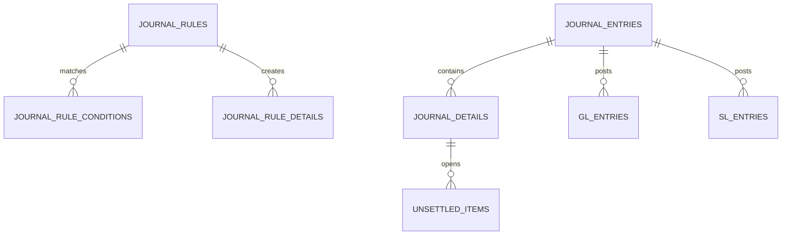

# Journal Ledger 데이터 모델

이 문서는 업무 흐름을 이해하는 데 필요한 핵심 테이블과 소유권을 설명합니다. 실제 DDL 기준은 `core/src/main/resources/db/migration`입니다.

## 핵심 관계

## 전표와 자동분개 규칙

| 테이블 | 역할 | 중요 필드 |
| --- | --- | --- |
| `journal_entries` | 전표 헤더와 상태, 원천 추적 | `slip_no`, `status`, `accounting_date`, lineage 필드 |
| `journal_details` | 차변/대변 라인 | `account_code`, `side`, `amount`, 거래처·부서 코드 |
| `journal_rules` | 적용 가능한 자동분개 규칙 | 규칙 코드, 우선순위, 유효기간 |
| `journal_rule_conditions` | 규칙 적용 조건 | 필드, 연산자, 비교값 |
| `journal_rule_details` | 규칙이 생성할 라인 명세 | `drcr_type`, 계정·금액·적요 표현식 |

`journal_rule_details.drcr_type`은 DB에는 문자열로 저장하지만 도메인에서는 `JournalSide` 열거형으로 제한합니다.

## 원장

| 테이블 | 역할 |
| --- | --- |
| `gl_entries` | 전기된 계정과목별 원장 거래 |
| `gl_balances` | 날짜·계정·통화 단위 GL 잔액 |
| `sl_entries` | 거래처·부서 등 상세 차원을 가진 원장 거래 |
| `sl_balances` | 보조원장 잔액 |

잔액 조회와 집계는 `POSTED` 전표만 재무 금액으로 취급합니다. 잔액 이월 상세는 [ledger-carry-forward.md](ledger-carry-forward.md)를 참고합니다.

`journal_details`, `gl_entries`, `sl_entries`, `gl_balances`, `sl_balances`의 원장 금액은
`DECIMAL(19,2)` 계약입니다. `AccountingPrecision`은 같은 precision/scale을 코드에서
검증하고 `RoundingMode.UNNECESSARY`로 숨은 반올림을 차단합니다. 환율은 별도
`DECIMAL(19,8)` 정책을 사용합니다.

`GlBalance`가 현재 GL 일자별 잔액 projection의 단일 권위입니다. 호출되지 않던
`GlAccountBalance`/`GlBalanceType`/repository와 별도의 미사용 `Money` 모델은 Issue #44에서
제거해 서로 다른 잔액 정의가 병렬로 남지 않도록 했습니다.

`gl_balances.period`, `sl_balances.period`는 코드에서는 `YearMonth` 타입이지만 DB에는 `yyyy-MM` 문자열로 저장합니다.
JPA와 JDBC bulk upsert가 같은 잔액 키를 사용하도록 `YearMonthAttributeConverter`에서 표현을 고정했습니다.

대용량 운영 저장 모드(`journal-ledger.ledger.persistence-mode=jdbc-bulk`)에서는 다음 어댑터가 사용됩니다.

| 어댑터 | 저장 방식 | 비고 |
| --- | --- | --- |
| `JdbcLedgerEntryBulkPersistenceAdapter` | `gl_entries`, `sl_entries` batch insert | 전표 상세 ID가 없는 엔트리는 원천 추적이 끊기므로 실패 처리 |
| `JdbcLedgerBalanceBulkPersistenceAdapter` | GL upsert, SL null-safe bulk update/insert | SL은 거래처·부서가 없는 행도 같은 키로 갱신되도록 처리 |

## 미결 항목

`unsettled_items`는 아직 완전히 수금·지급되지 않은 채권·채무를 보관합니다.

| 필드 | 의미 |
| --- | --- |
| `management_no` | 외부 조회용 미결 관리번호 |
| `journal_detail_id` | 미결이 발생한 원천 전표 라인 |
| `account_code`, `bp_code` | 계정과 거래처 코드 |
| `original_amount` | 최초 미결 금액 |
| `settled_amount`, `remaining_amount` | 누적 반제액과 잔액 |
| `status`, `resolved` | `OPEN/PARTIAL/CLEARED`와 활성 조회 여부 |
| `last_settled_by` | 마지막 실제 반제 처리자 |
| `last_settlement_reference` | 중복 반제를 막는 외부 참조번호 |
| `last_settled_at` | 마지막 반제 일시 |

애플리케이션 계층은 이 테이블이나 JPA 저장소를 직접 알지 않습니다. `UnsettledItemPersistencePort`를 호출하고, `UnsettledItemPersistenceAdapter`가 실제 JPA 쿼리를 수행합니다.

## 마이그레이션 주의사항

- 기준 스키마는 `V1__init_baseline.sql`에서 시작합니다.
- 미결 반제 감사 필드는 `V10__unsettled_settlement_audit.sql`에 추가되어 있습니다.
- 운영 배포 전 실제 통합 스키마의 버전 충돌과 기존 데이터 null 처리 정책을 확인합니다.
