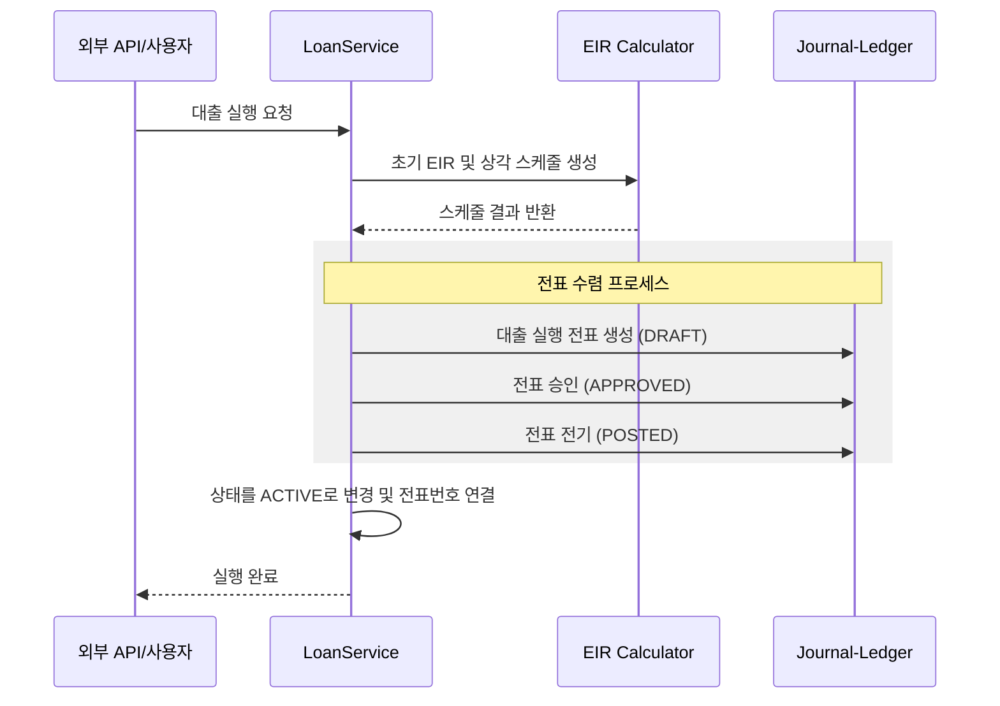
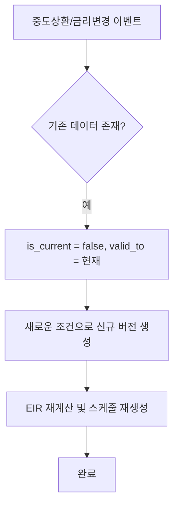
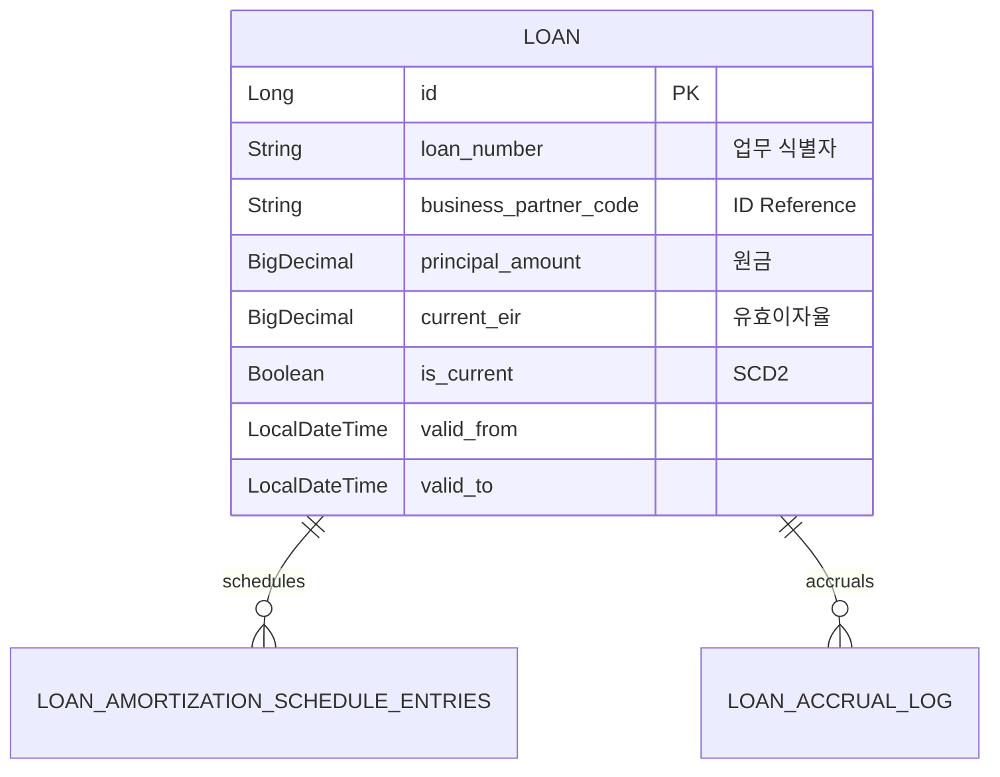

# 🏦 Loan Service (대출 회계 관리)

`loan` 모듈은 은행/금융업의 핵심인 고객 대출의 실행, 이자 수익 계산, 상환 처리 등을 관리하는 대출 특화 서브레저입니다. 고도의 EIR(유효이자율) 계산 엔진과 SCD2 기반의 이력 추적 기능을 갖추고 있습니다.

---

## 0. 📚 문서 읽기 순서

세부 문서는 `loan/docs`에 모았습니다.

1. [문서 인덱스](docs/README.md)
2. [입문 가이드](docs/beginner-guide.md)
3. [업무 흐름](docs/process-flow.md)
4. [데이터 모델](docs/schema.md)
5. [IntelliJ/Gradle 로컬 실행](docs/local-run.md)

IntelliJ에서는 `.run`의 `Loan API bootRun`, `Loan Batch Context` 실행 설정을 사용할 수 있습니다.

---

## 1. 🐣 초보자를 위한 개념 설명 (Beginner Guide)

대출 업무는 '친구에게 돈을 빌려주고 매달 이자를 받는 것'과 비슷하지만, 회계적으로는 훨씬 정교합니다.
1. **대출 실행:** 고객에게 돈을 쏴주면 장부에는 "대출채권(받을 돈) / 현금" 이라고 기록합니다.
2. **이연 항목 (Deferred Item):** 대출 시 뗀 수수료는 오늘 한 번에 번 것으로 치지 않고, 대출 기간 내내 조금씩 나눠서 수익으로 잡습니다.
3. **유효이자율 (EIR):** 수수료와 원금 상환 등을 모두 고려한 '진짜 수익률'입니다. 이 이율에 따라 매일 조금씩 이자 수익을 인식합니다.
4. **SCD2 (이력 관리):** 금리가 바뀌거나 중도상환이 일어나면 과거 기록을 지우지 않고 "어제까지의 조건"과 "오늘부터의 새 조건"을 모두 남깁니다.

---

## 2. 🔄 프로세스 흐름 (Process Flow)

### 📌 대출 라이프사이클 및 수렴 흐름
대출 생성부터 원장 반영까지의 통합 흐름입니다. 모든 전표는 최종적으로 원장(`POSTED`)까지 수렴됩니다.



### 📌 이벤트 발생 시 SCD2 처리 흐름
중도상환이나 금리 변경 시 기존 데이터를 마감하고 새 버전을 생성합니다.



---

## 3. 📊 데이터 모델 (Schema)

`Loan` 단일 모델로 통합되어 있으며, 모든 주요 테이블은 SCD2 필드를 포함합니다.



---

## 4. 🧪 로컬 실행 및 설정 방법

**필수 설정 (YAML):**
자동 전표 생성을 위해 다음 계정 코드 설정이 반드시 필요합니다.
```yaml
account.loan.accounting:
  cash-account-code: "101000"
  loan-receivable-account-code: "131000"
  deferred-asset-account-code: "118000"
  recognized-income-account-code: "410000"
  accrued-interest-receivable-account-code: "11501"
  interest-income-account-code: "410100"
```

먼저 테스트와 컴파일로 모듈 상태를 확인합니다.

```powershell
.\gradlew :loan:core:test :loan:api:compileJava :loan:batch:compileJava --console=plain --max-workers=1 --no-daemon
```

API 컨텍스트 실행:

```powershell
.\gradlew :loan:api:bootRun --args="--server.port=8087 --spring.cloud.config.enabled=false --spring.cloud.discovery.enabled=false --spring.cloud.loadbalancer.enabled=false --eureka.client.enabled=false --spring.jpa.hibernate.ddl-auto=create-drop --account.loan.accounting.cash-account-code=101000 --account.loan.accounting.loan-receivable-account-code=131000 --account.loan.accounting.deferred-asset-account-code=118000 --account.loan.accounting.recognized-income-account-code=410000 --account.loan.accounting.accrued-interest-receivable-account-code=115010 --account.loan.accounting.interest-income-account-code=410100" --console=plain
```

Batch 컨텍스트만 실행:

```powershell
.\gradlew :loan:batch:bootRun --args="--spring.batch.job.enabled=false --spring.batch.jdbc.initialize-schema=always --spring.jpa.hibernate.ddl-auto=create-drop --account.loan.accounting.cash-account-code=101000 --account.loan.accounting.loan-receivable-account-code=131000 --account.loan.accounting.deferred-asset-account-code=118000 --account.loan.accounting.recognized-income-account-code=410000 --account.loan.accounting.accrued-interest-receivable-account-code=115010 --account.loan.accounting.interest-income-account-code=410100" --console=plain
```

### 헥사고날 경계
- `LoanService`는 `LoanPersistencePort`, `LoanReferenceDataPort`, `LoanJournalPort`에만 의존합니다.
- JPA 저장소, 기준정보 구현체, journal-ledger 내부 모델은 인프라 어댑터가 감춥니다.
- 외부 전표 연결은 엔티티 연관관계 대신 전표 ID와 전표번호 값으로 저장하여 대출 Aggregate의 생명주기를 독립적으로 유지합니다.
- Docker 실행이 필요하면 `loan/docker-compose.yml`을 사용할 수 있지만, 신규 개발자는 먼저 위 Gradle 명령으로 컨텍스트와 테스트를 확인하는 편이 문제 범위를 좁히기 쉽습니다.
