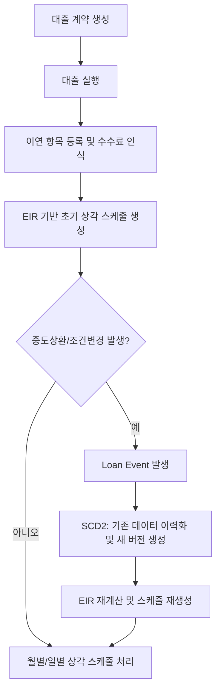
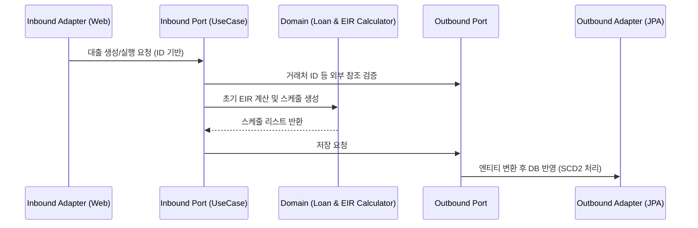

# Loan Process Flow

## 1. 전체 흐름

## 2. 헥사고날 아키텍처 관점의 흐름

## 3. 핵심 기술 요소 적용 사항

### 3.1 헥사고날 분리
- 대출 로직, 이자율 계산, 상환 스케줄 계산(`EIRCalculator`)은 특정 프레임워크나 DB에 의존하지 않는 순수 도메인 모듈로 구성됩니다.
- DB 저장은 `LoanPersistencePort`를 구현하는 어댑터에서 JPA 기술을 사용해 수행됩니다.

### 3.2 ID 기반 참조 (ID-based references)
- `BusinessPartner`나 `Currency` 정보는 이름이나 일반 코드가 아닌 `business_partner_id`, `currency_id` 등 시스템 고유 식별자를 통해 연결됩니다.

### 3.3 SCD2를 활용한 재계산 이력 추적
- 중도상환 이벤트나 금리 변경 이벤트가 발생하면 `loans` 및 `eir_amortization_schedules` 테이블의 기존 레코드는 `is_current = false`, `valid_to = 현재시간`으로 마감됩니다.
- 새로운 금리와 원금을 바탕으로 생성된 새 데이터가 `is_current = true` 상태로 삽입되어 변경 추적이 투명하게 이루어집니다.

### 3.4 Multi-stage Docker 및 클라우드 배포
- 복잡한 수학 연산 로직을 포함하는 이 모듈은 다단계 빌드를 통해 컴파일되며, 프로덕션 런타임 환경에서는 JVM 최적화가 적용된 가벼운 컨테이너에서 독립적으로 구동됩니다.