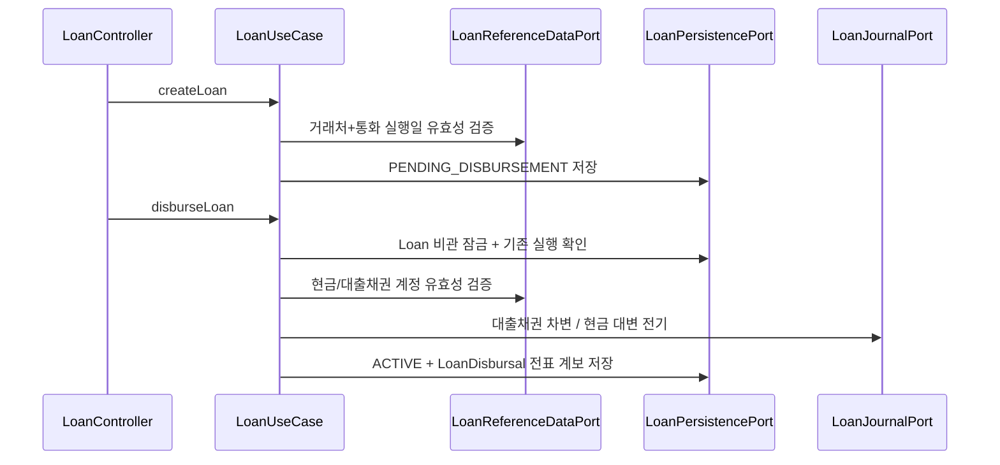
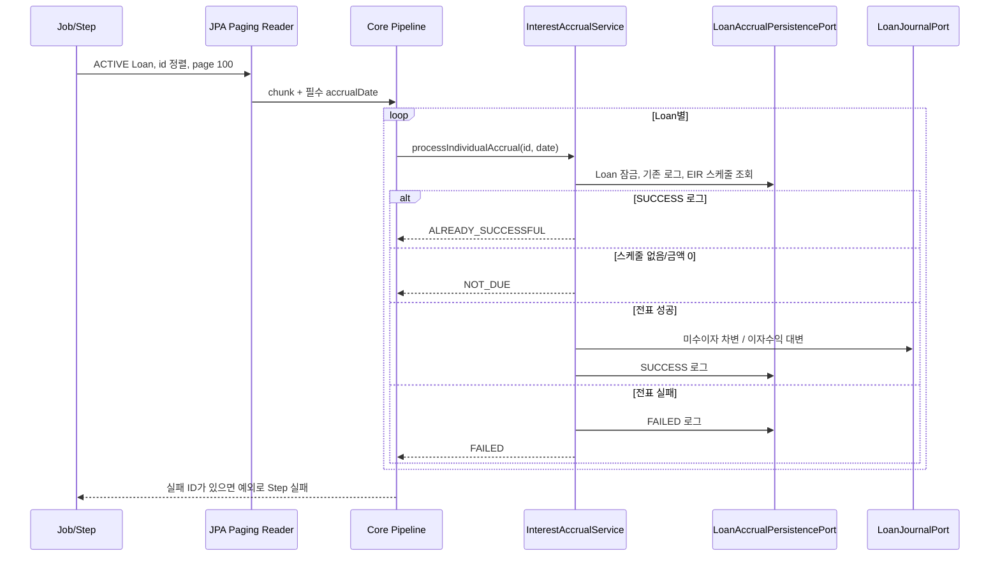

# Loan 업무 흐름

## 계층 책임

| 계층 | 책임 | 예시 |
| --- | --- | --- |
| API Adapter | HTTP 검증, DTO 변환, 상태 코드 | `LoanController`, `LoanApiExceptionHandler` |
| Inbound Port | 외부에 노출할 유즈케이스 계약 | `LoanUseCase` |
| Application Service | 잠금, 트랜잭션, 도메인 협업 순서 | `LoanService`, `InterestAccrualService` |
| Pipeline | chunk 단위 반복·결과 집계 | `LoanInterestAccrualPipeline` |
| Domain | 금액·율·날짜·상태 불변식 | `Loan`, `DeferredItem`, `EIRAmortizationSchedule` |
| Outbound Port/Adapter | 저장·기준정보·전표 기술 격리 | `LoanPersistencePort`와 구현체 |
| Batch | Job/Step/paging/chunk 설정 | `LoanInterestAccrualBatchConfig` |

## 계약 생성과 실행

현재 모델은 원금과 같은 금액의 1회 실행만 허용합니다. 분할 실행이 필요하면 tranche aggregate, 미실행 잔액, 취소·역분개, 동시성 테스트를 먼저 설계해야 합니다.

## 이연 항목과 EIR

1. 이연 유형 생성 시 유형의 계정 코드 또는 기본 계정 설정을 Master Data에서 검증합니다.
2. ACTIVE 대출에 이연 항목을 만들고 초기 전표 ID/번호를 연결합니다.
3. `EIRCalculator`가 현재 잔액과 포함 대상 현금흐름으로 소수 단위 연 EIR을 구합니다.
4. 새 스케줄 전체를 먼저 계산합니다.
5. 계산 성공 후에만 대상 기존 스케줄을 삭제하고 새 행을 저장합니다.

## 이벤트 처리

| 이벤트 | 처리 |
| --- | --- |
| `EARLY_REPAYMENT` | 미상환 잔액 감소, EIR/스케줄 재계산, 현금 차변/대출채권 대변 전표 |
| `CONDITION_CHANGE` | 제시 조건으로 EIR/스케줄 재계산 |
| `RESCHEDULE` | 만기 등 조건 변경 후 재계산 |
| `DEFAULT` | ACTIVE → DEFAULTED 상태와 이벤트 저장 |
| `RECOVERY` | DEFAULTED → ACTIVE 상태와 이벤트 저장 |
| `OTHER` | 재계산 필드 없이 설명 이벤트 저장 |

API 응답은 저장된 이벤트와 선택적 재계산 결과를 함께 반환합니다.

## 이자 발생 Batch

전표 어댑터는 독립 트랜잭션으로 Journal 내부 변경을 묶습니다. 다만 Journal 성공 후 Loan 저장 실패까지 자동 보상하는 분산 원자성은 아직 없으며, outbox/inbox와 lineage 멱등 응답이 완료 조건입니다.

## API 엔드포인트

| 기능 | 엔드포인트 |
| --- | --- |
| 계약 생성/조회 | `POST /api/loan/loans`, `GET /api/loan/loans/{id}` |
| 실행 | `POST /api/loan/disbursals` |
| 이연 유형/항목 | `POST /api/loan/deferred-item-types`, `POST /api/loan/deferred-items` |
| EIR 스케줄 | `POST /api/loan/amortization-schedules/generate` |
| 이벤트/재계산 | `POST /api/loan/events` |
| 예제 시나리오 | `POST /api/loan/dod-scenario` |
