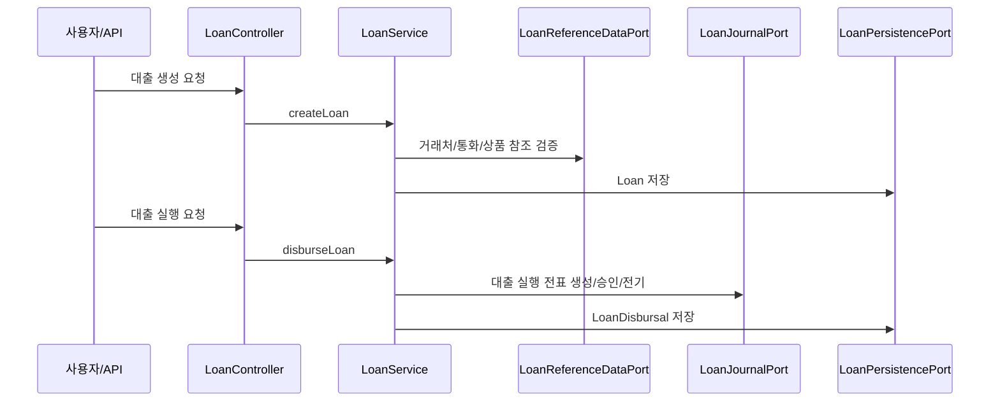
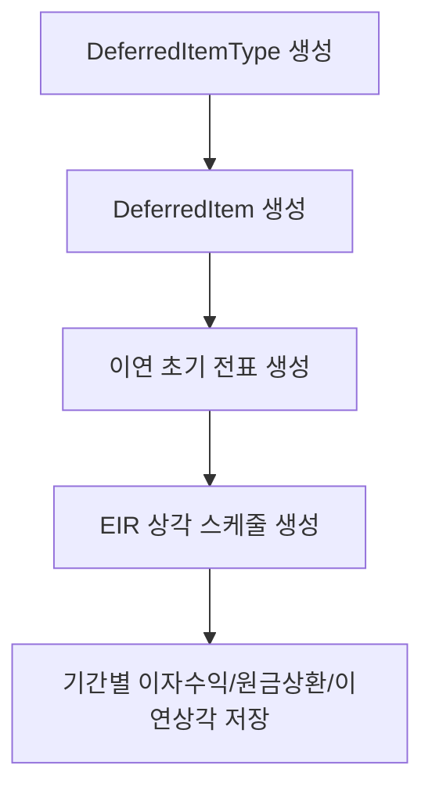
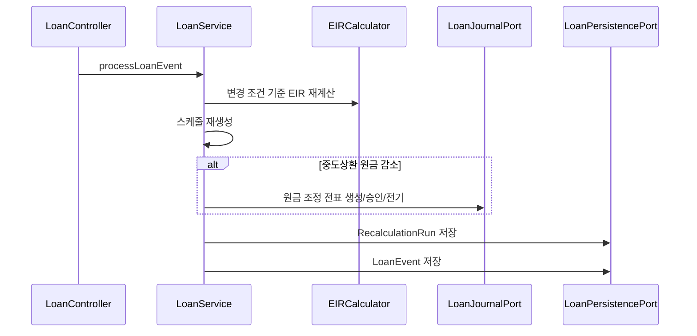
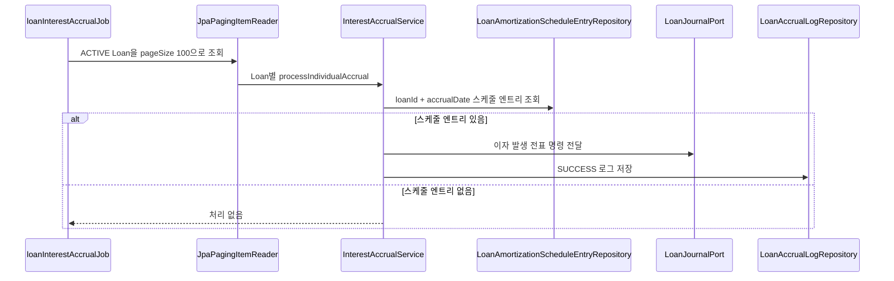

# Loan 업무 흐름

이 문서는 `loan` 모듈의 API, Batch, 전표 수렴, 재계산 흐름을 정리합니다.

## 헥사고날 경계

| 계층 | 책임 | 예시 |
| --- | --- | --- |
| Inbound Adapter | HTTP 요청을 서비스 호출로 변환 | `LoanController` |
| Application/UseCase Service | 트랜잭션 경계와 도메인 협업 | `LoanService`, `InterestAccrualService` |
| Domain | 대출/이연/스케줄/이벤트 상태 | `Loan`, `DeferredItem`, `RecalculationRun` |
| Outbound Port | 기술 독립 외부 인터페이스 | `LoanPersistencePort`, `LoanReferenceDataPort`, `LoanJournalPort` |
| Infrastructure Adapter | JPA/JDBC/journal-ledger/master-data 구현 | `LoanPersistenceAdapter`, `LoanJournalAdapter`, `LoanReferenceDataAdapter` |

## 대출 생성과 실행

대출 실행 전표는 `LoanJournalPort`를 통해 journal-ledger로 전달됩니다. 대출 도메인은 journal-ledger 엔티티를 직접 소유하지 않고 전표 ID와 전표번호만 보관합니다.

## 이연 항목과 EIR 스케줄

현재 `LoanService.generateAmortizationSchedule`은 월 단위 스케줄을 생성합니다. 재계산일이 대출 실행일과 다르면 해당 일자 이후 스케줄을 삭제하고 새로 생성합니다.

## 중도상환/조건 변경 재계산

## 일일 이자 발생 Batch

Batch 실행 파라미터:

| 파라미터 | 예시 | 설명 |
| --- | --- | --- |
| `spring.batch.job.name` | `loanInterestAccrualJob` | 실행할 Job |
| `accrualDate` | `2026-04-30` | 이자 발생 기준일 |

## API 엔드포인트

| 기능 | 엔드포인트 |
| --- | --- |
| 대출 생성 | `POST /api/loan/loans` |
| 대출 조회 | `GET /api/loan/loans/{id}` |
| 대출 실행 | `POST /api/loan/disbursals` |
| 이연 항목 유형 생성 | `POST /api/loan/deferred-item-types` |
| 이연 항목 생성 | `POST /api/loan/deferred-items` |
| EIR 상각 스케줄 생성 | `POST /api/loan/amortization-schedules/generate` |
| 대출 이벤트/재계산 | `POST /api/loan/events` |
| DoD 시나리오 재현 | `POST /api/loan/dod-scenario` |

## 정합성 체크

- 계정 코드 설정이 없으면 자동 전표 생성 전에 실패합니다.
- 대출 실행 전표, 이연 전표, 재계산 전표는 전표 ID와 전표번호를 대출 쪽에 값으로 저장합니다.
- 일일 이자 발생은 같은 대출/기준일 로그가 있으면 중복 처리하지 않습니다.
- Batch는 개별 대출 처리 실패를 로그로 남기고 다음 대출로 넘어갑니다. 전표 생성/승인/전기 순서는 `LoanJournalPort` 구현체가 journal-ledger에 위임합니다.
