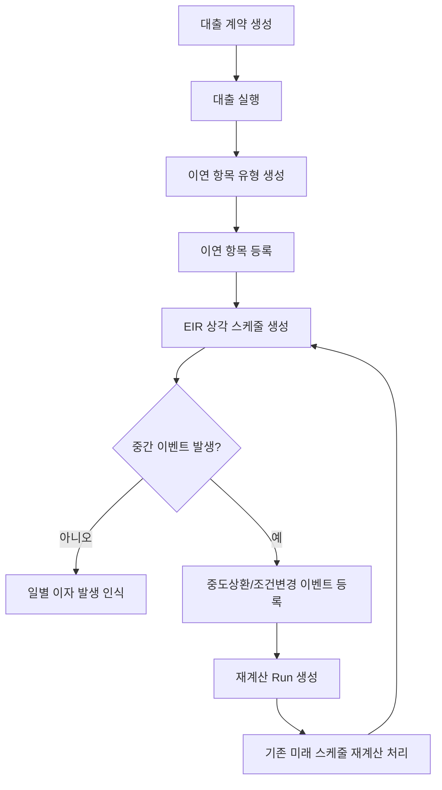
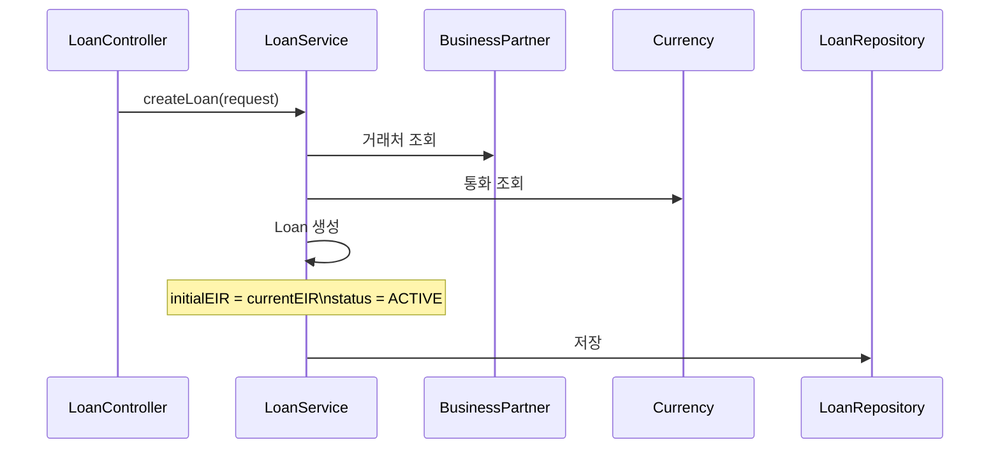
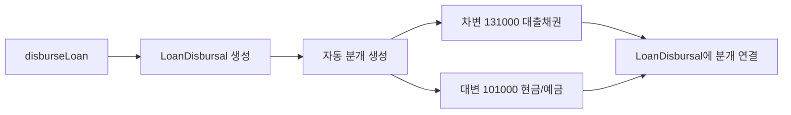
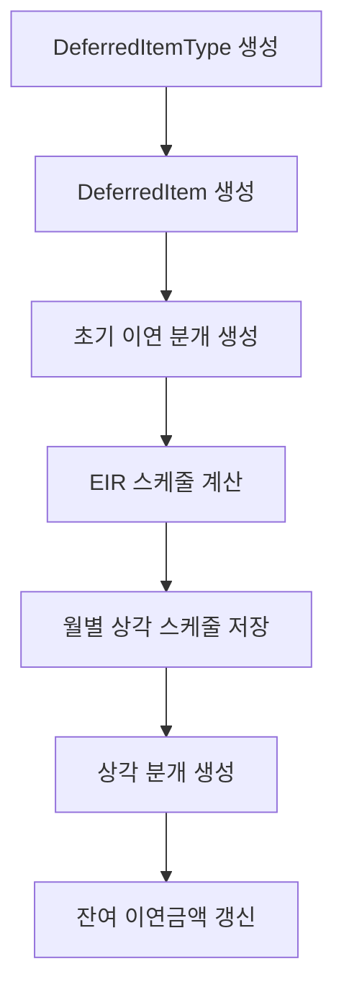
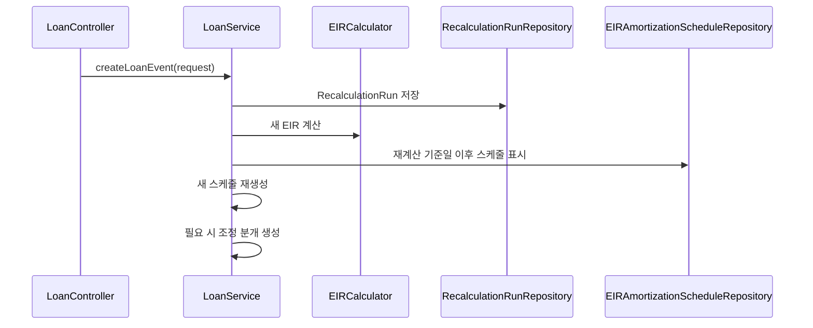
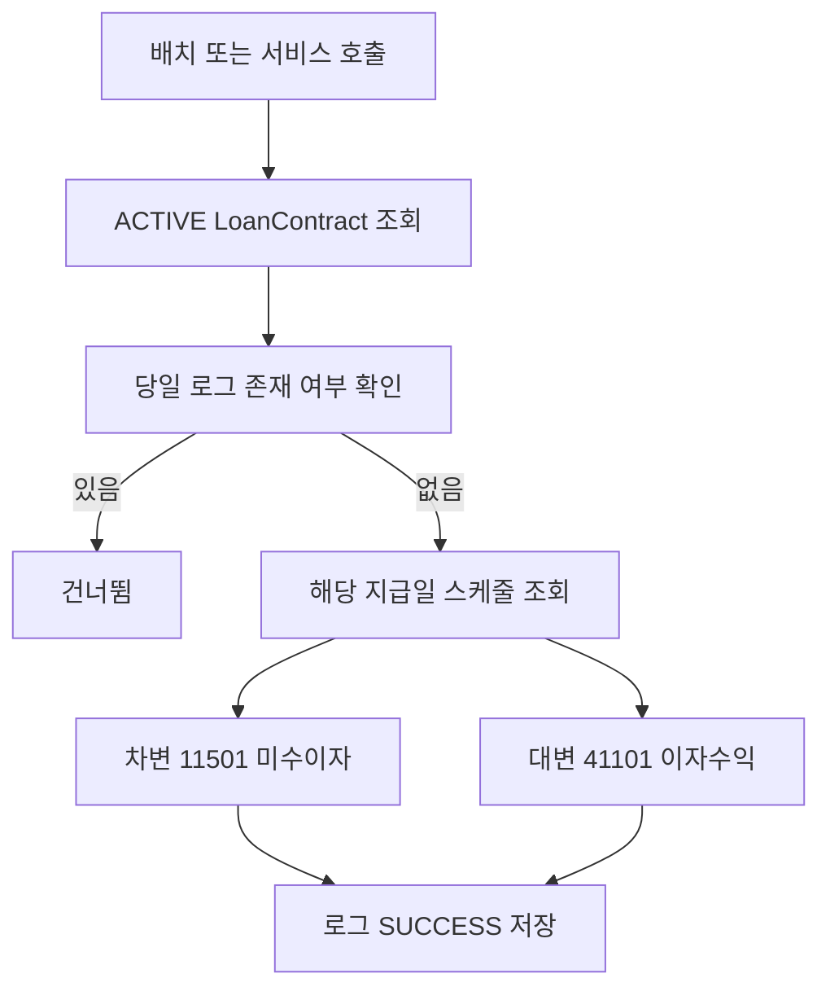

# Loan Process Flow

## 1. 전체 흐름

## 2. 대출 계약 생성

설명:
- 대출번호, 거래처, 통화, 원금, 금리, 만기, 상환주기 등을 입력해 `Loan`을 생성합니다.
- 생성 시점에는 현재 EIR과 최초 EIR을 같은 값으로 시작합니다.

## 3. 대출 실행 분개

설명:
- 실행 시 대출금이 실제로 나간 것으로 보고 분개를 만듭니다.
- 현재 구현은 계정과목을 설정 테이블에서 찾지 않고 코드값으로 고정합니다.

## 4. 이연 항목과 EIR 상각

설명:
- 대출 취급수수료 같은 금액은 즉시 비용/수익으로 처리하지 않고 이연합니다.
- 이후 매 기간 EIR 기준으로 조금씩 상각합니다.
- 현재 코드는 첫 번째 `DeferredItem` 하나를 중심으로 잔액을 갱신합니다.

## 5. 중도상환과 재계산

설명:
- 중도상환이나 만기 변경이 생기면 기존 스케줄을 그대로 쓰지 않고 다시 계산합니다.
- 기존 미래 스케줄은 `isRecalculated = true`로 표시한 뒤 새 스케줄을 만듭니다.
- 조정 분개는 현재 `EARLY_REPAYMENT` 이벤트 중심으로 생성됩니다.

## 6. 일별 이자 발생 인식

설명:
- 이 흐름은 `LoanContract` 기반으로 동작합니다.
- 그래서 메인 대출 API가 쓰는 `Loan` 모델과 연결 규칙을 운영 관점에서 따로 관리해야 합니다.

## 7. 현재 구현상 주의점

- 분개 생성이 `JournalService`를 통일해서 사용하지 않습니다.
- 계정과목 선택이 하드코딩이라 환경별 계정체계 차이를 흡수하지 못합니다.
- `Loan`과 `LoanContract`가 병행되어 데이터 흐름이 한 번에 이어지지 않습니다.
- 재계산 시 첫 번째 이연 항목을 전제로 상각금액을 갱신하는 부분이 있습니다.
