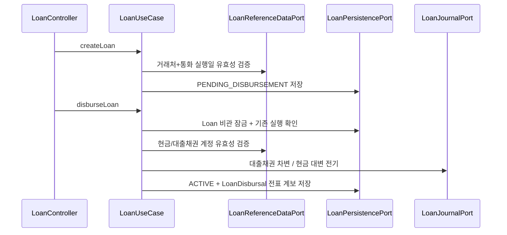
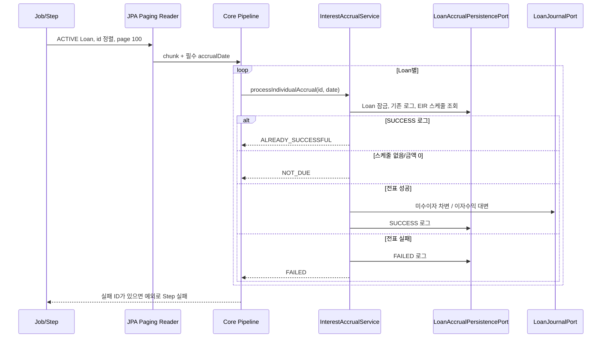

# Loan 업무 흐름

## 계층 책임

| 계층 | 책임 | 예시 |
| --- | --- | --- |
| API Adapter | HTTP 검증, DTO 변환, 상태 코드 | `LoanController`, `LoanApiExceptionHandler` |
| Inbound Port | 외부에 노출할 유즈케이스 계약 | `LoanUseCase` |
| Application Service | 잠금, 트랜잭션, 도메인 협업 순서 | `LoanService`, `InterestAccrualService`, `ScheduledRepaymentService` |
| Pipeline | chunk 단위 반복·결과 집계 | `LoanInterestAccrualPipeline` |
| Domain | 금액·율·날짜·상태 불변식 | `Loan`, `DeferredItem`, `EIRAmortizationSchedule` |
| Outbound Port/Adapter | 저장·기준정보·전표 기술 격리 | `LoanPersistencePort`와 구현체 |
| Batch | Job/Step/paging/chunk 설정 | `LoanInterestAccrualBatchConfig`, `LoanScheduledRepaymentBatchConfig` |

## 계약 생성과 실행

현재 모델은 원금과 같은 금액의 1회 실행만 허용합니다. 분할 실행이 필요하면 tranche aggregate, 미실행 잔액, 취소·역분개, 동시성 테스트를 먼저 설계해야 합니다.

## 이연 항목과 EIR

1. 이연 유형 생성 시 유형의 계정 코드 또는 기본 계정 설정을 Master Data에서 검증합니다.
2. ACTIVE 대출에 이연 항목을 만들고 초기 전표 ID/번호를 연결합니다.
3. `EIRCalculator`가 현재 잔액과 포함 대상 현금흐름으로 소수 단위 연 EIR을 구합니다.
4. 새 스케줄 전체를 먼저 계산합니다.
5. 계산 성공 후에만 대상 기존 스케줄을 삭제하고 새 행을 저장합니다.

## 이벤트 처리

| 이벤트 | 처리 |
| --- | --- |
| `EARLY_REPAYMENT` | 미상환 잔액 감소, EIR/스케줄 재계산, 현금 차변/대출채권 대변 전표 |
| `CONDITION_CHANGE` | 제시 조건으로 EIR/스케줄 재계산 |
| `RESCHEDULE` | 만기 등 조건 변경 후 재계산 |
| `DEFAULT` | ACTIVE → DEFAULTED 상태와 이벤트 저장 |
| `RECOVERY` | DEFAULTED → ACTIVE 상태와 이벤트 저장 |
| `OTHER` | 재계산 필드 없이 설명 이벤트 저장 |
| `SCHEDULED_REPAYMENT_PENDING` / `SCHEDULED_REPAYMENT` | 약정 상환 배치가 만드는 예약/완료 이벤트. 일반 이벤트 API로 직접 생성할 수 없음 |

API 응답은 저장된 이벤트와 선택적 재계산 결과를 함께 반환합니다.

## 로컬 전표 승인과 재시도

로컬 모드(`account.loan.remote.enabled=false`, 기본값)에서 Loan은 `account.loan.accounting.journal-approver-actor`를 서버 설정으로 받아야 전표를 전기할 수 있습니다. 예: `service:loan-checker`. 값은 `service:` 뒤에 영문 소문자·숫자로 시작하고 이후 영문 소문자·숫자·점·밑줄·하이픈만 허용하며 전체 50자 이하입니다. 대소문자와 양끝 공백은 Journal 신원 규칙에 따라 정규화합니다. 실행 actor와 정규화된 신원이 같으면 실패합니다. 설정이 없거나 잘못되면 전표나 outbox를 쓰기 전에 실패하므로 운영자는 별도 기계 승인 주체를 설정해야 합니다. 이 설정값은 승인 주체의 식별자이며 인증 자격 증명이 아닙니다.

로컬 어댑터는 Loan 명령의 actor를 작성자와 승인 요청자로 기록하고, 별도 설정된 기계 주체로 `DRAFT → REQUESTED → APPROVED`를 거친 뒤 기존 Journal `PostingService`로 `POSTED` 전기합니다. 전기 직전에 회계기간을 다시 검사하며, 성공한 전표의 ID·번호만 Loan 계보에 연결합니다. 대출 실행 중 승인·마감·전기 오류가 나면 호출이 실패하고 Loan 실행 완료 및 전표 계보는 저장하지 않습니다. 로컬 DB 트랜잭션 롤백이 전제입니다.

OutboxPort 주입이 없으면 어댑터는 비영속 `InMemoryOutboxAdapter`를 사용합니다. 승인·마감·전기 실패 시 이미 기록한 `PENDING` 이벤트는 메모리에 남을 수 있고, 프로세스가 종료되면 사라집니다. `PUBLISHED` 표시는 로컬 전기 호출 후의 메모리 상태 갱신일 뿐 외부 전달·중복 방지·복구를 보장하지 않습니다. 현재 Loan에는 동일 DB 트랜잭션에 참여하는 영속 OutboxPort가 없으므로 Loan 상태·Journal 전기·outbox의 원자성을 주장할 수 없습니다. 영속 어댑터를 추가하더라도 같은 DB 트랜잭션 참여와 실패 롤백을 검증해야 그 범위의 원자적 저장을 말할 수 있습니다. 실패나 결과 불명 시 메모리 이벤트만 보고 재전기하지 말고 Journal 계보와 Loan 상태를 대사해야 합니다.

약정 상환은 위 전표 호출 전에 `SCHEDULED_REPAYMENT_PENDING` 예약을 별도 트랜잭션으로 커밋합니다. 전표 실패 또는 결과 불명 시 예약을 유지하고 자동 재전기하지 않습니다. 담당자가 `LOAN_SCHEDULED_REPAYMENT` 계보와 `<loanId>:<repaymentDate>`로 Journal의 실제 상태, Loan 잔액, 이벤트를 대사해 복구 여부를 결정합니다. 이자를 포함한 다른 Loan 전표도 성공 여부가 불명확하면 계보를 먼저 확인한 뒤 재시도를 결정해야 합니다. 원격 HTTP 어댑터의 인증된 작성자·승인자 분리와 결과 유실 복구는 별도 후속 작업입니다.

## 이자 발생 Batch

전표 어댑터는 독립 트랜잭션으로 Journal 내부 변경을 묶습니다. 다만 Journal 성공 후 Loan 저장 실패까지 자동 보상하는 분산 원자성은 아직 없으며, outbox/inbox와 lineage 멱등 응답이 완료 조건입니다.

## 약정 상환 Batch

`LoanScheduledRepaymentBatchConfig`의 `loanScheduledRepaymentJob`은 `repaymentDate`를 필수 **식별 파라미터**로 받습니다. 형식은 `YYYY-MM-DD`이며 재시작 시 같은 날짜를 유지합니다. 해당 날짜의 EIR 스케줄을 대출 ID 순으로 100건씩 읽고 core의 `ScheduledRepaymentService`를 순차 호출합니다. 실행·재시작 중에는 대상 날짜의 스케줄을 추가·삭제·변경하지 않아야 페이지 이동과 체크포인트가 안정적으로 유지됩니다.

1. 먼저 같은 날짜의 `loanInterestAccrualJob`을 실행합니다. 상환 이자가 양수이면 금액이 일치하는 `SUCCESS` 발생 로그와 전표 ID/번호가 필요합니다. 이자가 0이면 이 조건은 생략합니다.
2. Core는 대출을 잠그고 ACTIVE 상태, 계약 기간, 현재 잔액과 스케줄 금액·통화 정밀도를 검증합니다. 원금은 양수여야 하며 이연 항목 상각액이 있는 스케줄은 별도 정산 흐름이 필요해 거부합니다.
3. `REQUIRES_NEW` 트랜잭션으로 `SCHEDULED_REPAYMENT_PENDING` 예약을 저장하고 커밋합니다. 이 시점에는 원금과 누적 상환액을 바꾸지 않습니다.
4. Loan 트랜잭션 밖에서 전표를 요청합니다. 현금은 원리금 합계 차변, 대출채권은 원금 대변, 미수이자는 이자 대변입니다. 계보는 `LOAN_SCHEDULED_REPAYMENT`와 `<loanId>:<repaymentDate>`입니다.
5. 전표 성공 후 새로운 `REQUIRES_NEW` 트랜잭션에서 예약과 스케줄 불변 여부를 확인합니다. 현재 원금 감소, 누적 원금·이자 상환액 증가, `SCHEDULED_REPAYMENT` 완료 이벤트와 전표 ID/번호를 함께 저장합니다. 잔액이 0이면 `REPAID`로 바꾸며 EIR이나 미래 스케줄은 재계산하지 않습니다.

재시작 중 이미 성공한 대출·날짜는 core에서 `ALREADY_SUCCESSFUL`로 건너뛰며 다시 전기하지 않습니다. 완료된 날짜의 JobInstance를 새 실행으로 만들기 위해 날짜를 바꾸지 않습니다. 스케줄이 없으면 core는 `NOT_DUE`를 반환합니다.

원격 오류·응답 유실·프로세스 종료 또는 완료 저장 실패가 발생하면 예약은 남습니다. 미확정 예약이 있는 대출은 다른 날짜의 상환도 차단하며, 예외를 숨기지 않고 Step을 실패시킵니다. 담당자가 위 계보의 원격 전표와 로컬 원금·이벤트를 대조하여 완료 또는 취소 복구를 결정해야 합니다. 자동 복구 명령은 없으며 예약 삭제나 재전기로 재시도를 강제하지 않습니다. 원금·완료 이벤트·계보의 원자성은 Loan DB 안에서만 보장하며 원격 Journal과의 분산 원자성을 뜻하지 않습니다.

합성 데이터 준비, 순차 실행 명령과 결과 검증은 [업무 배치 개발 검증 가이드](../../docs/guides/business-batch-dev-verification.md)를 참고합니다. 동작 근거는 `ScheduledRepaymentServiceTest`, `ScheduledRepaymentTransactionIntegrationTest`, `LoanScheduledRepaymentBatchConfigTest`이며 실제 개발서버 실행 결과는 별도 검증 기록으로 확인합니다.

## API 엔드포인트

| 기능 | 엔드포인트 |
| --- | --- |
| 계약 생성/조회 | `POST /api/loan/loans`, `GET /api/loan/loans/{id}` |
| 실행 | `POST /api/loan/disbursals` |
| 이연 유형/항목 | `POST /api/loan/deferred-item-types`, `POST /api/loan/deferred-items` |
| EIR 스케줄 | `POST /api/loan/amortization-schedules/generate` |
| 이벤트/재계산 | `POST /api/loan/events` |
| 예제 시나리오 | `POST /api/loan/dod-scenario` |
