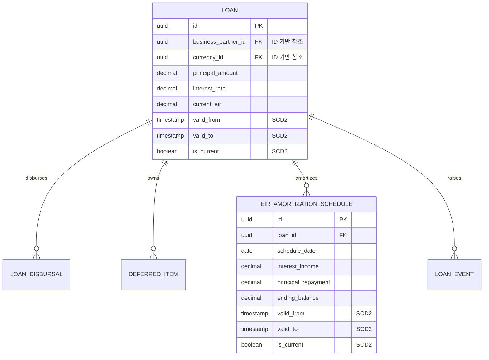

# Loan Schema

## 1. 핵심 엔티티 맵 (SCD2 및 ID 기반 참조 적용)

## 2. 주요 테이블 및 아키텍처 특징

### `loans` (대출 마스터)
대출의 조건과 이율, 잔액 정보를 들고 있습니다. ID 기반 참조를 철저히 지켜 외부 의존성을 낮췄습니다. 금리나 조건이 바뀔 경우 업데이트 대신 SCD2 방식을 통해 새 버전을 쌓습니다.

### `eir_amortization_schedules` (EIR 상각 스케줄)
가장 많은 데이터가 쌓이는 테이블입니다. 대출이 재계산될 때 과거 스케줄은 `is_recalculated=true` 대신 SCD2(`is_current=false`)로 이력화되어, 특정 시점에 미래 스케줄이 어땠는지 시계열 조회가 가능합니다.

### `loan_events` (이벤트 로그)
중도상환, 금리변경 등 트리거된 사건 자체를 기록하는 불변(Immutable) 이벤트 테이블입니다. 이 테이블의 삽입(Insert)이 도메인 이벤트를 발생시켜 헥사고날 구조 내 다른 포트(회계 분개 등)를 비동기로 호출하는 데 사용됩니다.

## 3. 포트 및 어댑터 관점의 매핑
- DB 테이블(`loans`, `eir_amortization_schedules`)은 JPA Entity 객체와 매핑됩니다.
- 도메인 로직 처리 시에는 JPA Entity를 순수 도메인 객체로 매퍼가 변환한 후 비즈니스 룰을 검증하고 다시 Entity로 매핑되어 저장됩니다. 이로써 DB 스키마 변경이 핵심 이자 계산 로직에 영향을 주지 않도록 격리됩니다.