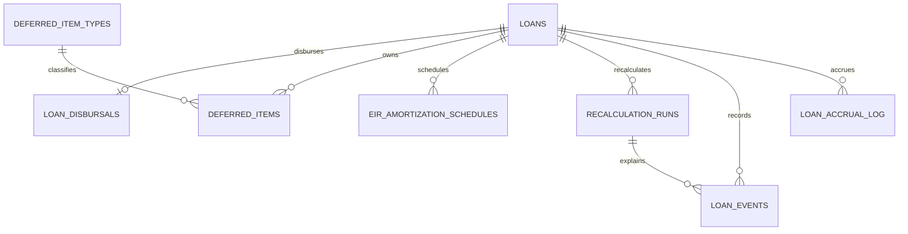

# Loan 데이터 모델

## 관계



## 테이블 역할

| 테이블 | 역할 |
| --- | --- |
| `loans` | 약정 원금, 현재 잔액, 소수 단위 이율, 거래처 ID, 통화 코드, 상태, optimistic lock version |
| `loan_disbursals` | 1회 실행 금액과 전표 계보 |
| `deferred_item_types` | EIR 현금흐름 정책과 Loan 소유 계정 코드 참조 |
| `deferred_items` | 대출별 이연 금액·잔액·기간·초기 전표 |
| `eir_amortization_schedules` | runtime이 생성하고 Batch가 읽는 단일 월별 EIR 스케줄 |
| `recalculation_runs` | 변경 전후 EIR·만기, 영향 분석, 조정 전표 |
| `loan_events` | 이벤트 유형·설명과 선택적 재계산/전표 계보 |
| `loan_accrual_log` | `(loan_id, accrual_date)`별 성공·실패·전표 결과 |
| `loan_amortization_schedule_entries` | V30에 남은 레거시 중복 테이블. runtime 코드가 사용하지 않음 |

모든 테이블이 SCD2인 것은 아닙니다. 계약 조건 변경의 업무 이력은 `recalculation_runs`와 `loan_events`가 보존하고, 동시 수정은 `loans.lock_version`이 감지합니다.

## 외부 참조 경계

| 값 | Loan 저장 형태 | 유효성 제공자 |
| --- | --- | --- |
| 차주 | `loans.business_partner_id` | Master Data 거래처 |
| 통화 | `loans.currency_code` | Master Data 통화 |
| 계정 | 설정 및 `deferred_item_types.*_account_ref` | Master Data 계정과목 |
| 전표 | 각 업무 테이블의 ID/전표번호 | Journal Ledger |

Master Data/Journaling JPA 엔티티를 Loan 엔티티 관계로 매핑하지 않습니다.

## Flyway

| 파일 | 역할 |
| --- | --- |
| `V30__init_loan_schema.sql` | 초기 통합 스키마와 현재는 레거시인 중복 스케줄 테이블 |
| `V31__loan_owned_journal_references.sql` | 실행·이연·재계산 전표번호 값 컬럼 |
| `V32__loan_accrual_journal_reference.sql` | 발생 로그·이벤트·EIR 스케줄 전표 참조 |
| `V33__loan_consistency_and_reference_boundaries.sql` | lock version, 계정 코드 참조, 실행/스케줄/발생 멱등 인덱스, 상태 조회 인덱스 |

V30~V32는 배포된 checksum을 보존하고 V33 forward migration으로 보강합니다. V33 적용 전에 다음 중복을 사전 조회해야 합니다.

```sql
SELECT loan_id, COUNT(*) FROM loan_disbursals GROUP BY loan_id HAVING COUNT(*) > 1;
SELECT loan_id, schedule_date, COUNT(*) FROM eir_amortization_schedules GROUP BY loan_id, schedule_date HAVING COUNT(*) > 1;
SELECT loan_id, accrual_date, COUNT(*) FROM loan_accrual_log GROUP BY loan_id, accrual_date HAVING COUNT(*) > 1;
```

레거시 `loan_amortization_schedule_entries` 제거 완료 조건은 운영 데이터와 EIR 스케줄 대조·이관 보고서, 소비처 0건 확인, 백업/복구 리허설, 별도 forward migration입니다.

## 운영 조회 예시

```sql
SELECT loan_number, status, principal_amount, current_principal_balance,
       current_eir, maturity_date, lock_version
FROM loans
ORDER BY id DESC;
```

```sql
SELECT loan_id, schedule_date, beginning_balance, interest_income,
       principal_repayment, ending_balance
FROM eir_amortization_schedules
WHERE schedule_date = DATE '2026-04-30';
```

```sql
SELECT loan_id, accrual_date, accrued_amount, journal_entry_id,
       journal_no, status, error_message
FROM loan_accrual_log
ORDER BY accrual_date DESC, loan_id;
```
