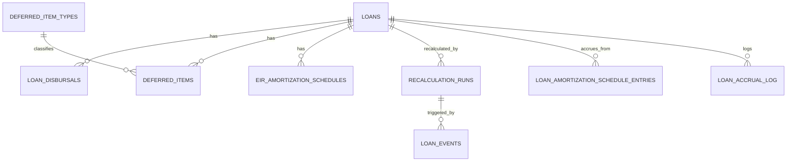

# Loan 데이터 모델

이 문서는 `loan` 모듈의 주요 테이블과 외부 데이터 연결 기준을 정리합니다.

## 주요 엔티티



## 테이블별 역할

| 테이블 | 도메인 | 역할 |
| --- | --- | --- |
| `loans` | `Loan` | 대출 계약 조건, 원금, 이율, 통화, 상태 |
| `loan_disbursals` | `LoanDisbursal` | 실제 실행일, 실행금액, 실행 전표 ID/전표번호 |
| `deferred_item_types` | `DeferredItemType` | 이연 항목 유형과 계정 매핑 |
| `deferred_items` | `DeferredItem` | 대출별 이연 금액, 상각기간, 초기 전표 |
| `eir_amortization_schedules` | `EIRAmortizationSchedule` | EIR 기준 월별 상각 스케줄 |
| `recalculation_runs` | `RecalculationRun` | EIR/만기/원금 변경 전후 값과 영향 분석 |
| `loan_events` | `LoanEvent` | 중도상환, 조건 변경, 리스케줄 등 대출 이벤트 |
| `loan_amortization_schedule_entries` | `LoanAmortizationScheduleEntry` | 일일/회차별 이자 발생 Batch가 참조하는 스케줄 엔트리 |
| `loan_accrual_log` | `LoanAccrualLog` | 대출/기준일별 이자 발생 전표 처리 결과 |

## 외부 데이터 의존성

| 외부 데이터 | 제공 모듈 | 사용 이유 |
| --- | --- | --- |
| 거래처 | `master-data` | 차주 검증 |
| 통화 | `master-data` | 전표 통화와 대출 통화 검증 |
| 계정과목 | `master-data` | 대출채권, 현금, 이연자산, 이자수익 등 계정 검증 |
| 전표 | `journal-ledger` | 대출 실행, 이연, 재계산, 이자 발생 전표 생성/승인/전기 |

## 마이그레이션

| 파일 | 역할 |
| --- | --- |
| `V30__init_loan_schema.sql` | 통합 대출 스키마 생성 |
| `V31__loan_owned_journal_references.sql` | 대출 소유 전표번호 값 컬럼 추가 |

`V30`처럼 높은 버전을 쓰는 이유는 여러 모듈의 Flyway migration이 같은 classpath에서 실행될 수 있기 때문입니다. 낮은 `V1`을 각 모듈이 동시에 쓰면 충돌할 수 있어, loan은 후순번 버전을 사용합니다.

## 전표 연결 방식

대출 도메인은 전표 엔티티를 직접 소유하지 않고 값으로 참조합니다.

| 컬럼 | 의미 |
| --- | --- |
| `loan_disbursals.journal_entry_id` | 대출 실행 전표 ID |
| `loan_disbursals.journal_entry_slip_no` | 대출 실행 전표번호 |
| `deferred_items.initial_journal_entry_id` | 이연 항목 초기 전표 ID |
| `deferred_items.initial_journal_entry_slip_no` | 이연 항목 초기 전표번호 |
| `recalculation_runs.adjustment_journal_entry_id` | 중도상환/원금 조정 전표 ID |
| `recalculation_runs.adjustment_journal_entry_slip_no` | 중도상환/원금 조정 전표번호 |

## 설정 키

| 설정 | 설명 |
| --- | --- |
| `account.loan.accounting.cash-account-code` | 대출 실행/상환 시 현금 계정 |
| `account.loan.accounting.loan-receivable-account-code` | 대출채권 계정 |
| `account.loan.accounting.deferred-asset-account-code` | 이연자산 기본 계정 |
| `account.loan.accounting.recognized-income-account-code` | 이연 수익 인식 기본 계정 |
| `account.loan.accounting.accrued-interest-receivable-account-code` | 미수이자 계정 |
| `account.loan.accounting.interest-income-account-code` | 이자수익 계정 |

## 운영 점검 SQL 예시

```sql
SELECT loan_number, status, principal_amount, current_eir, maturity_date
FROM loans
ORDER BY id DESC;
```

```sql
SELECT loan_id, payment_date, interest_amount, principal_amount, ending_balance
FROM loan_amortization_schedule_entries
WHERE payment_date = DATE '2026-04-30';
```

```sql
SELECT loan_id, accrual_date, accrued_amount, journal_no, status, error_message
FROM loan_accrual_log
ORDER BY accrual_date DESC, loan_id;
```
