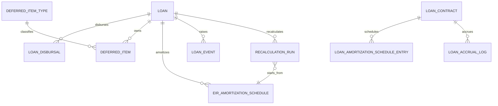

# Loan Schema

## 1. 핵심 엔티티 맵

## 2. 주요 테이블

### `loans`

대출 관리의 메인 엔티티입니다.

주요 컬럼:
- `id`
- `loan_number`
- `business_partner_id`
- `loan_type`
- `currency_code`
- `principal_amount`
- `interest_rate`
- `disbursal_date`
- `maturity_date`
- `payment_frequency`
- `initial_eir`
- `current_eir`
- `status`
- `created_at`, `updated_at`, `audit_user`

의미:
- 실제 API에서 생성하고 조회하는 대출 레코드입니다.
- EIR 상각과 재계산의 기준 객체입니다.

### `loan_disbursals`

실행 이력과 실행 분개를 보관합니다.

주요 컬럼:
- `id`
- `loan_id`
- `disbursal_date`
- `disbursed_amount`
- `journal_entry_id`
- `created_at`, `updated_at`, `audit_user`

의미:
- 한 대출이 실제로 언제 얼마 실행되었는지 남깁니다.

### `deferred_item_types`

이연 항목의 유형 정의 테이블입니다.

주요 컬럼:
- `id`
- `code`
- `name`
- `description`
- `deferral_method`
- `deferred_asset_account_code`
- `recognized_income_account_code`
- `is_active`
- `created_at`, `updated_at`, `audit_user`

의미:
- 대출 취급수수료, 부대비용 같은 항목이 어떤 계정으로 이연되고 어떤 방식으로 상각되는지 정의합니다.

### `deferred_items`

실제 이연된 금액을 저장합니다.

주요 컬럼:
- `id`
- `loan_id`
- `deferred_item_type_id`
- `amount`
- `deferral_date`
- `amortization_start_date`
- `amortization_end_date`
- `remaining_amount`
- `initial_journal_entry_id`
- `status`
- `created_at`, `updated_at`, `audit_user`

의미:
- 특정 대출에 귀속된 이연자산 또는 이연수익 잔액을 관리합니다.

### `eir_amortization_schedules`

EIR 방식 상각 스케줄을 저장합니다.

주요 컬럼:
- `id`
- `loan_id`
- `schedule_date`
- `beginning_balance`
- `interest_income`
- `principal_repayment`
- `ending_balance`
- `deferred_item_amortization`
- `cash_flow`
- `amortization_journal_entry_id`
- `is_recalculated`
- `created_at`, `updated_at`, `audit_user`

의미:
- 기간별 유효이자 수익, 원금 상환, 이연 상각, 기말잔액을 한 줄씩 보관합니다.

### `loan_events`

대출 생애주기의 이벤트를 기록합니다.

주요 컬럼:
- `id`
- `loan_id`
- `event_type`
- `event_date`
- `description`
- `journal_entry_id`
- `recalculation_run_id`
- `created_at`, `updated_at`, `audit_user`

의미:
- 중도상환, 조건변경, 리스케줄링 같은 사건을 남깁니다.

### `recalculation_runs`

재계산 실행 이력을 남깁니다.

주요 컬럼:
- `id`
- `loan_id`
- `recalculation_date`
- `reason`
- `old_eir`
- `new_eir`
- `old_maturity_date`
- `new_maturity_date`
- `recalculated_amortization_schedule_start_id`
- `impact_analysis`
- `adjustment_journal_entry_id`
- `created_at`, `updated_at`, `audit_user`

의미:
- 왜 재계산했는지, 무엇이 바뀌었는지, 어느 스케줄부터 다시 계산했는지를 남깁니다.

## 3. 보조 모델

### `LOAN_CONTRACTS`

`InterestAccrualService`와 `LoanSourceDocumentProvider`가 사용하는 별도 대출 계약 모델입니다.

주요 컬럼:
- `LOAN_CONTRACT_NO`
- `BUSINESS_PARTNER_CODE`
- `PRINCIPAL_AMOUNT`
- `DISBURSEMENT_DATE`
- `MATURITY_DATE`
- `INTEREST_RATE`
- `REPAYMENT_METHOD`
- `CURRENT_PRINCIPAL_BALANCE`
- `DEFERRED_LOAN_FEE`
- `EFFECTIVE_INTEREST_RATE`

### `LOAN_AMORTIZATION_SCHEDULE_ENTRIES`

`LoanContract` 기준의 전통적 상환 스케줄입니다.

주요 컬럼:
- `LOAN_CONTRACT_ID`
- `PAYMENT_DATE`
- `PERIOD_NUMBER`
- `STARTING_BALANCE`
- `SCHEDULED_PAYMENT_AMOUNT`
- `INTEREST_AMOUNT`
- `PRINCIPAL_AMOUNT`
- `ENDING_BALANCE`
- `DEFERRED_FEE_AMORTIZATION`
- `ENTRY_TYPE`

### `LOAN_ACCRUAL_LOG`

일별 이자 발생 인식 결과 로그입니다.

주요 컬럼:
- `ACCRUAL_DATE`
- `LOAN_CONTRACT_ID`
- `ACCRUED_AMOUNT`
- `JOURNAL_NO`
- `STATUS`
- `ERROR_MESSAGE`

## 4. 관계를 이해할 때 중요한 점

- `Loan` 기반 모델과 `LoanContract` 기반 모델이 동시에 존재합니다.
- `LoanSourceDocumentProvider`는 `lineageSourceType = LOAN`일 때 `LoanContract`를 반환합니다.
- 따라서 소스문서 조회와 메인 API 데이터가 1:1로 바로 이어진다고 가정하면 안 됩니다.
