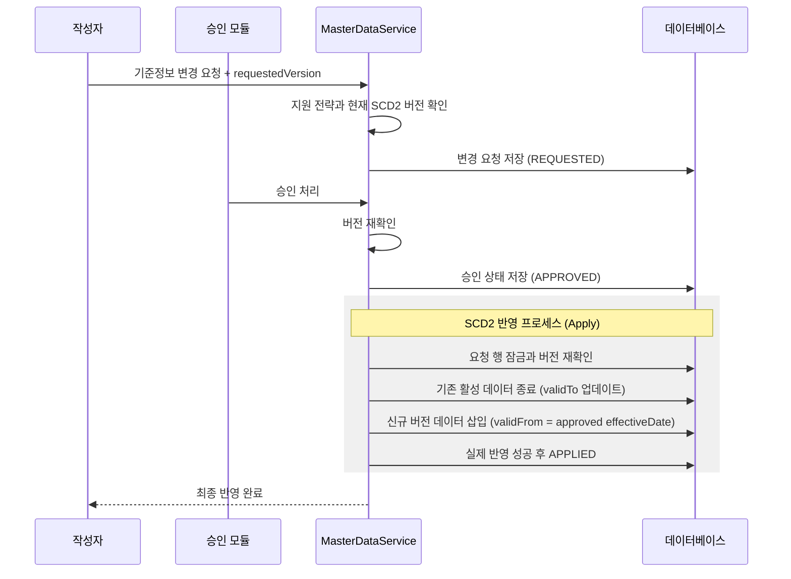
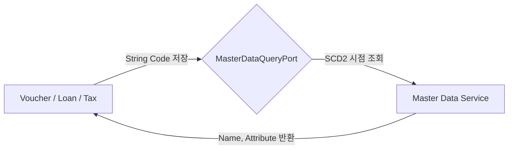
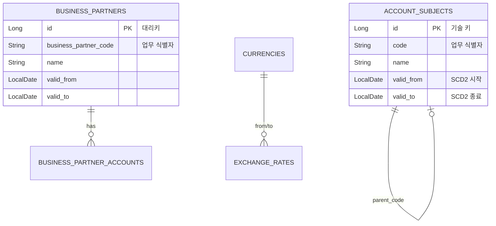

# 📂 Master Data Service (기준 정보 관리)

`master-data` 모듈은 전체 시스템의 '단일 진실의 원천(Single Source of Truth)'입니다. 모든 모듈이 공유하는 계정과목, 거래처, 부서, 통화 등의 핵심 데이터를 관리하며, 이력 보존(SCD2)과 변경 승인 프로세스를 통해 데이터의 신뢰성을 보장합니다.

### 거래처 도메인과 저장 모델의 경계

- `BusinessPartner`와 `BusinessPartnerAccount`는 JPA를 모르는 순수 도메인 객체입니다. 생성 팩터리가 필수 코드·이름, 유효기간, 계좌의 대표 여부 같은 업무 불변식을 먼저 검사합니다.
- `BusinessPartnerJpaEntity`와 `BusinessPartnerAccountJpaEntity`만 테이블·컬럼·연관관계를 알고, `JpaBusinessPartnerPersistenceAdapter`가 두 모델을 명시적으로 변환합니다. 따라서 도메인 규칙을 DB 프록시 생명주기와 분리해 단위 테스트할 수 있습니다.
- SCD2 수정에서 `closeVersion()`은 과거 버전의 종료일만 닫고, 업무 비활성화인 `terminate()`는 `useYn=false`도 함께 적용합니다. 두 의미를 섞지 않아 미래 시행 버전을 만들 때 현재 사용 가능 상태가 일찍 사라지지 않습니다.
- 새 SCD2 버전은 기존 계좌 값을 새 자식 행으로 복제합니다. 자식 ID는 재사용하지 않아 과거 버전의 FK와 현재 지급 계좌를 모두 보존합니다.
- HTTP 응답은 `BusinessPartnerDto`가 조립하며 사업자등록번호 마스킹도 API 경계에서 수행합니다. 영속성 엔티티나 민감한 원문을 Controller가 직접 반환하지 않습니다.
- 기존 `business_partners`, `business_partner_accounts` 테이블·컬럼과 API 경로는 유지되므로 이번 분리만을 위한 DB migration은 없습니다.

---

## 1. 🐣 초보자를 위한 개념 설명 (Beginner Guide)

회계 시스템에서 데이터가 엉키지 않으려면 모두가 똑같은 이름표를 써야 합니다.
1. **계정과목 (Account):** 돈의 용도 분류 (예: "식비", "비품비").
2. **거래처 (Partner):** 돈을 주고받는 대상 (예: "A사", "B은행").
3. **부서 (Department):** 돈을 쓰고 버는 주체 (예: "영업팀", "개발팀").
4. **SCD2 (이력 관리):** 데이터를 수정할 때 덮어쓰지 않고, "어제까지의 기록"과 "오늘부터의 새 기록"을 모두 남기는 방식입니다. 이를 통해 1년 전 전표를 볼 때 '당시의 부서명'을 정확히 알 수 있습니다.

---

## 2. 🔄 프로세스 흐름 (Process Flow)

### 📌 SCD2 기준정보 변경 및 승인 흐름
중요 기준 정보는 승인을 거쳐 반영되며, 기존 이력을 보존하면서 새로운 버전을 생성합니다.



### 📌 타 모듈과의 연동 (ID 기반 참조)
다른 모듈은 `master-data`의 복잡한 엔티티를 직접 가져가지 않고, **코드(String ID)**만 저장한 뒤 필요할 때 API(Port)로 조회합니다.



---

## 3. 📊 데이터 모델 (Schema)

SCD2 관리를 위해 모든 테이블은 유효 기간 필드를 포함합니다.



---

## 4. 🧭 실행 및 연동 방법

상세 문서는 [docs/README.md](./docs/README.md)에서 `beginner-guide`, `process-flow`, `schema`, `local-run` 순서로 확인합니다.

**IntelliJ 실행 순서:**
1. 로컬 단독 실행은 `Master Data bootRun`을 바로 실행합니다.
2. 통합 모드에서만 Config Server와 Discovery를 먼저 실행합니다.

**PowerShell 검증 명령:**
```powershell
.\gradlew :master-data:core:test :master-data:api:test :master-data:batch:test --console=plain --max-workers=1 --no-daemon
```

**API 로컬 실행 명령:**
```powershell
.\gradlew :master-data:api:bootRun --console=plain --max-workers=1
```

**일일 유효성 Batch 실행 명령:**
```powershell
.\gradlew :master-data:batch:bootRun --args="--spring.batch.job.enabled=true --spring.batch.job.name=masterDataValidityJob asOfDate=2026-07-29" --console=plain --max-workers=1 --no-daemon
```

프로파일을 생략하면 `local`이 선택되어 H2 PostgreSQL mode와 Flyway V1-V6, JPA validate를
사용합니다. `dev`/`prod`는 주입된 PostgreSQL 접속정보를 사용하고 애플리케이션 Flyway와
SQL/Batch schema 자동 생성을 끕니다. 배포 migration은 별도 `migration-runner`가 수행합니다.
prod PostgreSQL은 `sslmode=verify-full`을 startup에서 검증합니다. 외부 서비스의 SCD2 조회는
`/api/basic/references/**?effectiveDate=yyyy-MM-dd`와 read-only Fiscal Period API를 사용하며,
회계기간 상태 변경은 Closing 승인/gate를 우회하는 raw endpoint로 제공하지 않습니다.

**연동 주의사항:**
- 다른 모듈에서 마스터 데이터를 조회할 때는 반드시 `contracts`의 `MasterDataQueryPort`를 사용하세요.
- SCD2 수정은 이전 버전에 `closeVersion()`을 호출하고 새 버전을 저장합니다. 업무상 비활성화에만 `terminate()`를 사용합니다.
- 계정과목·부서·상품·거래처의 `CREATE`는 신규 업무 키에만 사용합니다. 오늘 활성 행이 없어도 미래 예약 또는 종료된 이력이 하나라도 있으면 같은 키의 직접 생성과 승인 반영을 HTTP 409 충돌로 거부합니다. 날짜가 서로 닿거나 완전히 떨어져 있어도 키 재생성은 허용하지 않습니다. 현재 활성 버전이 있는 키의 변경은 SCD2 `UPDATE`를 사용하며, 종료 이력만 있거나 미래 버전만 있는 키의 재활성화는 현재 지원하지 않습니다.
- 승인된 변경 요청은 targetType별 applier가 실제 SCD2 반영을 수행한 뒤에만 `APPLIED`가 됩니다. 현재 `ACCOUNT_SUBJECT`, `BUSINESS_PARTNER`, `DEPARTMENT`, `PRODUCT` typed applier가 구현되어 있습니다.
- `requestedVersion`은 CREATE=1, UPDATE=현재 저장 이력 수+1, DEACTIVATE=현재 저장 이력 수입니다. 요청·승인·반영 직전에 반복 검증하므로 대기 중 다른 버전이 먼저 반영되면 오래된 요청은 실패합니다.
- `DEACTIVATE`는 JSON payload 없이 실행되며 승인된 `effectiveDate`를 SCD2 종료일로 사용합니다. `CURRENCY`, `EXCHANGE_RATE`, `FISCAL_PERIOD`는 typed applier와 버전 어댑터가 생기기 전까지 접수 단계에서 fail-closed 됩니다.
- 승인/반려/반영은 변경 요청 행을 잠그고 `lockVersion`으로 동시 갱신도 감지합니다. 예약 반영은 `APPROVED` 상태와 `effectiveDate` 조건으로 최대 500건을 조회합니다.
- Governance 승인 ID는 `sourceReference`로 저장해 동일 명령 재시도는 기존 요청을 반환하고 다른 명령 재사용은 충돌로 차단합니다. 실제 반영 완료 시각은 `appliedAt`에 기록합니다.
- 계정과목/부서/거래처/상품의 직접 쓰기(POST/PUT/DELETE) API는 서비스의 인증 필터에서 설정한 `AUTH_JWT_AUDIENCE`(기본 `account-api`) audience의 Auth 서명 JWT를 재검증한 뒤 `MasterDataDirectWritePolicy`를 통해 승인된 관리자 역할(`ROLE_ADMIN`, `ROLE_SYSTEM_ADMIN`, `ROLE_MASTER_MANAGER`, `ROLE_ACCOUNTING_ADMIN`, `ROLE_PARTNER_MANAGER`)로 제한됩니다. 자격증명이 없거나 위조된 요청은 HTTP 401, 검증된 비관리자는 HTTP 403입니다. Gateway의 `X-Auth-*` 전달 값은 JWT claim과 일치해야 합니다.
- 변경 요청의 조회/승인/반려/반영도 같은 수신 서비스 검증을 거칩니다. 내부 회계기간 변경은 별도 서명키와 `master-data-internal` audience의 Closing assertion을 요구하며, `audit_user`에는 검증된 `closing:<delegated actor>`를 기록합니다. 상세 입력과 통합 제약은 [docs/process-flow.md](docs/process-flow.md)에 있습니다.
- 일일 유효성 보고서는 core pipeline이 기준일을 필수로 받고, JPA 통계 어댑터가 네 테이블의 활성 건수를 DB `COUNT`로 계산합니다.
- 계정과목/상품 활성 목록과 거래처 이름 검색도 전체 행을 Java에서 필터링하지 않고 기준일 조건을 DB query에 전달합니다. 거래처 검색은 빈 검색어를 거부하고 현재 활성 버전만 반환합니다.
- 환율 조회는 요청일 이하의 데이터 중 가장 최근 `effectiveDate` 1건을 DB에서 선택합니다. 환율은 양수이고 통화 코드는 3자리 ISO 형식이어야 합니다.
- Closing이 회계기간 상태를 바꿀 때는 `FiscalPeriodPersistencePort` 뒤에서 대상 행을 잠그고, 영구 마감 불변식과 감사 사용자를 `FiscalPeriod` 도메인 메서드가 검증합니다.
- 운영에서는 애플리케이션 `ddl-auto`를 `validate`로 유지하고 migration-runner가 검증한 Flyway 기준만 사용합니다.
- 현재 Loan core의 거래처/통화 엔티티 연관과 Closing Batch의 환율 Repository 직접 참조는 위 contracts 원칙의 예외입니다. 다음 순차 리팩터링에서 코드/ID 저장과 소비 모듈 소유 포트 + contracts 조회로 분리해야 합니다.
