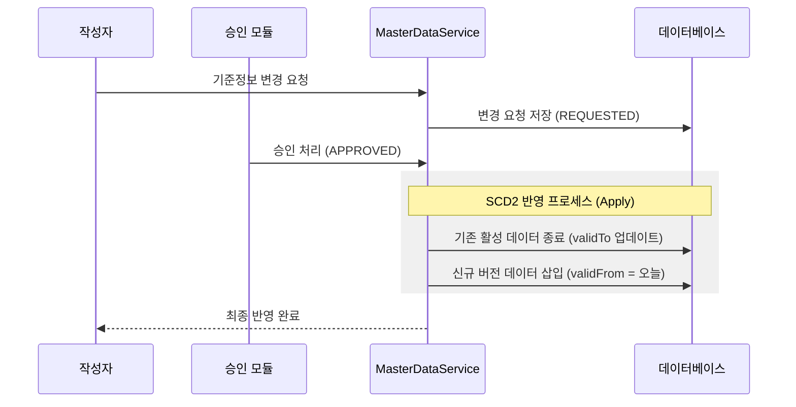
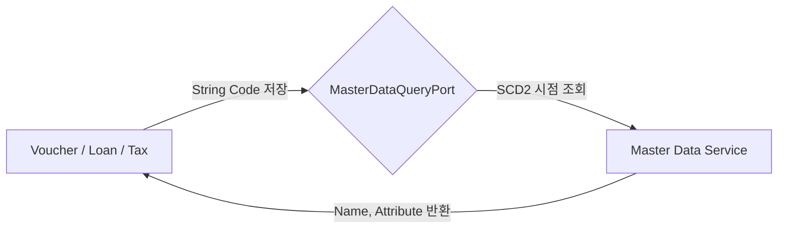
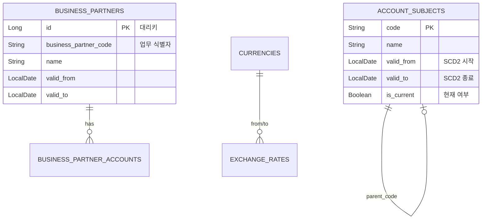

# 📂 Master Data Service (기준 정보 관리)

`master-data` 모듈은 전체 시스템의 '단일 진실의 원천(Single Source of Truth)'입니다. 모든 모듈이 공유하는 계정과목, 거래처, 부서, 통화 등의 핵심 데이터를 관리하며, 이력 보존(SCD2)과 변경 승인 프로세스를 통해 데이터의 신뢰성을 보장합니다.

---

## 1. 🐣 초보자를 위한 개념 설명 (Beginner Guide)

회계 시스템에서 데이터가 엉키지 않으려면 모두가 똑같은 이름표를 써야 합니다.
1. **계정과목 (Account):** 돈의 용도 분류 (예: "식비", "비품비").
2. **거래처 (Partner):** 돈을 주고받는 대상 (예: "A사", "B은행").
3. **부서 (Department):** 돈을 쓰고 버는 주체 (예: "영업팀", "개발팀").
4. **SCD2 (이력 관리):** 데이터를 수정할 때 덮어쓰지 않고, "어제까지의 기록"과 "오늘부터의 새 기록"을 모두 남기는 방식입니다. 이를 통해 1년 전 전표를 볼 때 '당시의 부서명'을 정확히 알 수 있습니다.

---

## 2. 🔄 프로세스 흐름 (Process Flow)

### 📌 SCD2 기준정보 변경 및 승인 흐름
중요 기준 정보는 승인을 거쳐 반영되며, 기존 이력을 보존하면서 새로운 버전을 생성합니다.



### 📌 타 모듈과의 연동 (ID 기반 참조)
다른 모듈은 `master-data`의 복잡한 엔티티를 직접 가져가지 않고, **코드(String ID)**만 저장한 뒤 필요할 때 API(Port)로 조회합니다.



---

## 3. 📊 데이터 모델 (Schema)

SCD2 관리를 위해 모든 테이블은 유효 기간 필드를 포함합니다.



---

## 4. 🐳 실행 방법 (Docker)

**실행 명령:**
```bash
docker-compose up -d master-data
```

**연동 주의사항:**
- 다른 모듈에서 마스터 데이터를 조회할 때는 반드시 `contracts`의 `MasterDataQueryPort`를 사용하세요.
- 데이터 수정 시 `terminate()` 메서드를 호출하여 SCD2 정책을 준수해야 합니다.
