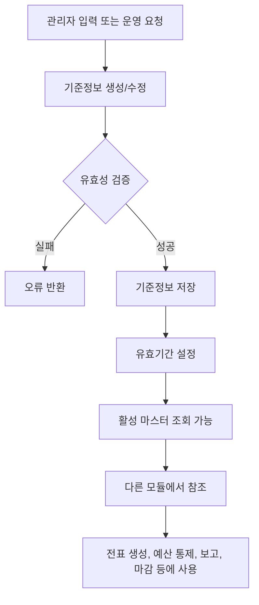
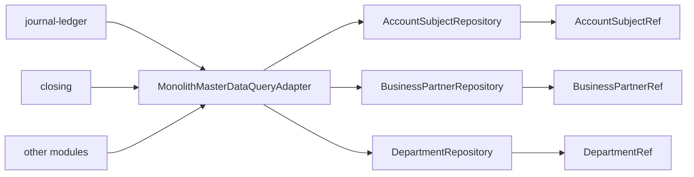

# master-data process flow

## 1. 이 모듈이 하는 일

`master-data`는 회계 시스템의 기준표를 관리한다.

- 계정과목 관리
- 거래처 관리
- 부서 계층 관리
- 통화와 환율 관리
- 회계기간 기준 관리
- 상품 기준 관리
- 다른 모듈용 조회 포트 제공

## 2. 핵심 흐름도

## 3. 실무 흐름별 설명

### 3.1 계정과목 생성

- 진입점: `POST /api/basic/account-subjects`
- 서비스: `AccountSubjectService.createAccountSubject`
- 처리:
  - 코드 중복 확인
  - 상위 계정이 있으면 parent 연결
  - `validFrom`, `validTo` 기본값 설정
  - 차대구분, 분류, 리포트 라인 등 저장

### 3.2 계정과목 비활성화

- 진입점: `DELETE /api/basic/account-subjects/{code}`
- 처리:
  - 물리 삭제가 아니라 `validTo`를 오늘로 바꿔 종료
  - 즉, SCD2 스타일의 유효기간 종료 처리

### 3.3 거래처 생성과 운영

- 진입점: `POST /api/basic/businesspartners`
- 서비스: `BusinessPartnerService`
- 처리:
  - 거래처 코드 유일성 확인
  - `partnerType`, `kycStatus`, `riskRating`, `useYn` 기본값 설정
  - 활성 거래처 조회는 `useYn = true` 기준

### 3.4 부서 생성과 계층 연결

- 진입점: `POST /api/basic/departments`
- 서비스: `DepartmentService`
- 처리:
  - 코드 중복 확인
  - 상위 부서 연결
  - 부서 유형 설정
  - `validFrom`, `validTo`로 활성 기간 관리

### 3.5 다른 모듈이 읽는 흐름

## 4. 초보자가 꼭 기억할 포인트

- 이 모듈의 오류는 다른 모듈 전체로 전파된다.
- 계정과목과 부서는 `validFrom`, `validTo` 기반으로 활성 여부를 판단한다.
- 거래처는 현재 `useYn`으로 활성 여부를 판단한다.
- `MasterDataQueryPort`는 향후 MSA 분리를 위한 조회 계약 역할도 한다.
