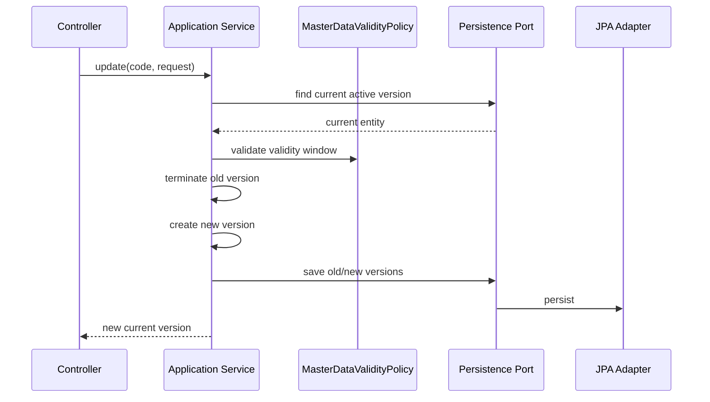
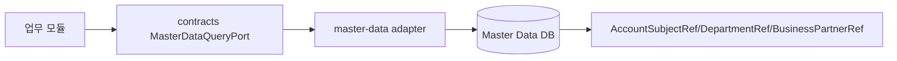

# master-data process flow

## API 입구

| 컨트롤러 | 경로 | 역할 |
| --- | --- | --- |
| `AccountSubjectController` | `/api/basic/account-subjects` | 계정과목 생성, 조회, SCD2 수정, 종료 |
| `DepartmentController` | `/api/basic/departments` | 부서 조회, 활성 부서 조회, 생성 |
| `BusinessPartnerController` | `/api/basic/businesspartners` | 거래처 생성, 조회, 검색, SCD2 수정, 종료 |
| `ProductController` | `/api/basic/products` | 상품 생성, 조회, 수정, 종료 |
| `MasterDataChangeRequestController` | `/api/master-data/change-requests` | 변경 요청, 승인, 반려, 반영 |

## 기준정보 SCD2 수정 흐름



기존 값을 직접 덮어쓰지 않고 이전 버전을 종료한 뒤 새 버전을 만듭니다. 그래서 과거 전표와 보고서는 과거 기준정보를 다시 조회할 수 있습니다.

## 변경 요청 승인 흐름

```mermaid
flowchart TD
    A[POST /change-requests] --> B[REQUESTED 저장]
    B --> C[GET /pending]
    C --> D[POST /{id}/approve]
    D --> E[APPROVED]
    E --> F[POST /{id}/apply 또는 /apply-due]
    F --> G{targetType별 Applier 존재}
    G -->|Yes| H[SCD2 도메인 반영]
    H --> I[APPLIED]
    G -->|No| J[fail-closed 예외]
```

`MasterDataChangeRequestService.applyApprovedChange`는 targetType별 `MasterDataChangeApplier`를 호출한 뒤에만 승인 요청 상태를 `APPLIED`로 바꿉니다. 현재 `DEPARTMENT`는 `DepartmentMasterDataChangeApplier`가 `DepartmentService`를 호출해 SCD2 생성, 수정, 비활성화를 처리합니다. typed applier가 없는 targetType은 조용히 성공시키지 않고 fail-closed 예외로 중단합니다.

예약 반영인 `/apply-due`는 `findAll()` 후 메모리 필터를 하지 않습니다. `status=APPROVED`, `effectiveDate <= today` 조건으로 최대 500건씩 조회해 적용합니다.

## 타 모듈 조회 흐름



업무 모듈은 `master-data` JPA 엔티티를 직접 참조하지 않습니다. 코드나 ID만 저장하고, 상세 이름/속성은 포트 또는 API로 조회합니다.

## 현재 고도화 후보

- `ACCOUNT_SUBJECT`, `BUSINESS_PARTNER`, `PRODUCT`, `CURRENCY`, `EXCHANGE_RATE`, `FISCAL_PERIOD`도 운영 적용 전 typed applier를 추가해야 합니다. 구현 전에는 fail-closed로 중단됩니다.
