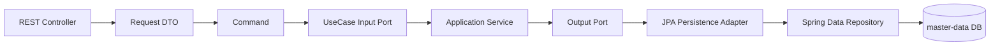
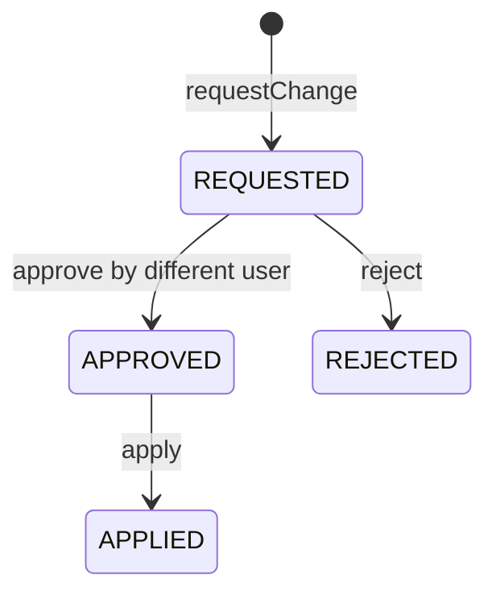
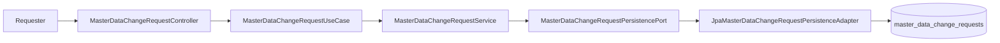
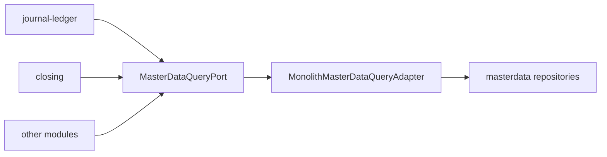

# master-data process flow

## Standard Master Data Request

Application services coordinate the use case and transaction. They call output ports and domain objects, not Spring Data repositories directly.

## Change Request Flow

Important rules:

- The requester and approver must be different users.
- Only `REQUESTED` changes can be approved or rejected.
- Only `APPROVED` changes can be applied.
- `apply-due` applies only approved requests whose effective date is today or earlier.
- `payloadJson` is converted into the target command by `DefaultMasterDataChangeApplier`.

## Lookup Flow For Other Modules

Other modules should depend on lookup contracts, not on master-data JPA entities.
