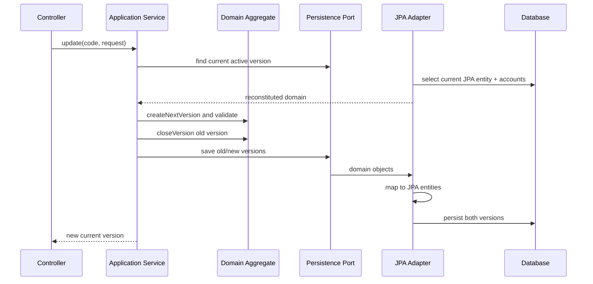
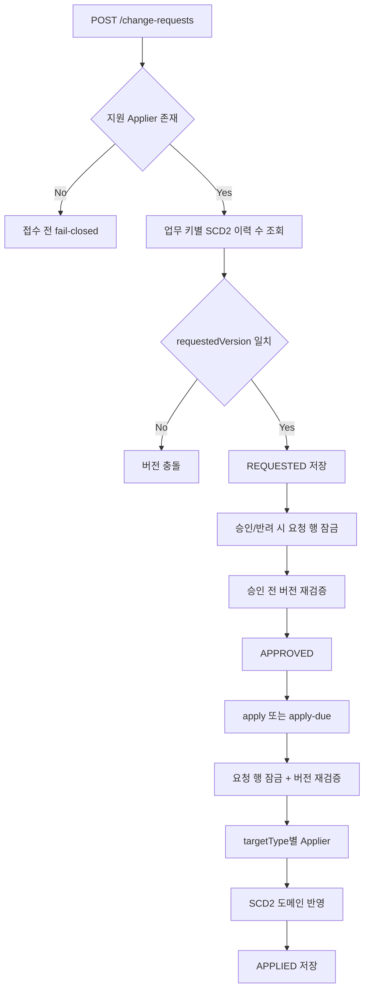
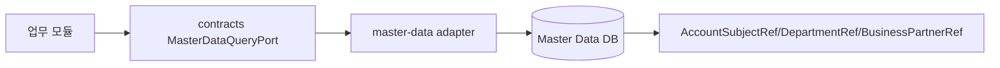
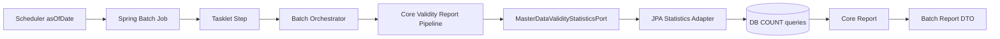
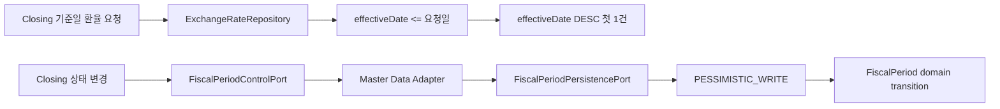

# master-data process flow

## API 입구

### 수신 서비스 인증

`MasterDataIngressAuthenticationFilter`는 모든 비-`OPTIONS` 쓰기, `/api/master-data/**` 조회, `/api/internal/**` 요청이 Controller에 도달하기 전에 자격증명을 검증합니다. Servlet context path를 제외한 경로로 판단하며, MVC가 다르게 해석할 수 있는 matrix 세미콜론, 모든 percent 인코딩 경로, 점 경로 구간은 401로 차단합니다. 따라서 경로 ID에도 percent 인코딩을 사용할 수 없습니다. `OPTIONS` preflight는 업무 호출이 아니므로 통과합니다. 사용자는 `Authorization: Bearer <JWT>`가 필요합니다. 필터는 Auth와 공유한 `AUTH_JWT_SECRET`으로 서명, issuer(`AUTH_JWT_ISSUER`, 기본 `auth-service`), 발급·만료 시각, 설정한 `AUTH_JWT_AUDIENCE`(기본 `account-api`) audience, 사용자·역할·roleVersion claim을 확인합니다. Gateway가 전달한 `X-Auth-User`, `X-Auth-Roles`, `X-Auth-Role-Version`, `X-Auth-Department`, `X-User-ID`가 있으면 claim과 일치해야 하고, Controller에는 검증된 값만 전달합니다. 임의의 `X-Auth-*` 헤더는 거부합니다. 자격증명/설정 누락, 위조, 만료, claim 불일치는 401이며, 인증됐지만 역할이 허용되지 않으면 403입니다. 읽기 전용 `/api/basic/**`는 이 필터의 쓰기 정책 대상이 아닙니다.

Closing의 회계기간 상태 변경은 `X-Service-Assertion`에 별도 HS256 JWT를 보냅니다. 검증키는 `MASTER_DATA_CLOSING_ASSERTION_SECRET`이고 사용자 JWT 키와 달라야 합니다. assertion은 `iss=closing-service`, `sub=closing`, `aud=master-data-internal`, 현재 유효한 `iat`/`exp`(발급부터 만료까지 최대 5분), `actor`(1~42자의 안전한 ID), `actorRoles`(문자열 목록), `fiscalPeriodId`(양의 정수), `closingStatus`(`OPEN`/`CLOSED`/`PERMANENTLY_CLOSED`), `method=PUT`, `path=/api/internal/fiscal-periods/{id}/closing-status`를 포함해야 합니다. `path`는 servlet context path를 제외한 값이고 ID는 URL의 `{id}`, 상태는 JSON 본문의 `closingStatus`와 정확히 같아야 합니다. 형식이 올바르고 비어 있지 않은 ID/상태/메서드/경로가 서명된 값과 다르면 use case 호출 전에 401로 차단합니다. JSON 형식이 잘못되었거나 필수 `closingStatus`가 비어 있으면 MVC 역직렬화·검증 단계에서 400을 반환합니다. 위임 역할은 `ROLE_ADMIN`, `ROLE_SYSTEM_ADMIN`, `ROLE_ACCOUNTING_ADMIN` 중 하나여야 합니다. 선택적으로 전달한 `X-Service-Identity`는 정확히 `closing`이어야 합니다. 사용자 Bearer 또는 `X-Auth-*` 헤더는 내부 요청과 함께 사용할 수 없습니다. 서비스와 위임 actor는 각각 검증된 request attribute로 유지하고 기존 `fiscal_periods.audit_user VARCHAR(50)`에는 `closing:<actor>`를 저장합니다. 본문의 `auditUser`는 호환용 입력일 뿐 권한이나 감사 값으로 사용하지 않습니다. assertion의 5분 유효기간 안에는 같은 값을 다시 제출할 수 있으므로 재전송 방지가 필요하다면 `jti` 저장/중복 거부를 별도 통합 계약으로 추가해야 합니다.

현재 Closing HTTP 호출자는 이 assertion을 발급하지 않으므로 해당 호출은 401로 차단됩니다. Closing 클라이언트가 별도 키를 안전하게 주입받아 위 claim을 생성하도록 연동 변경이 필요합니다. 또한 Master Data는 서명된 `roleVersion`을 형식 검증하지만 현재 Auth 상태를 다시 조회하지 않습니다. Gateway 경로는 별도로 Auth의 현재 버전을 확인하며, Master Data에 직접 도달한 유효기간 내 토큰은 역할 변경 직후에도 과거 역할을 유지할 수 있습니다. 직접 서비스 접근 제한 또는 수신 서비스의 bounded Auth 조회를 별도 통합 게이트로 검토해야 합니다.

| 컨트롤러 | 경로 | 역할 |
| --- | --- | --- |
| `AccountSubjectController` | `/api/basic/account-subjects` | 계정과목 생성, 조회, SCD2 수정, 종료 |
| `DepartmentController` | `/api/basic/departments` | 부서 조회, 활성 부서 조회, 생성 |
| `BusinessPartnerController` | `/api/basic/businesspartners` | 거래처 생성, 조회, 검색, SCD2 수정, 종료 |
| `ProductController` | `/api/basic/products` | 상품 생성, 조회, 수정, 종료 |
| `MasterDataChangeRequestController` | `/api/master-data/change-requests` | 변경 요청, 승인, 반려, 반영 |

## 기준정보 SCD2 수정 흐름

기존 값을 직접 덮어쓰지 않고 이전 버전을 종료한 뒤 새 버전을 만듭니다. 그래서 과거 전표와 보고서는 과거 기준정보를 다시 조회할 수 있습니다.
신규 `validFrom/validTo` 기간이 뒤집히지 않았는지 먼저 검증하므로, 잘못된 신규 기간 때문에
기존 활성 행만 먼저 종료되는 순서 오류를 막습니다. 계정과목과 부서는 상위 항목 조회와 신규
버전 조립까지 끝낸 다음 현재 행을 종료하므로 잘못된 `parentCode`도 기존 행을 건드리지 않습니다.

거래처에서는 `closeVersion()`과 `terminate()`를 구분합니다. 수정은 이전 SCD2 버전의 기간만
닫고 `useYn`을 유지하지만, 비활성화는 종료일과 `useYn=false`를 함께 적용합니다. 저장소 조회는
`BusinessPartnerJpaEntity`와 계좌를 한 aggregate로 읽은 뒤 포트 밖으로 순수 도메인만 반환합니다.
다음 버전의 계좌는 업무 값만 복제하고 자식 ID를 비워 새 FK 행으로 저장하므로 과거 계좌가
새 부모로 이동하지 않습니다.
현재/기준일 단건 조회에서 기간이 겹친 행이 여러 개면 `Optional`로 임의 선택하지 않고 실패해
데이터 이상을 숨기지 않습니다.

## 변경 요청 승인 흐름

`MasterDataChangeApplierRegistry`는 한 targetType을 정확히 한 typed applier에 연결합니다. 담당 전략이 없으면 요청을 저장하기 전에 실패하고, 같은 유형을 두 전략이 담당하면 애플리케이션 시작 시 실패합니다. 현재 `ACCOUNT_SUBJECT`, `BUSINESS_PARTNER`, `DEPARTMENT`, `PRODUCT`를 지원합니다.

Governance 승인 ID를 `sourceReference`로 전달하면 같은 승인 재시도는 기존 변경 요청을 재사용합니다.
같은 sourceReference에 다른 target/payload가 들어오면 409로 차단하고, 실제 반영 완료 시각은
`appliedAt`에 기록합니다. 이는 외부 승인 성공 응답이 유실되어도 요청을 새로 만들지 않기 위한 계보입니다.
`requestedVersion`은 임의 숫자가 아니라 업무 키별 SCD2 목표 순번입니다.

| 변경 유형 | 요청 버전 | 이유 |
| --- | --- | --- |
| `CREATE` | `1` | 이력이 없는 업무 키의 첫 행을 생성합니다. |
| `UPDATE` | 현재 저장된 이력 수 + 1 | 이전 행을 종료하고 신규 SCD2 행을 추가합니다. |
| `DEACTIVATE` | 현재 저장된 이력 수 | 신규 행 없이 현재 행의 종료일만 바꿉니다. |

요청을 저장한 뒤 승인이나 시행일까지 다른 변경이 먼저 반영될 수 있으므로 요청, 승인, 반영 직전에 같은 정책을 반복 확인합니다. 승인/반려/반영은 `PESSIMISTIC_WRITE`로 요청 행을 직렬화하고, JPA `lockVersion`으로 예상하지 못한 동시 갱신도 감지합니다.

CREATE/UPDATE payload의 업무 코드는 승인 대상 `targetKey`와 같아야 합니다. DEACTIVATE는 변경 필드가 없으므로 payload를 요구하지 않고 승인된 `effectiveDate`를 종료일로 사용합니다. 실제 typed applier와 도메인 서비스가 성공한 뒤에만 `APPLIED`가 됩니다.

예약 반영인 `/apply-due`는 `findAll()` 후 메모리 필터를 하지 않습니다. `status=APPROVED`, `effectiveDate <= today` 조건으로 최대 500건씩 조회합니다. 현재 한 chunk가 하나의 트랜잭션이므로 운영 대량 처리에서는 요청별 `REQUIRES_NEW`와 DB `SKIP LOCKED` 파티셔닝이 다음 단계입니다.

## 타 모듈 조회 흐름

목표 구조에서 업무 모듈은 `master-data` JPA 엔티티를 직접 참조하지 않고 코드나 ID만 저장하며,
상세 이름/속성은 contracts 포트 또는 API로 조회합니다. 현재 Loan core의 거래처/통화 엔티티 연관과
Closing Batch의 `ExchangeRateRepository` 직접 참조는 아직 이 원칙의 예외이므로 다음 순차 리팩터링 대상입니다.
거래처 현재 조회는 `useYn=true`와 오늘의 유효기간을 함께 보지만, 과거 기준일 조회는 종료된
SCD2 행도 유효기간으로 찾습니다. 따라서 거래처가 나중에 변경·종료돼도 과거 전표의 당시
거래처명을 복원할 수 있습니다. 단건 조회는 `Optional` 반환으로 겹치는 기간이 두 행이면
한 행을 임의 선택하지 않고 예외로 중단합니다.

SCD2 교체용 `closeVersion`은 과거 행의 legacy `useYn`을 유지하지만, 업무 비활성화용
`terminate`는 같은 행의 값을 false로 바꿉니다. 따라서 나중에 업무 종료된 거래처의
`BusinessPartnerRef.active`는 그 이전 기준일 상태를 완전히 표현하지 않습니다. 현재 보장
범위는 당시 이름/유형 복원이며, 계약의 `active`를 별도 이력 값으로 확정하는 작업은 후속입니다.

## 일일 유효성 보고 흐름

`master-data:batch`의 Job/Step은 실행 흐름과 파라미터 변환만 소유하고 core pipeline은 batch DTO를 참조하지 않습니다. 기준일 `asOfDate`가 없으면 현재 날짜로 조용히 대체하지 않고 실패합니다. 네 기준정보의 전체 행을 Java 메모리에 올리지 않고 DB 집계 쿼리로 활성 건수만 가져옵니다. 실행 요약은 primitive 값으로 Step execution context에 기록해 Java record 직렬화에 재시작 메타데이터를 결합하지 않습니다.

API 활성 계정과목/상품 목록도 같은 원칙으로 `validFrom <= 기준일 <= validTo`를 DB에서 필터링합니다.
거래처 이름 검색은 `useYn=true`, 유효기간, 이름 조건을 한 쿼리에서 확인합니다.

## 환율과 회계기간 흐름

환율 쿼리는 정렬만 한 다건 결과를 `Optional`로 받지 않고 Spring Data의 `findFirst...OrderBy...Desc`
계약으로 DB에서 한 건만 선택합니다. 회계기간은 열린 상태에서 바로 영구 마감할 수 없고,
영구 마감 후 재오픈할 수 없으며, 상태 변경자는 감사 사용자로 남습니다.

## 현재 고도화 후보

- `CURRENCY`, `EXCHANGE_RATE`, `FISCAL_PERIOD`는 도메인 서비스, 영속성 포트, 버전 조회, typed applier를 함께 구현하기 전까지 요청 접수부터 fail-closed 됩니다.
- 같은 업무 키의 동시 요청 접수는 조회와 저장 사이 경쟁이 남아 있습니다. 다중 노드 운영 전 업무 키 잠금 테이블 또는 PostgreSQL advisory lock 어댑터가 필요합니다.
- 같은 sourceReference의 동시 최초 저장은 DB unique index가 중복 행을 막지만 한 요청이 충돌 예외를 받을 수 있습니다. 충돌 후 기존 요청을 재조회·검증하는 원자적 멱등 저장 포트가 필요합니다.
- 단건 거래처 조회는 겹치는 SCD2 행을 감지해 fail-closed 하지만 저장을 원천 차단하지는 않습니다. PostgreSQL 날짜 범위 exclusion constraint와 실제 DB 통합 테스트가 필요합니다.
- 거래처의 `useYn`은 업무 사용 가능 여부이지만 `terminate`가 현재 SCD2 행을 직접 false로 바꿉니다. 종료 전 기준일의 `BusinessPartnerRef.active`까지 재현하려면 별도 상태 이력과 기존 데이터 이관이 필요합니다.
- Loan core의 Master Data 엔티티 연관과 Closing Batch의 Repository 직접 의존을 소비 모듈 소유 포트/contracts DTO로 교체해야 합니다.
- `TaxProfile`은 엔티티만 있고 repository/use case/applier/소비 계약이 없습니다. Tax와 소유권을 정해 전체 SCD2 흐름을 구현하거나 중복 모델을 이관·제거해야 합니다.
- 전체 이력/검색/pending API는 아직 무제한 List 계약입니다. 안정 정렬, 최대 page size와 DB limit가 있는 pagination을 포트부터 HTTP까지 연결해야 합니다.
- `/apply-due`는 최대 500건을 제한하지만 한 트랜잭션입니다. 요청별 재시작성과 병렬 처리를 위해 `REQUIRES_NEW` 실행기, `SKIP LOCKED`, 성공/실패 실행 이력 포트를 추가해야 합니다.
- 계정과목/부서/거래처/상품의 직접 쓰기 API는 `MasterDataDirectWritePolicy`에 의해 관리자 보정 전용(`ROLE_ADMIN`, `ROLE_SYSTEM_ADMIN` 등)으로 인가 제한이 적용되었습니다. 변경 요청(`/api/master-data/change-requests`)의 접수·승인·반려·반영과 pending 조회도 `PARTNER_MANAGER`, `MASTER_MANAGER`, `ACCOUNTING_ADMIN`, `SYSTEM_ADMIN`, `ADMIN` 역할 중 하나가 있어야 합니다.
- `master-data:batch`는 독립 Job/Step 실행 모듈이지만 현재 결과를 execution context에만 남깁니다. 운영 장기 보관과 관제를 위해 실행 이력 출력 포트와 메트릭/알림 어댑터를 추가해야 합니다.
