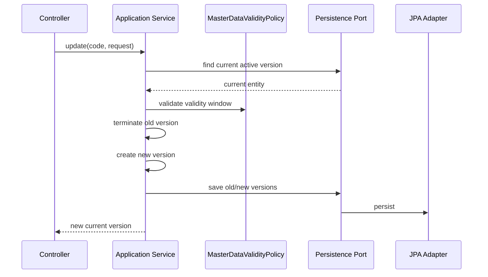
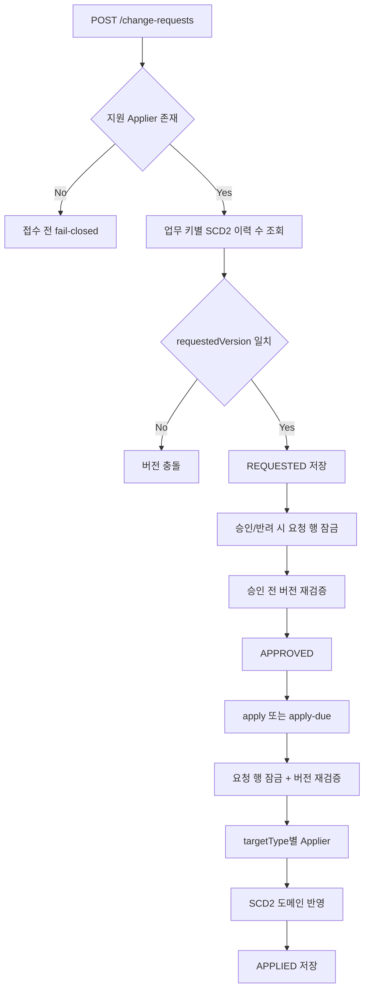
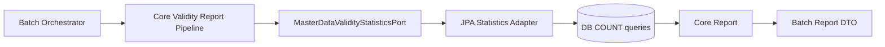

# master-data process flow

## API 입구

| 컨트롤러 | 경로 | 역할 |
| --- | --- | --- |
| `AccountSubjectController` | `/api/basic/account-subjects` | 계정과목 생성, 조회, SCD2 수정, 종료 |
| `DepartmentController` | `/api/basic/departments` | 부서 조회, 활성 부서 조회, 생성 |
| `BusinessPartnerController` | `/api/basic/businesspartners` | 거래처 생성, 조회, 검색, SCD2 수정, 종료 |
| `ProductController` | `/api/basic/products` | 상품 생성, 조회, 수정, 종료 |
| `MasterDataChangeRequestController` | `/api/master-data/change-requests` | 변경 요청, 승인, 반려, 반영 |

## 기준정보 SCD2 수정 흐름

기존 값을 직접 덮어쓰지 않고 이전 버전을 종료한 뒤 새 버전을 만듭니다. 그래서 과거 전표와 보고서는 과거 기준정보를 다시 조회할 수 있습니다.

## 변경 요청 승인 흐름

`MasterDataChangeApplierRegistry`는 한 targetType을 정확히 한 typed applier에 연결합니다. 담당 전략이 없으면 요청을 저장하기 전에 실패하고, 같은 유형을 두 전략이 담당하면 애플리케이션 시작 시 실패합니다. 현재 `ACCOUNT_SUBJECT`, `BUSINESS_PARTNER`, `DEPARTMENT`, `PRODUCT`를 지원합니다.

Governance 승인 ID를 `sourceReference`로 전달하면 같은 승인 재시도는 기존 변경 요청을 재사용합니다.
같은 sourceReference에 다른 target/payload가 들어오면 409로 차단하고, 실제 반영 완료 시각은
`appliedAt`에 기록합니다. 이는 외부 승인 성공 응답이 유실되어도 요청을 새로 만들지 않기 위한 계보입니다.
`requestedVersion`은 임의 숫자가 아니라 업무 키별 SCD2 목표 순번입니다.

| 변경 유형 | 요청 버전 | 이유 |
| --- | --- | --- |
| `CREATE` | `1` | 이력이 없는 업무 키의 첫 행을 생성합니다. |
| `UPDATE` | 현재 저장된 이력 수 + 1 | 이전 행을 종료하고 신규 SCD2 행을 추가합니다. |
| `DEACTIVATE` | 현재 저장된 이력 수 | 신규 행 없이 현재 행의 종료일만 바꿉니다. |

요청을 저장한 뒤 승인이나 시행일까지 다른 변경이 먼저 반영될 수 있으므로 요청, 승인, 반영 직전에 같은 정책을 반복 확인합니다. 승인/반려/반영은 `PESSIMISTIC_WRITE`로 요청 행을 직렬화하고, JPA `lockVersion`으로 예상하지 못한 동시 갱신도 감지합니다.

CREATE/UPDATE payload의 업무 코드는 승인 대상 `targetKey`와 같아야 합니다. DEACTIVATE는 변경 필드가 없으므로 payload를 요구하지 않고 승인된 `effectiveDate`를 종료일로 사용합니다. 실제 typed applier와 도메인 서비스가 성공한 뒤에만 `APPLIED`가 됩니다.

예약 반영인 `/apply-due`는 `findAll()` 후 메모리 필터를 하지 않습니다. `status=APPROVED`, `effectiveDate <= today` 조건으로 최대 500건씩 조회합니다. 현재 한 chunk가 하나의 트랜잭션이므로 운영 대량 처리에서는 요청별 `REQUIRES_NEW`와 DB `SKIP LOCKED` 파티셔닝이 다음 단계입니다.

## 타 모듈 조회 흐름

업무 모듈은 `master-data` JPA 엔티티를 직접 참조하지 않습니다. 코드나 ID만 저장하고, 상세 이름/속성은 포트 또는 API로 조회합니다.

## 일일 유효성 보고 흐름

core pipeline은 batch DTO를 참조하지 않습니다. 기준일 `asOfDate`가 없으면 현재 날짜로 조용히 대체하지 않고 실패합니다. 네 기준정보의 전체 행을 Java 메모리에 올리지 않고 DB 집계 쿼리로 활성 건수만 가져옵니다.

## 현재 고도화 후보

- `CURRENCY`, `EXCHANGE_RATE`, `FISCAL_PERIOD`는 도메인 서비스, 영속성 포트, 버전 조회, typed applier를 함께 구현하기 전까지 요청 접수부터 fail-closed 됩니다.
- 같은 업무 키의 동시 요청 접수는 조회와 저장 사이 경쟁이 남아 있습니다. 다중 노드 운영 전 업무 키 잠금 테이블 또는 PostgreSQL advisory lock 어댑터가 필요합니다.
- 같은 sourceReference의 동시 최초 저장은 DB unique index가 중복 행을 막지만 한 요청이 충돌 예외를 받을 수 있습니다. 충돌 후 기존 요청을 재조회·검증하는 원자적 멱등 저장 포트가 필요합니다.
- `/apply-due`는 최대 500건을 제한하지만 한 트랜잭션입니다. 요청별 재시작성과 병렬 처리를 위해 `REQUIRES_NEW` 실행기, `SKIP LOCKED`, 성공/실패 실행 이력 포트를 추가해야 합니다.
- 계정과목/부서/거래처/상품의 직접 쓰기 API가 승인 API와 공존합니다. 운영 권한 정책에서 관리자 보정 전용으로 제한하거나 모든 일반 변경을 승인 흐름으로 통합해야 합니다.
- `batch.application`은 현재 패키지 수준 orchestrator이며 독립 Spring Batch Job/Step 실행 모듈은 아닙니다. 운영 배치가 필요하면 별도 `master-data:batch` 실행 모듈과 결과 저장/모니터링 포트를 추가해야 합니다.
