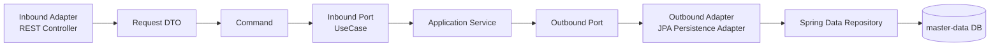
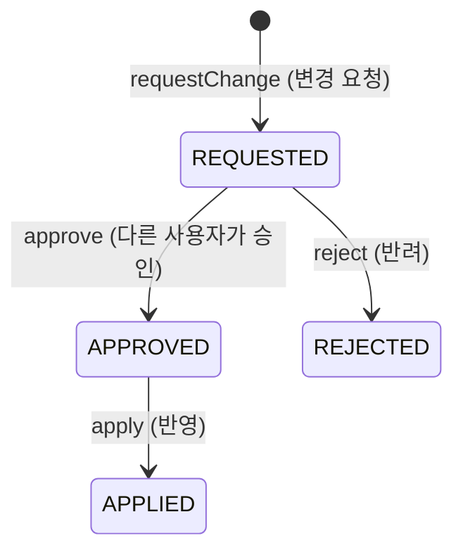
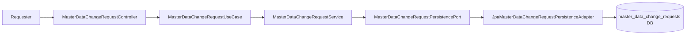

# master-data 프로세스 흐름 (Process Flow)

## 표준 기준정보 요청 (헥사고날 아키텍처 기반)



Application Service는 트랜잭션과 유스케이스 흐름을 조율합니다. Spring Data Repository(DB 구현체)를 직접 호출하지 않고 반드시 Outbound Port 인터페이스를 통해 통신합니다.

## 변경 요청 흐름 (Change Request Flow)





중요 규칙:
- 요청자와 승인자는 반드시 다른 사용자여야 합니다.
- `REQUESTED` 상태의 요청만 승인하거나 반려할 수 있습니다.
- `APPROVED` 상태의 요청만 시스템에 반영(apply)할 수 있습니다.
- `apply-due` 배치는 승인되었으면서 적용 일자(effective date)가 도래한 건들만 반영합니다.
- 멀티 스테이지 Docker 환경에서는 각 배치가 독립적인 컨테이너에서 스케줄링되어 실행될 수 있습니다.

## 타 모듈 참조 흐름 (ID 기반 참조)

```mermaid
flowchart LR
    A[journal-ledger] --> D[MasterDataQueryPort (REST/gRPC)]
    B[closing] --> D
    C[other modules] --> D
    D --> E[Inbound Adapter\nMaster Data API]
    E --> F[Application Service]
    F --> G[Outbound Port]
    G --> H[(master-data DB)]
```

**핵심 원칙:** `journal-ledger` 등 다른 모듈은 `master-data`의 JPA 엔티티나 테이블을 직접 참조(Direct Reference)해서는 안 됩니다. 데이터베이스의 외래키(FK) 대신 ID(`code` 등)를 문자열로 저장하고, 필요 시 API 통신(Port)을 통해 데이터를 조회(ID-based Reference)합니다.