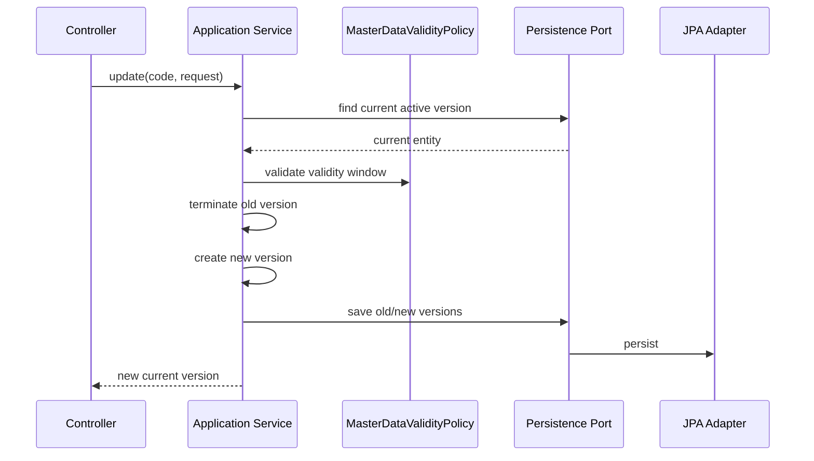
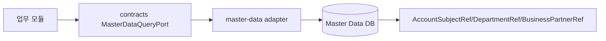

# master-data process flow

## API 입구

| 컨트롤러 | 경로 | 역할 |
| --- | --- | --- |
| `AccountSubjectController` | `/api/basic/account-subjects` | 계정과목 생성, 조회, SCD2 수정, 종료 |
| `DepartmentController` | `/api/basic/departments` | 부서 조회, 활성 부서 조회, 생성 |
| `BusinessPartnerController` | `/api/basic/businesspartners` | 거래처 생성, 조회, 검색, SCD2 수정, 종료 |
| `ProductController` | `/api/basic/products` | 상품 생성, 조회, 수정, 종료 |
| `MasterDataChangeRequestController` | `/api/master-data/change-requests` | 변경 요청, 승인, 반려, 반영 |

## 기준정보 SCD2 수정 흐름



기존 값을 직접 덮어쓰지 않고 이전 버전을 종료한 뒤 새 버전을 만듭니다. 그래서 과거 전표와 보고서는 과거 기준정보를 다시 조회할 수 있습니다.

## 변경 요청 승인 흐름

```mermaid
flowchart TD
    A[POST /change-requests] --> B[REQUESTED 저장]
    B --> C[GET /pending]
    C --> D[POST /{id}/approve]
    D --> E[APPROVED]
    E --> F[POST /{id}/apply 또는 /apply-due]
    F --> G[APPLIED]
```

현재 `MasterDataChangeRequestService.applyApprovedChange`는 승인 요청 상태를 `APPLIED`로 바꾸는 기본 흐름입니다. 실제 targetType별 SCD2 도메인 반영까지 한 트랜잭션으로 묶는 작업은 코드에 `@todo`로 남겼습니다.

## 타 모듈 조회 흐름



업무 모듈은 `master-data` JPA 엔티티를 직접 참조하지 않습니다. 코드나 ID만 저장하고, 상세 이름/속성은 포트 또는 API로 조회합니다.

## 현재 고도화 후보

- 변경 요청 반영은 targetType별 도메인 applier를 호출해야 합니다. 현재 코드는 상태 변경 중심이라 코드에 `@todo`를 남겼습니다.
- 예약 반영은 `findAll()` 후 메모리 필터가 아니라 `status`와 `effectiveDate` 조건 조회 및 chunk 처리로 전환해야 합니다.
