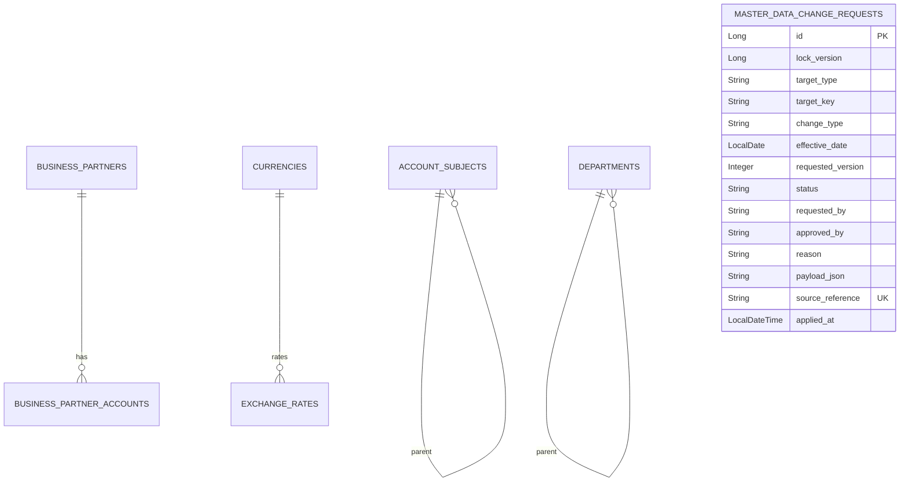

# master-data schema

## 핵심 모델

## SCD2 공통 필드

| 필드 | 의미 |
| --- | --- |
| `id` | 각 이력 행을 구분하는 기술 기본키. 업무 코드는 SCD2 때문에 unique가 아닙니다. |
| `validFrom` | 해당 버전이 유효해지는 시작일. |
| `validTo` | 해당 버전이 끝나는 일자. 종료되지 않은 행은 보통 `9999-12-31`입니다. |
| `auditUser` | 마지막 변경자. 현재 일부 엔티티는 기본값을 사용하므로 사용자 전파 고도화가 필요합니다. |
| 활성 여부 | 별도 `isCurrent` 컬럼이 아니라 `validFrom <= 기준일 <= validTo`로 계산합니다. |

SCD2 테이블은 업무 식별 코드와 유효 기간이 함께 중요합니다. `account_subjects`, `business_partners`, `departments`, `products`에는 업무 코드와 유효 기간을 앞부분으로 하는 인덱스가 있어 기준일 조회와 버전 개수 집계를 지원합니다. 단순히 업무 코드만 unique로 묶으면 과거 버전을 보존할 수 없습니다.

활성 계정과목/상품 목록과 거래처 검색은 이 기간 조건을 DB query에서 처리합니다. 거래처는
legacy `useYn=true`도 함께 확인합니다. 단건 통화/거래처 조회는 중복 기간이 있으면 한 행을
임의 선택하지 않고 실패합니다. PostgreSQL V9는 네 지원 유형의 저장 단계에서도 모든 이력의 기간 중첩을 거부합니다.

## 거래처 도메인과 JPA 스키마 매핑

| 업무 모델 | 저장 모델 | 테이블 |
| --- | --- | --- |
| `BusinessPartner` | `BusinessPartnerJpaEntity` | `business_partners` |
| `BusinessPartnerAccount` | `BusinessPartnerAccountJpaEntity` | `business_partner_accounts` |

도메인 클래스에는 `@Entity`, `@Table`, `@OneToMany` 같은 JPA annotation이 없습니다.
`JpaBusinessPartnerPersistenceAdapter`가 ID, 코드, 유형, 등록번호, 유효기간, 감사 필드와
계좌 목록을 양방향으로 전부 매핑합니다. JPA 모델은 기존 테이블명, 컬럼명, 인덱스,
`business_partner_id` 외래키와 orphan removal 의미를 유지하므로 이번 리팩터링에는 migration이
필요하지 않습니다. 도메인 계좌 목록은 방어적으로 복사되고 대표 계좌는 최대 한 개만 허용됩니다.
SCD2 새 거래처 버전은 계좌의 은행·번호·예금주·SWIFT·대표 여부를 복제하되 계좌 PK는 비워
새 행으로 저장합니다. 기존 자식 PK를 새 부모에 재사용해 과거 FK를 이동시키지 않습니다.

## 환율과 회계기간

| 모델 | 핵심 제약/조회 |
| --- | --- |
| `exchange_rates` | `(from_currency_code, to_currency_code, effective_date)` unique. 요청일 이하 중 최신 날짜 1건을 조회합니다. rate는 양수입니다. |
| `fiscal_periods` | `(fiscal_year, fiscal_period)` unique. Closing 상태 변경은 대상 행 비관적 잠금과 도메인 전이를 사용합니다. |

`FiscalPeriod`는 `OPEN -> CLOSED -> PERMANENTLY_CLOSED` 순서를 지키며, `CLOSED -> OPEN`은
승인된 재오픈 흐름에서만 호출됩니다. 영구 마감은 terminal 상태입니다.

## 변경 요청 상태

| 상태 | 의미 |
| --- | --- |
| `REQUESTED` | 지원 전략과 목표 SCD2 버전을 확인한 변경 요청이 접수됨. |
| `APPROVED` | 분리된 승인자가 결정했고 `effectiveDate` 도래 후 반영 가능함. |
| `REJECTED` | 승인자가 사유와 함께 반려함. 작성자는 자기 요청을 승인하거나 반려할 수 없음. |
| `APPLIED` | typed applier의 실제 SCD2 변경과 요청 상태 저장이 같은 트랜잭션에서 성공함. |

## 외부 승인 멱등성과 계보

`sourceReference`는 Governance 승인 ID처럼 재시도해도 바뀌지 않는 외부 업무 식별자입니다. 같은
식별자와 같은 명령이 다시 오면 기존 요청을 반환하고, 같은 식별자를 다른 target/payload에 재사용하면
409 충돌로 차단합니다. `appliedAt`은 typed applier가 성공한 뒤 `APPLIED`로 전환된 시각을 보존합니다.

DB unique index는 중복 행을 막지만, 두 노드가 동시에 최초 요청을 넣는 경우 한쪽 unique 충돌을 기존
요청 조회로 복구하는 원자적 저장 포트는 아직 TODO입니다.
## 두 종류의 버전

`requestedVersion`과 `lockVersion`은 목적이 다릅니다.

| 버전 | 소유 계층 | 역할 |
| --- | --- | --- |
| `requestedVersion` | 업무/도메인 정책 | 업무 키별 SCD2 목표 순번. CREATE=1, UPDATE=저장 이력 수+1, DEACTIVATE=저장 이력 수입니다. |
| `lockVersion` | JPA 어댑터 | 같은 변경 요청 행의 동시 갱신을 감지하는 낙관적 잠금 값입니다. 클라이언트가 정하지 않습니다. |

승인과 반영은 업무 키를 먼저 잠근 뒤 요청 행을 `PESSIMISTIC_WRITE`로 잠그고 최신 상태를 읽습니다. `lockVersion`도 유지합니다. 이 잠금은 네 지원 유형의 직접 쓰기와 공유하며 버전 검사를 트랜잭션 잠금 안에서 수행합니다.

## Flyway

- `V2__master_data_change_requests.sql`: 변경 요청 테이블과 상태/업무 키 조회 인덱스를 만듭니다.
- `V3__master_data_change_request_lock_version.sql`: 기존 요청 데이터에 기본값 0을 적용하며 `lock_version`을 추가합니다.
- `V4__master_data_change_request_payload_text.sql`: 적용 이력이 있는 V2를 수정하지 않고 `payload_json`을 `TEXT`로 보정합니다. 현재 V2의 실제 SQL은 `TEXT`이며 이 작업은 V1–V7을 수정하지 않습니다. PostgreSQL clean/upgrade 경로는 합성 DB 회귀로 검증합니다.
- `V5__master_data_change_request_lineage.sql`: Governance 재시도 멱등 키 `source_reference`, 실제 반영 시각 `applied_at`, source reference unique index를 추가합니다.
- `V6__master_data_postgresql_baseline.sql`: 적용 이력이 있는 V1-V5를 수정하지 않고 나머지
  9개 JPA 소유 테이블과 변경 요청 제약, 정밀도, FK, unique/check/index를 forward-only로
  완성합니다. clean H2 PostgreSQL mode와 V5→V6 upgrade 경로를 모두 검증합니다.
- 운영 완료 판정은 승인된 PostgreSQL에서 clean/upgrade migrate+validate, API/Batch JPA
  validate 부팅, runtime role의 DDL 거부를 확인하는 것입니다. 적용된 migration은 수정하거나
  `repair`하지 않고 새 forward migration으로 보정합니다.

## 업무 키 잠금과 기간 제약 (GH-753)

`V8__master_data_business_key_lock_and_validity.sql`은
`master_data_business_key_locks(target_type VARCHAR(40), target_key VARCHAR(100))` 복합 PK와
네 SCD2 테이블의 `valid_from <= valid_to` CHECK를 추가합니다. 키 행은 성공한 트랜잭션
이후에도 보존합니다. 업무 행이 아직 없는 CREATE도 같은 행을 잠그므로 다중 서버에서도
동일한 직렬화 지점을 사용합니다. 실행 중 잠금 행을 지우면 서로 다른 잠금 소유자가 생길 수
있으므로 삭제하지 않습니다. 서로 다른 키는 별도 행을 사용합니다.

`V9__master_data_scd2_non_overlap.sql`은 PostgreSQL 전용입니다. 네 테이블을 일정한 순서로
`ACCESS EXCLUSIVE` 잠근 뒤 기존 중첩을 검사하고, `btree_gist` 확장과 GiST exclusion을
추가합니다. 기존 B-tree 업무 키/날짜 인덱스는 조회/COUNT 용도로 유지합니다.

| 테이블 | 업무 키 | 유효기간 CHECK | 중첩 exclusion |
| --- | --- | --- | --- |
| account_subjects | code | ck_account_subjects_validity | ex_account_subjects_no_overlap |
| business_partners | business_partner_code | ck_business_partners_validity | ex_business_partners_no_overlap |
| departments | code | ck_departments_validity | ex_departments_no_overlap |
| products | product_code | ck_products_validity | ex_products_no_overlap |

각 exclusion은 `(업무 키 WITH =, daterange(valid_from, valid_to, '[]') WITH &&)`입니다.
예를 들어1월1일–1월31일과2월1일–2월28일은 허용되지만, 두 구간이1월31일을 공유하면
거부됩니다. 하루짜리 구간과 `9999-12-31` 종료일은 허용됩니다. `use_yn=false`와 과거
종료 이력도 제외하지 않습니다. 직접 SQL 쓰기가 애플리케이션 잠금을 따르지 않더라도
DB가 중첩을 차단합니다. SQL만 사용하는 도구가 승인 버전 정책까지 자동 준수하는 것은 아닙니다.

UPDATE는 기존 종료행을 flush한 뒤 새 버전을 INSERT합니다. 즉시 exclusion 검사가 정상
분할의 중간 상태를 겹침으로 오인하지 않기 위함이며 둘은 같은 트랜잭션으로 롤백됩니다.
ID 기반 거래처/상품 쓰기는 스칼라 업무 키 → 잠금 → 수정용 조회 순서로 진행합니다.
네 유형의 수정용 조회는 선택한 엔티티를 DB에서 refresh하여 외부 트랜잭션이 미리 읽은
JPA 캐시도 새 상태로 교체합니다. 승인 applier의 기간 확인도 같은 수정용 조회를 사용합니다.
전체 영속성 컨텍스트를 지우지 않으므로 다른 요청의 미반영 변경은 버리지 않습니다. 직접 CREATE도 이미 과거/미래 이력이 있는 키를409로 거부합니다.

HTTP는 정확한 테이블·제약 이름과 PostgreSQL SQLSTATE `23P01`(exclusion), `23514`(위
유효기간 CHECK)가 일치할 때만409를 반환합니다. 변경 요청 경로의 잘못된 payload 날짜는400이며,
직접 쓰기는 기존 컨트롤러별 입력 오류 매핑을 유지합니다. 관련 없는 NOT NULL/FK/CHECK/unique
오류는500으로 유지하고 SQL·행 값은 응답하지 않습니다.

### 기존 데이터 보정과 배포

1. 합성 복제본/승인된 별도 검증 경로에서 네 테이블의 역전 기간과 같은 키의 중첩을 먼저
   확인합니다. 중첩은 시작일 순의 **이전 모든 종료일 최대값**과 비교해야 긴 구간 안에
   들어간 짧은 이력도 찾습니다. 검토 기록에 실제 키/민감 필드를 노출하지 않습니다.
2. 역전 기간이면 V8, 중첩이면 V9가 실패합니다. PostgreSQL에서 해당 migration은
   트랜잭션 롤백되고 데이터는 수정되지 않습니다. V8 성공 후 V9 실패 시 V8은 남습니다.
3. 데이터 소유자가 실제 시행일, 전표/참조 FK와 승인 계보를 확인하여 별도 보정안을
   승인해야 합니다. 임의 삭제, 모든 이력의 일괄 축소, constraint 비활성화, Flyway repair는
   해결책이 아닙니다. 이 Issue는 운영 데이터 보정을 실행하지 않습니다.
4. 보정 후 같은 forward migration을 다시 실행합니다. 배포 migration 계정에는 테이블
   변경과 `btree_gist` 설치 권한이 필요합니다. 확장은 `public`에 두며 다른 schema에 이미
   설치돼 있으면 자동 이동하지 않고 검토를 요구합니다. runtime 계정은 잠금 테이블에
   SELECT/INSERT/UPDATE 권한이 필요합니다.
5. V9의 테이블 잠금과 GiST 구축은 데이터 크기에 비례해 쓰기를 막습니다. 검토된 배포
   창에서 수행하고, 큰 데이터의 실행계획/처리량은 별도로 확인합니다.

두 migration은 기존 release runner가 복사하는 같은 SQL 디렉터리에 있어 타 모듈 수정이
필요 없습니다. H2 local은 target8로 멈추므로 기간 CHECK/잠금은 검증하지만 exclusion
증거는 아닙니다. PostgreSQL 환경에는 H2 target8을 적용하지 않습니다.

Rollback은 Issue 코드의 검토된 revert와 **새 forward schema correction**으로 합니다.
이전 코드는 기간 종료 UPDATE를 flush하지 않을 수 있으므로 코드만 롤백하면 정상 UPDATE가
기존 exclusion에 거부될 수 있습니다. 코드/스키마 호환성을 함께 검토하고 이력은 보존합니다.

## 포트와 어댑터

- `AccountSubjectPersistencePort`, `DepartmentPersistencePort`, `BusinessPartnerPersistencePort`, `ProductPersistencePort`: 애플리케이션 서비스가 저장소 세부 구현을 모르게 하는 출력 포트. 거래처 포트는 현재 버전뿐 아니라 명시적 기준일 버전 조회도 domain 타입으로 제공한다.
- `MasterDataBusinessKeyLockPort`: 현재 트랜잭션 종료까지 정확한 업무 키 잠금을 유지하는 포트. JDBC 구현은 JPA와 같은 연결에서 PostgreSQL upsert/H2 merge 뒤 행 잠금을 수행합니다.
- `MasterDataVersionQueryPort`: targetType/targetKey별 저장된 SCD2 이력 수를 조회하는 출력 포트.
- `JpaMasterDataVersionQueryAdapter`: targetType을 실제 Repository `COUNT` 메서드에 연결하는 JPA 어댑터.
- `MasterDataQueryPort`: 다른 모듈이 기준일 기준정보를 이름표 DTO로 조회하는 계약.
- `FiscalPeriodPersistencePort`: 외부 Closing 계약 어댑터가 JPA Repository를 직접 호출하지 않고 조회/잠금/저장을 요청하는 출력 포트.
- JPA 어댑터와 `*JpaEntity`는 `core.infrastructure.persistence` 아래에 두고 core application/domain은 Spring Data와 JPA annotation을 직접 참조하지 않습니다.
