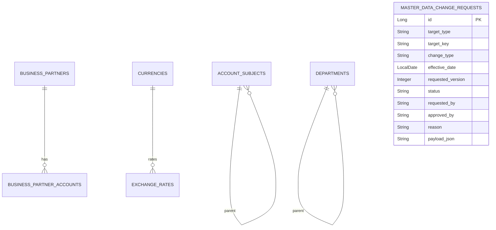

# master-data schema

## 핵심 모델

## SCD2 공통 필드

| 필드 | 의미 |
| --- | --- |
| `validFrom` | 해당 버전이 유효해지는 시작일 |
| `validTo` | 해당 버전이 끝나는 일자 |
| `isCurrent` | 현재 활성 버전 여부 |
| `auditUser` | 마지막 변경자 |

SCD2 테이블은 업무 식별 코드와 버전 기간이 함께 중요합니다. 그래서 단순히 `code`만 unique로 묶으면 과거 버전을 보존할 수 없습니다.

## 변경 요청 상태

| 상태 | 의미 |
| --- | --- |
| `REQUESTED` | 변경 요청 접수 |
| `APPROVED` | 승인 완료, 반영 대기 |
| `REJECTED` | 반려 |
| `APPLIED` | 실제 반영 완료로 표시 |

## 포트와 어댑터

- `AccountSubjectPersistencePort`, `DepartmentPersistencePort`, `BusinessPartnerPersistencePort`, `ProductPersistencePort`: 애플리케이션 서비스가 저장소 세부 구현을 모르게 하는 출력 포트.
- `MasterDataQueryPort`: 다른 모듈이 기준정보를 이름표 DTO로 조회하는 계약.
- JPA 어댑터는 `core.infrastructure.persistence` 아래에 둡니다.
