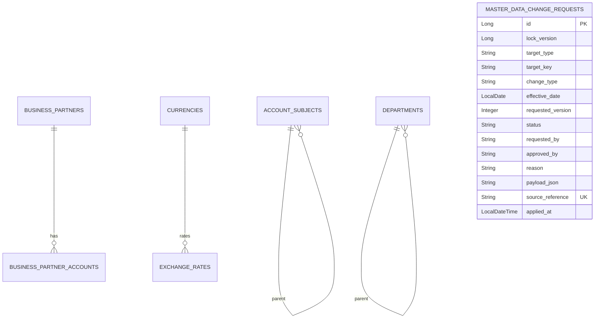

# master-data schema

## 핵심 모델

## SCD2 공통 필드

| 필드 | 의미 |
| --- | --- |
| `id` | 각 이력 행을 구분하는 기술 기본키. 업무 코드는 SCD2 때문에 unique가 아닙니다. |
| `validFrom` | 해당 버전이 유효해지는 시작일. |
| `validTo` | 해당 버전이 끝나는 일자. 종료되지 않은 행은 보통 `9999-12-31`입니다. |
| `auditUser` | 마지막 변경자. 현재 일부 엔티티는 기본값을 사용하므로 사용자 전파 고도화가 필요합니다. |
| 활성 여부 | 별도 `isCurrent` 컬럼이 아니라 `validFrom <= 기준일 <= validTo`로 계산합니다. |

SCD2 테이블은 업무 식별 코드와 유효 기간이 함께 중요합니다. `account_subjects`, `business_partners`, `departments`, `products`에는 업무 코드와 유효 기간을 앞부분으로 하는 인덱스가 있어 기준일 조회와 버전 개수 집계를 지원합니다. 단순히 업무 코드만 unique로 묶으면 과거 버전을 보존할 수 없습니다.

활성 계정과목/상품 목록과 거래처 검색은 이 기간 조건을 DB query에서 처리합니다. 거래처는
legacy `useYn=true`도 함께 확인합니다. 단건 통화/거래처 조회는 중복 기간이 있으면 한 행을
임의 선택하지 않고 실패하지만, PostgreSQL 저장 단계의 날짜 범위 exclusion constraint는 아직 필요합니다.

## 거래처 도메인과 JPA 스키마 매핑

| 업무 모델 | 저장 모델 | 테이블 |
| --- | --- | --- |
| `BusinessPartner` | `BusinessPartnerJpaEntity` | `business_partners` |
| `BusinessPartnerAccount` | `BusinessPartnerAccountJpaEntity` | `business_partner_accounts` |

도메인 클래스에는 `@Entity`, `@Table`, `@OneToMany` 같은 JPA annotation이 없습니다.
`JpaBusinessPartnerPersistenceAdapter`가 ID, 코드, 유형, 등록번호, 유효기간, 감사 필드와
계좌 목록을 양방향으로 전부 매핑합니다. JPA 모델은 기존 테이블명, 컬럼명, 인덱스,
`business_partner_id` 외래키와 orphan removal 의미를 유지하므로 이번 리팩터링에는 migration이
필요하지 않습니다. 도메인 계좌 목록은 방어적으로 복사되고 대표 계좌는 최대 한 개만 허용됩니다.
SCD2 새 거래처 버전은 계좌의 은행·번호·예금주·SWIFT·대표 여부를 복제하되 계좌 PK는 비워
새 행으로 저장합니다. 기존 자식 PK를 새 부모에 재사용해 과거 FK를 이동시키지 않습니다.

## 환율과 회계기간

| 모델 | 핵심 제약/조회 |
| --- | --- |
| `exchange_rates` | `(from_currency_code, to_currency_code, effective_date)` unique. 요청일 이하 중 최신 날짜 1건을 조회합니다. rate는 양수입니다. |
| `fiscal_periods` | `(fiscal_year, fiscal_period)` unique. Closing 상태 변경은 대상 행 비관적 잠금과 도메인 전이를 사용합니다. |

`FiscalPeriod`는 `OPEN -> CLOSED -> PERMANENTLY_CLOSED` 순서를 지키며, `CLOSED -> OPEN`은
승인된 재오픈 흐름에서만 호출됩니다. 영구 마감은 terminal 상태입니다.

## 변경 요청 상태

| 상태 | 의미 |
| --- | --- |
| `REQUESTED` | 지원 전략과 목표 SCD2 버전을 확인한 변경 요청이 접수됨. |
| `APPROVED` | 분리된 승인자가 결정했고 `effectiveDate` 도래 후 반영 가능함. |
| `REJECTED` | 승인자가 사유와 함께 반려함. 작성자는 자기 요청을 승인하거나 반려할 수 없음. |
| `APPLIED` | typed applier의 실제 SCD2 변경과 요청 상태 저장이 같은 트랜잭션에서 성공함. |

## 외부 승인 멱등성과 계보

`sourceReference`는 Governance 승인 ID처럼 재시도해도 바뀌지 않는 외부 업무 식별자입니다. 같은
식별자와 같은 명령이 다시 오면 기존 요청을 반환하고, 같은 식별자를 다른 target/payload에 재사용하면
409 충돌로 차단합니다. `appliedAt`은 typed applier가 성공한 뒤 `APPLIED`로 전환된 시각을 보존합니다.

DB unique index는 중복 행을 막지만, 두 노드가 동시에 최초 요청을 넣는 경우 한쪽 unique 충돌을 기존
요청 조회로 복구하는 원자적 저장 포트는 아직 TODO입니다.
## 두 종류의 버전

`requestedVersion`과 `lockVersion`은 목적이 다릅니다.

| 버전 | 소유 계층 | 역할 |
| --- | --- | --- |
| `requestedVersion` | 업무/도메인 정책 | 업무 키별 SCD2 목표 순번. CREATE=1, UPDATE=저장 이력 수+1, DEACTIVATE=저장 이력 수입니다. |
| `lockVersion` | JPA 어댑터 | 같은 변경 요청 행의 동시 갱신을 감지하는 낙관적 잠금 값입니다. 클라이언트가 정하지 않습니다. |

승인과 반영은 요청 행을 `PESSIMISTIC_WRITE`로 먼저 잠그고 `lockVersion`으로도 보호합니다. 그러나 서로 다른 요청 ID가 같은 업무 키로 동시에 접수되는 경쟁은 별도의 업무 키 잠금 어댑터가 필요하며 코드 TODO로 남아 있습니다.

## Flyway

- `V2__master_data_change_requests.sql`: 변경 요청 테이블과 상태/업무 키 조회 인덱스를 만듭니다.
- `V3__master_data_change_request_lock_version.sql`: 기존 요청 데이터에 기본값 0을 적용하며 `lock_version`을 추가합니다.
- `V4__master_data_change_request_payload_text.sql`: 적용 이력이 있는 V2를 수정하지 않고 `payload_json`을 `TEXT`로 보정합니다. H2 PostgreSQL 모드에서는 검증했지만, 신규 PostgreSQL은 V2의 `CLOB`보다 먼저 실행할 vendor별 baseline이 필요하므로 아직 운영 부트스트랩 완료로 보지 않습니다.
- `V5__master_data_change_request_lineage.sql`: Governance 재시도 멱등 키 `source_reference`, 실제 반영 시각 `applied_at`, source reference unique index를 추가합니다.
- 기준정보 본 테이블의 전체 운영 DDL은 아직 baseline에 없습니다. 로컬 학습 실행은 Hibernate `create-drop`을 사용하지만 운영 PostgreSQL은 전체 Flyway DDL을 완성하고 `ddl-auto=validate`로 전환해야 합니다.
- 완료 판정은 빈 PostgreSQL에서 모든 entity table/index/constraint를 Flyway만으로 만들고 `ddl-auto=validate` 부팅과 migration 통합 테스트를 통과하는 것입니다.

## 포트와 어댑터

- `AccountSubjectPersistencePort`, `DepartmentPersistencePort`, `BusinessPartnerPersistencePort`, `ProductPersistencePort`: 애플리케이션 서비스가 저장소 세부 구현을 모르게 하는 출력 포트. 거래처 포트는 현재 버전뿐 아니라 명시적 기준일 버전 조회도 domain 타입으로 제공한다.
- `MasterDataVersionQueryPort`: targetType/targetKey별 저장된 SCD2 이력 수를 조회하는 출력 포트.
- `JpaMasterDataVersionQueryAdapter`: targetType을 실제 Repository `COUNT` 메서드에 연결하는 JPA 어댑터.
- `MasterDataQueryPort`: 다른 모듈이 기준일 기준정보를 이름표 DTO로 조회하는 계약.
- `FiscalPeriodPersistencePort`: 외부 Closing 계약 어댑터가 JPA Repository를 직접 호출하지 않고 조회/잠금/저장을 요청하는 출력 포트.
- JPA 어댑터와 `*JpaEntity`는 `core.infrastructure.persistence` 아래에 두고 core application/domain은 Spring Data와 JPA annotation을 직접 참조하지 않습니다.
