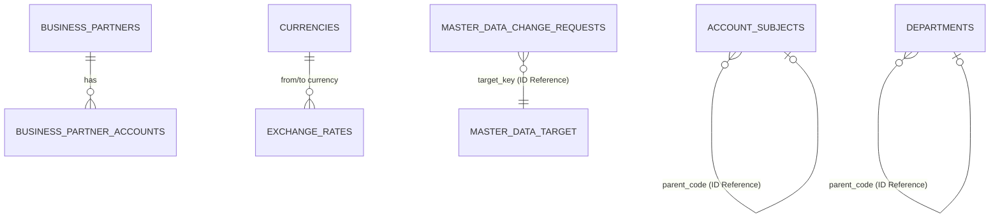

# master-data 스키마 (Schema)

## 엔티티 및 ID 기반 참조 개요

`master-data` 모듈 내에서는 JPA 연관 관계를 사용할 수 있으나, 외부 모듈은 철저히 ID(문자열/UUID)만을 저장하여 결합도를 낮춥니다. 이력 관리는 SCD2 (Slowly Changing Dimensions) 방식을 적용합니다.

## 핵심 테이블 설계 (SCD2 반영)

### `account_subjects` (계정과목)

SCD2 방식을 적용하여 `valid_from`과 `valid_to`를 통해 이력을 관리합니다.

- `code` (PK)
- `name`
- `parent_code` (상위 계정과목 ID)
- `category`
- `valid_from` (SCD2 시작일)
- `valid_to` (SCD2 종료일)

### `business_partners` (거래처)

- `id` (대리키)
- `business_partner_code` (비즈니스 키 - 외부 모듈이 참조하는 ID)
- `business_partner_name`
- `valid_from` (SCD2 적용)
- `valid_to`

### `departments` (부서)

- `code` (PK)
- `name`
- `parent_code` (상위 부서 ID)
- `valid_from`, `valid_to` (SCD2 적용)

### `master_data_change_requests` (기준정보 변경 요청)

감사 통제를 위한 메타 데이터 테이블입니다. 결합도를 낮추기 위해 다형성을 처리할 때 테이블 연관관계 대신 대상의 타입과 ID(`target_type`, `target_key`)를 문자열로 보관합니다.

- `target_type` (예: "ACCOUNT_SUBJECT")
- `target_key` (대상 엔티티의 ID 식별자)
- `status` (승인 상태)
- `payload_json` (변경 데이터 스냅샷)

멀티 스테이지 Docker 환경 구축 시 데이터베이스 마이그레이션 도구(Flyway/Liquibase)를 통해 이 스키마가 초기화됩니다.