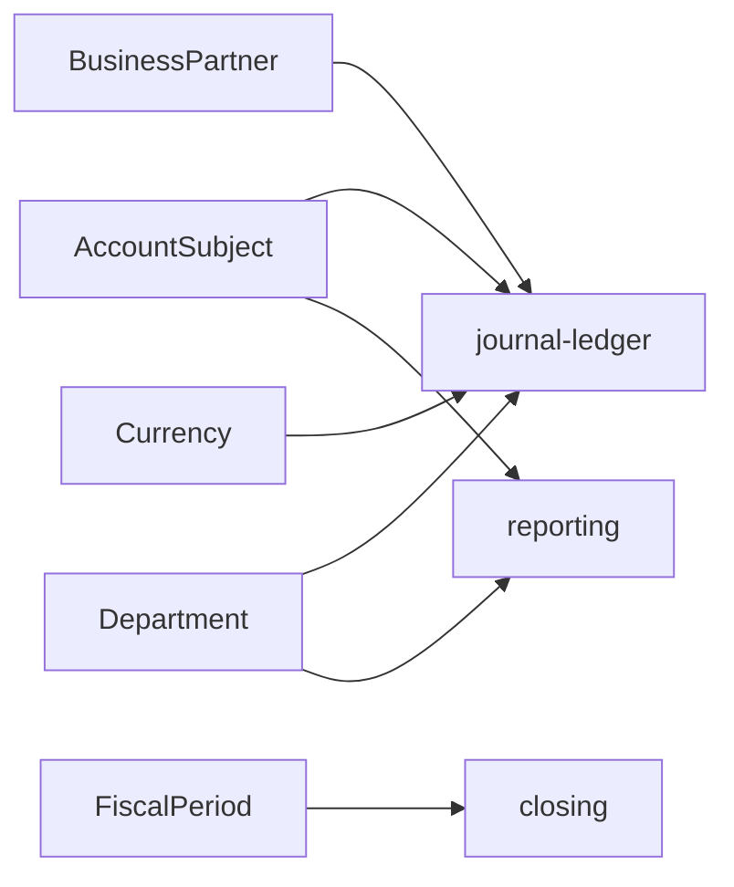

# master-data schema

## 1. 한눈에 보는 구조

```mermaid
erDiagram
    ACCOUNT_SUBJECTS }o--o| ACCOUNT_SUBJECTS : parent
    DEPARTMENTS }o--o| DEPARTMENTS : parent
    BUSINESS_PARTNERS ||--o{ BUSINESS_PARTNER_ACCOUNTS : has
    CURRENCIES ||--o{ EXCHANGE_RATES : from
    CURRENCIES ||--o{ EXCHANGE_RATES : to
    MASTER_DATA_CHANGE_REQUESTS }o--|| MASTER_DATA_TARGET : controls
```

## 2. 핵심 엔티티

### 2.1 `account_subjects`

회계 계정과목 기준 테이블이다.

주요 컬럼:

- `code`
- `name`
- `parent_code`
- `category`
- `account_type`
- `balance_type`
- `report_line`
- `regulatory_mapping_code`
- `unsettled`
- `fixed_asset`
- `valid_from`
- `valid_to`
- `audit_user`

핵심 의미:

- `unsettled = true`면 `journal-ledger` 승인 시 미결 관리 대상이 될 수 있다.
- `fixed_asset = true`면 자산 관련 도메인에서 의미를 가진다.
- `report_line`은 보고 라인 연결용이다.

### 2.2 `business_partners`

고객, 공급처, 은행 등 거래 상대방 기준 테이블이다.

주요 컬럼:

- `id`
- `business_partner_code`
- `business_partner_name`
- `registration_number`
- `ceo_name`
- `business_type`
- `business_item`
- `partner_type`
- `use_yn`
- `kyc_status`
- `risk_rating`
- `valid_from`
- `valid_to`

핵심 의미:

- `partner_type`: `CUSTOMER`, `VENDOR`, `BANK`, `OTHER_BP`
- `kyc_status`: 실명/심사 상태
- `risk_rating`: 리스크 등급

### 2.3 `business_partner_accounts`

거래처 계좌 정보 테이블이다.

주요 관계:

- N:1 `business_partners`

용도:

- 지급, 수납, 자금 처리에서 거래처 계좌 연결

### 2.4 `departments`

조직과 비용센터 기준 테이블이다.

주요 컬럼:

- `code`
- `name`
- `parent_code`
- `type`
- `valid_from`
- `valid_to`

부서 유형:

- `COST_CENTER`
- `PROFIT_CENTER`
- `SUPPORT`
- `OTHER`

### 2.5 `currencies`

통화 기준 테이블이다.

주요 컬럼:

- `currency_code`
- `currency_name`
- `symbol`
- `valid_from`
- `valid_to`

### 2.6 `exchange_rates`

환율 테이블이다.

주요 컬럼:

- `from_currency_code`
- `to_currency_code`
- `rate`
- `effective_date`

유니크 키:

- `from_currency_code + to_currency_code + effective_date`

### 2.7 `fiscal_periods`

회계연도와 회계기간 기준 테이블이다.

주요 컬럼:

- `fiscal_year`
- `fiscal_period`
- `start_date`
- `end_date`
- `closing_status`

상태값:

- `OPEN`
- `CLOSED`
- `PERMANENTLY_CLOSED`

### 2.8 `products`

상품 또는 서비스 기준 테이블이다.

주요 컬럼:

- `product_code`
- `name`
- `description`
- `unit_of_measure`
- `price`
- `product_type`
- `valid_from`
- `valid_to`

### 2.9 `master_data_change_requests`

기준정보 변경요청과 승인 이력을 저장하는 통제 테이블이다.

주요 컬럼:

- `id`
- `target_type`: `ACCOUNT_SUBJECT`, `BUSINESS_PARTNER`, `DEPARTMENT`, `PRODUCT` 등
- `target_key`: 변경 대상의 업무 키
- `change_type`: `CREATE`, `UPDATE`, `DEACTIVATE`
- `status`: `REQUESTED`, `APPROVED`, `REJECTED`, `APPLIED`
- `effective_date`: 적용 예정일
- `requested_version`: 요청 버전
- `requested_by`
- `approved_by`
- `requested_at`
- `approved_at`
- `reason`
- `payload_json`: 변경 상세 JSON

중요 인덱스:

- `status + requested_at`: 승인 대기 목록 조회
- `target_type + target_key + requested_version`: 대상별 변경 이력 추적

## 3. 데이터 활용 관점



## 4. 초보자용 해석

- `account_subjects`는 회계의 언어 사전이다.
- `business_partners`는 누구와 거래하는지 정의한다.
- `departments`는 조직과 비용 귀속 축이다.
- `currencies`와 `exchange_rates`는 다통화 회계 기반이다.
- `fiscal_periods`는 마감과 재오픈 판단의 기준점이다.
- 이 모듈이 안정적이어야 다른 모듈 검증이 흔들리지 않는다.
