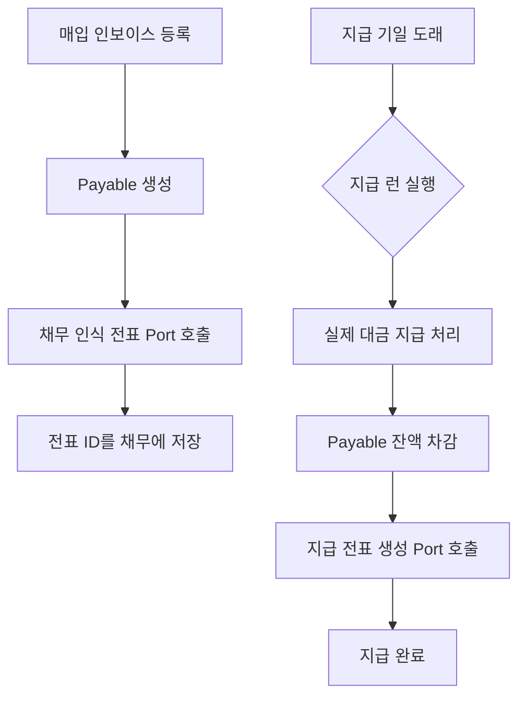
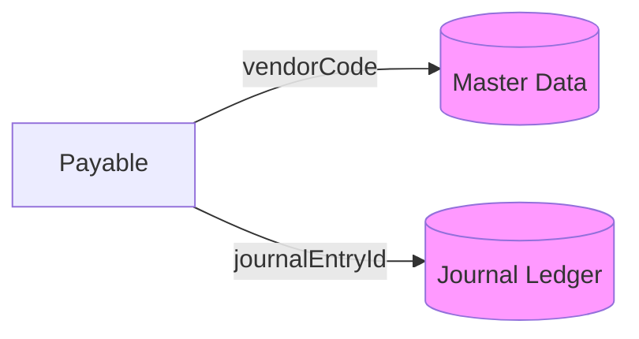
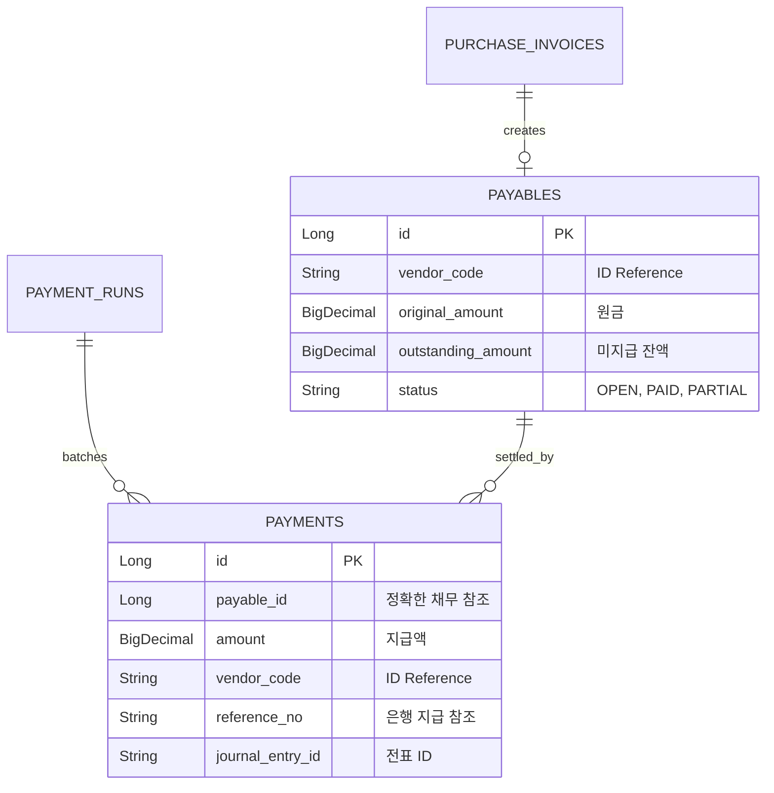

# 💸 Payable Service (매입채무 및 지급 관리)

`payable` 모듈은 회사가 물건이나 서비스를 구매하고 발생한 빚(매입채무)을 관리하며, 약속된 날짜에 대금을 지급하고 선급금을 정산하는 프로세스를 담당합니다.

---

## 1. 🐣 초보자를 위한 개념 설명 (Beginner Guide)

**매입채무(Payable)는 '물건을 먼저 받고 나중에 갚기로 한 외상값'입니다.**
1. **채무 인식:** 거래처로부터 청구서(매입 인보이스)를 받으면 "나중에 100원 갚아야 함"이라고 장부에 적습니다. (채무 생성)
2. **지급 실행:** 돈을 갚아야 하는 날이 오면 실제로 은행을 통해 송금합니다. (지급 처리)
3. **선급금(Advance Payment):** 물건을 받기 전에 계약금 조로 미리 준 돈입니다. 나중에 물건을 받으면 갚을 돈에서 미리 준 만큼 뺍니다(상계).
4. **지급 런(Payment Run):** 수많은 거래처에 줄 돈을 하나씩 처리하기 힘드니, "오늘 지급할 것들"을 한꺼번에 모아서 처리하는 일괄 작업입니다.

---

## 2. 🔄 프로세스 흐름 (Process Flow)

### 📌 매입 및 지급 통합 파이프라인
인보이스 접수부터 대금 지급, 원장 전표 기표까지의 헥사고날 아키텍처 흐름입니다.



### 📌 아키텍처 원칙: ID 기반 참조
공급업체(Vendor)나 회계 전표 정보는 직접 엔티티 연결 대신 **String ID(Code)**로 관리하여 모듈 간 독립성을 보장합니다.



---

## 3. 📊 데이터 모델 (Schema)

매입 채무와 지급 이력을 관리하기 위한 핵심 테이블 구조입니다.



---

## 4. 🐳 실행 및 연동 방법

**실행 명령:**
```bash
docker-compose up -d payable
```

**연동 주의사항:**
- 모든 지급 거래는 `journal-ledger`의 전표 생성을 동반하므로, `JournalPostingPort`의 가용성을 확인해야 합니다.
- 거래처별 지급 현황이나 Aging 분석 시 `LedgerQueryPort`를 활용하세요.
- 지급 런은 각 `Payment`에 `payableId`를 저장합니다. 실행 시 공급업체/금액으로 다시 찾지 않고 해당 채무만 차감합니다.
- 실제 송금은 `PaymentExecutionPort`를 호출하며 `PAYMENT:{paymentId}` 멱등 키를 사용합니다. 실패 시 채무는 차감하지 않고 실패 사유와 시도 횟수를 남겨 재시도할 수 있습니다.
- 거래처 조회는 `contracts`의 `MasterDataQueryPort`만 사용하므로 payable 애플리케이션 계층은 master-data 내부 저장소에 의존하지 않습니다.
