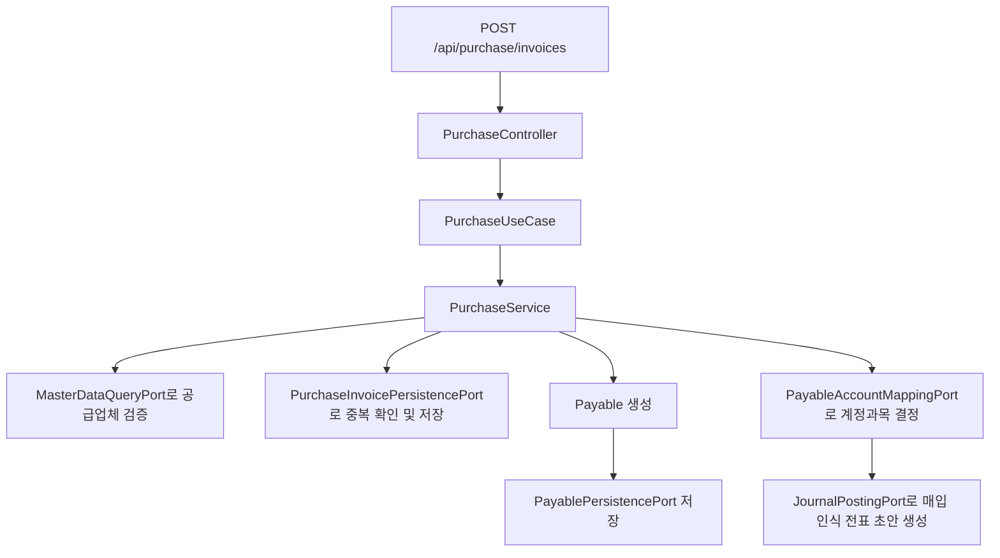
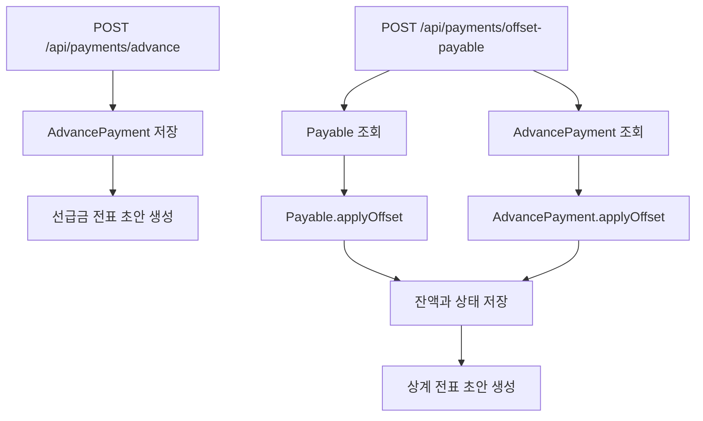

# payable process flow

## API 입구

현재 컨트롤러는 모듈 안에 있지만, `payable` 자체는 독립 실행 앱이 아니다. 아래 엔드포인트는 payable 컴포넌트를 포함하는 호스트 Spring Boot 애플리케이션에서 노출될 때 사용할 수 있다.

| 컨트롤러 | 메서드 | 경로 | 역할 |
| --- | --- | --- | --- |
| `PurchaseController` | `POST` | `/api/purchase/invoices` | 매입 인보이스를 등록하고 채무 및 매입 인식 전표를 만든다. |
| `PurchaseController` | `POST` | `/api/purchase/payables/update-status/{asOfDate}` | 기준일 이전 미지급 채무를 연체 상태로 갱신한다. |
| `PaymentController` | `POST` | `/api/payments/run` | 지급 기준일에 도래한 채무를 모아 지급 런과 지급 후보를 만든다. |
| `PaymentController` | `POST` | `/api/payments/execute` | 개별 지급을 실행하고 성공 시 채무 잔액을 차감한다. |
| `PaymentController` | `POST` | `/api/payments/advance` | 공급업체 선급금을 기록하고 전표 초안을 만든다. |
| `PaymentController` | `POST` | `/api/payments/offset-payable` | 선급금 잔액으로 채무를 상계한다. |

## 매입 인보이스 등록 흐름



핵심 정합성 포인트:

- 같은 공급업체의 같은 인보이스 번호는 중복 등록하지 않는다.
- 공급업체 코드는 `master-data`에서 검증한다.
- 매입 인식 전표에 필요한 비용, 매입부가세, 매입채무 계정이 존재해야 한다.
- 채무는 인보이스 번호와 공급업체 코드로 원천 문서를 추적한다.

## 지급 런과 지급 실행 흐름

```mermaid
flowchart TD
    A[POST /api/payments/run] --> B[PaymentService.initiatePaymentRun]
    B --> C[기준일 도래 Payable 조회]
    C --> D[Payment 생성]
    D --> E[Payment.payableId에 정확한 채무 ID 저장]
    E --> F[PaymentRun PROCESSING]

    G[POST /api/payments/execute] --> H[PaymentService.executePayment]
    H --> I{이미 COMPLETED인가?}
    I -->|예| J[기존 결과 반환]
    I -->|아니오| K[PAYMENT:{paymentId} 멱등 키 생성]
    K --> L[PaymentExecutionPort 호출]
    L -->|실패| M[Payment FAILED, 채무 미차감]
    L -->|성공| N[Payable.applyPayment]
    N --> O[Payment COMPLETED]
    O --> P[JournalPostingPort로 지급 전표 초안 생성]
```

지급 실행은 `PAYMENT:{paymentId}` 멱등 키를 사용한다. 장애 후 같은 지급을 재시도해도 로컬 어댑터는 같은 참조번호를 반환한다. 운영에서는 이 포트 자리에 은행 API 어댑터를 연결하되, 같은 멱등 키 규칙을 유지해야 한다.

## 선급금과 상계 흐름



상계는 채무와 선급금 양쪽 잔액을 동시에 줄이는 업무다. 한쪽만 바뀌면 거래처 잔액이 틀어지므로 `PaymentService`가 두 도메인 객체를 함께 조회하고 같은 트랜잭션에서 처리한다.

## 전표 유형과 차대변

| 업무 | 전표 유형 | 차변 | 대변 |
| --- | --- | --- | --- |
| 매입 인식 | `PURCHASE_RECOGNITION` | 비용, 매입부가세 | 매입채무 |
| 지급 실행 | `PAYMENT_EXECUTION` | 매입채무 | 현금/예금 |
| 선급금 지급 | `ADVANCE_PAYMENT` | 선급금 | 현금/예금 |
| 선급금 상계 | `AP_ADVANCE_OFFSET` | 매입채무 | 선급금 |

## 현재 고도화 후보

- `PaymentController`의 일부 요청은 raw `Map<String, Object>`를 사용한다. 컨트롤러 코드에 `@todo`로 남긴 것처럼 DTO와 Bean Validation으로 바꾸면 API 계약이 더 선명해진다.
- `PurchaseController`는 `PurchaseInvoice` JPA 엔티티를 요청 본문으로 직접 받는다. `receivable`의 `SalesInvoiceRequest`처럼 인바운드 DTO를 두면 웹 계약과 도메인 모델을 더 분리할 수 있다.
