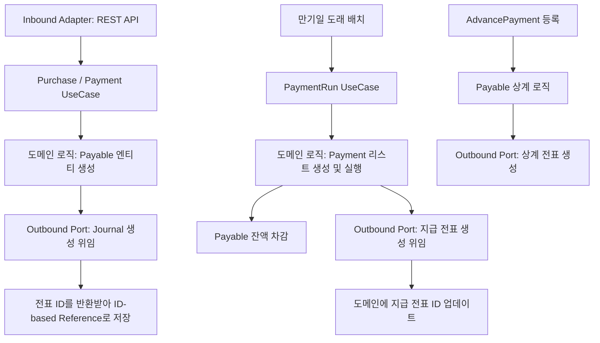

# Payable Process Flow

## 1. 이 모듈이 하는 일 (Hexagonal Architecture 중심)

`payable` 모듈은 매입 거래를 채무로 인식하고, 지급을 실행하며 선급금을 관리합니다.
도메인 핵심 로직과 외부 인프라(웹 API, DB 연결, 타 서비스 API)가 헥사고날 아키텍처 원칙에 의해 포트(Port)와 어댑터(Adapter)로 분리되어 있습니다.

## 2. 전체 흐름도

## 3. 지급 런과 지급 실행 상세 흐름

- **Port:** `InitiatePaymentRunUseCase`, `ExecutePaymentUseCase`
- **도메인 격리:** 지급 대상 거래처 및 채무 데이터를 조회할 때, 어댑터가 DB에서 도메인 엔티티로 변환하여 전달합니다.
- 여러 결제 건을 모아 처리할 때, 각 지급 건(`Payment`)의 상태 전이는 도메인 객체 내부 로직에 의해 캡슐화되어 진행됩니다.
- 지급 완료 후 회계 전표 반영은 `JournalPostingPort` 인터페이스를 통해 비동기 혹은 동기로 위임되며, 타 모듈 결합을 최소화하기 위해 전표의 식별자(ID)만 반환받아 저장합니다.

## 4. 인프라 및 아키텍처 특징

- **ID 기반 참조:** 공급업체(`vendor_code`)나 전표(`journal_entry_id`) 등 다른 모듈이 소유한 데이터는 식별자로만 참조합니다.
- **다단계 도커 (Multi-stage Docker):** 효율적인 빌드 및 실행을 위해 Multi-stage Dockerfile을 사용하여 최적화된 JRE 컨테이너 위에서 실행됩니다.
- **이력 관리 (SCD2):** 거래처 지급 조건이나 은행 계좌 정보가 변경될 수 있으므로, 과거 지급 이력에 문제가 없도록 식별자 참조와 SCD2 형태의 변경 이력 관리를 활용하여 정합성을 유지합니다.