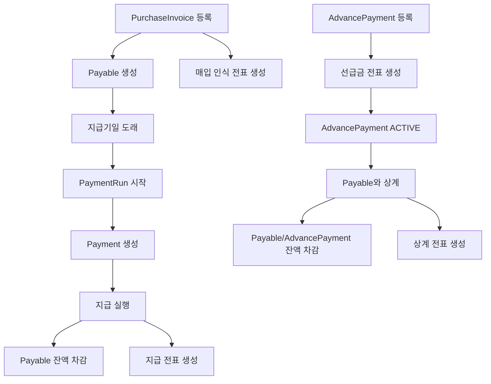

# payable process flow

## 1. 이 모듈이 하는 일

`payable`은 매입 거래를 채무로 인식하고, 실제 지급과 선급금 상계까지 연결하는 모듈이다.

핵심 책임:

- 매입 인보이스 등록
- AP 채무 오픈아이템 생성
- 지급 런 생성
- 개별 지급 실행
- 선급금 기록
- 채무와 선급금 상계
- 각 단계의 회계 전표 생성

## 2. 전체 흐름도

## 3. 매입 인보이스 인식 흐름

### 3.1 인보이스 등록

- 진입점: `POST /api/purchase/invoices`
- 서비스: `PurchaseService.createPurchaseInvoice`

처리:

1. 공급업체 존재 여부 확인
2. 거래처+인보이스번호 중복 확인
3. `PurchaseInvoice` 저장
4. `Payable` 오픈아이템 생성
5. 매입 인식 전표 생성

생성 분개:

- 차변: 비용/매입 계정 `50100`
- 차변: 부가세대급금 `13500`
- 대변: 매입채무 `21100`

## 4. 지급 런과 지급 실행 흐름

### 4.1 지급 런 생성

- 진입점: `POST /api/payments/run`
- 서비스: `PaymentService.initiatePaymentRun`

처리:

- 기준일 이전 만기 채무를 조회
- 각 채무에 대해 `Payment` 레코드 생성
- `PaymentRun` 상태를 `PROCESSING`으로 전환

### 4.2 개별 지급 실행

- 진입점: `POST /api/payments/execute`
- 서비스: `PaymentService.executePayment`

처리:

1. `Payment` 상태가 실행 가능한지 확인
2. 지급 성공 가정 로직 수행
3. 연결 가능한 `Payable` 잔액 차감
4. 상태를 `PAID` 또는 `PARTIAL_PAID`로 변경
5. 지급 전표 생성

생성 분개:

- 차변: 매입채무 `21100`
- 대변: 현금/예금 `10100`

## 5. 선급금과 상계 흐름

### 5.1 선급금 기록

- 진입점: `POST /api/payments/advance`
- 서비스: `PaymentService.recordAdvancePayment`

생성 분개:

- 차변: 선급금 `13100`
- 대변: 현금/예금 `10100`

### 5.2 선급금 상계

- 진입점: `POST /api/payments/offset-payable`
- 서비스: `PaymentService.offsetPayableWithAdvancePayment`

처리:

- 채무 잔액과 선급금 잔액을 동시에 감소
- 채무는 `PAID` 또는 `PARTIAL_PAID`
- 선급금은 `OFFSET` 또는 `ACTIVE`

생성 분개:

- 차변: 매입채무 `21100`
- 대변: 선급금 `13100`

## 6. 드릴다운 연계

- `PayableSourceDocumentProvider`가 `SourceDocumentProvider`를 구현한다
- 현재 지원하는 `lineageSourceType`은 `PURCHASE_INVOICE`, `P2P_AP`
- `lineageSourceId`에서 인보이스번호와 거래처 코드를 파싱해 원본 인보이스를 반환한다

주의:

- `PurchaseService`에서 생성하는 기본 `lineageSourceType`은 `PURCHASE_INVOICE`
- 기존 문서/연계에서 사용하던 `P2P_AP`도 호환 타입으로 유지한다

## 7. 초보자가 꼭 기억할 포인트

- 이 모듈은 채무 관리와 지급 실행을 같이 가진다.
- 각 주요 액션마다 전표를 따로 만든다.
- 상태 관리보다 중요한 것은 잔액(`outstandingAmount`) 변화다.
- 계정코드 `21100`, `10100`, `13100`, `13500`, `50100`은 현재 하드코딩된 기본 계정에 가깝다.
