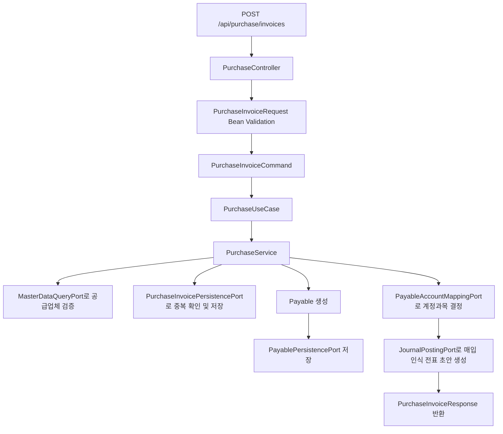
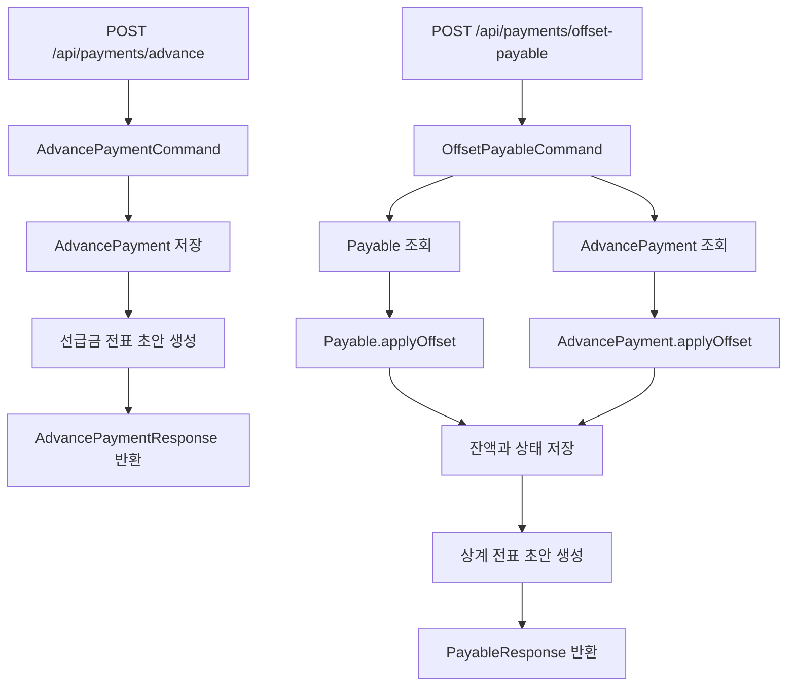

# payable process flow

## API 입구

`payable:api`가 HTTP Controller, 요청 DTO, Bean Validation, 응답 DTO를 소유한다. `payable:core`는 HTTP를 모르고 `PurchaseInvoiceCommand`, `PaymentRunCommand` 같은 유즈케이스 입력값과 업무 서비스를 소유한다.

| 컨트롤러 | 메서드 | 경로 | 역할 |
| --- | --- | --- | --- |
| `PurchaseController` | `POST` | `/api/purchase/invoices` | 매입 인보이스를 등록하고 채무 및 매입 인식 전표를 만든다. |
| `PurchaseController` | `POST` | `/api/purchase/payables/update-status/{asOfDate}` | 기준일 이전 미지급 채무를 연체 상태로 갱신한다. |
| `PaymentController` | `POST` | `/api/payments/run` | 지급 기준일에 도래한 채무를 모아 지급 런과 지급 후보를 만든다. |
| `PaymentController` | `POST` | `/api/payments/execute` | 개별 지급을 실행하고 성공 시 채무 잔액을 차감한다. |
| `PaymentController` | `POST` | `/api/payments/advance` | 공급업체 선급금을 기록하고 전표 초안을 만든다. |
| `PaymentController` | `POST` | `/api/payments/offset-payable` | 선급금 잔액으로 채무를 상계한다. |

## 매입 인보이스 등록 흐름



핵심 정합성 포인트:

- API DTO는 HTTP 입력 모양과 Bean Validation을 담당한다.
- core command는 API와 Batch가 공통으로 쓰는 업무 입력값이며, 날짜/금액/actor 정합성을 한 번 더 확인한다.
- 같은 공급업체의 같은 인보이스 번호는 중복 등록하지 않는다.
- 공급업체 코드는 `master-data`에서 검증한다.
- 매입 인식 전표에 필요한 비용, 매입부가세, 매입채무 계정이 존재해야 한다.
- 채무는 인보이스 번호와 공급업체 코드로 원천 문서를 추적한다.

## 지급 런과 지급 실행 흐름

```mermaid
flowchart TD
    A[POST /api/payments/run] --> B[PaymentRunRequest]
    B --> C[PaymentRunCommand]
    C --> D[PaymentService.initiatePaymentRun]
    D --> E[기준일 도래 Payable 조회]
    E --> F[Payment 생성]
    F --> G[Payment.payableId에 정확한 채무 ID 저장]
    G --> H[PaymentRun PROCESSING]
    H --> I[PaymentRunResponse 반환]

    J[POST /api/payments/execute] --> K[ExecutePaymentRequest]
    K --> L[ExecutePaymentCommand]
    L --> M[PaymentService.executePayment]
    M --> N{이미 COMPLETED인가?}
    N -->|예| O[기존 결과 반환]
    N -->|아니오| P[PAYMENT:{paymentId} 멱등 키 생성]
    P --> Q[PaymentExecutionPort 호출]
    Q -->|실패| R[Payment FAILED, 채무 미차감]
    Q -->|성공| S[Payable.applyPayment]
    S --> T[Payment COMPLETED]
    T --> U[JournalPostingPort로 지급 전표 초안 생성]
    U --> V[PaymentResponse 반환]
```

지급 실행은 `PAYMENT:{paymentId}` 멱등 키를 사용한다. 장애 후 같은 지급을 재시도해도 로컬 어댑터는 같은 참조번호를 반환한다. 운영에서는 이 포트 자리에 은행 API 어댑터를 연결하되, 같은 멱등 키 규칙을 유지해야 한다.

## 선급금과 상계 흐름



상계는 채무와 선급금 양쪽 잔액을 동시에 줄이는 업무다. 한쪽만 바뀌면 거래처 잔액이 틀어지므로 `PaymentService`가 두 도메인 객체를 함께 조회하고 같은 트랜잭션에서 처리한다.

## 전표 유형과 차대변

| 업무 | 전표 유형 | 차변 | 대변 |
| --- | --- | --- | --- |
| 매입 인식 | `PURCHASE_RECOGNITION` | 비용, 매입부가세 | 매입채무 |
| 지급 실행 | `PAYMENT_EXECUTION` | 매입채무 | 현금/예금 |
| 선급금 지급 | `ADVANCE_PAYMENT` | 선급금 | 현금/예금 |
| 선급금 상계 | `AP_ADVANCE_OFFSET` | 매입채무 | 선급금 |

## 경계 정리 결과

- `payable:core`는 더 이상 HTTP Controller, 요청 DTO, Bean Validation, `spring-boot-starter-web`을 소유하지 않는다.
- `payable:api`가 요청 DTO와 응답 DTO를 소유하고, core 유즈케이스에는 command만 전달한다.
- `payable:batch`도 지급런 실행 시 `PaymentRunCommand`를 사용하므로 API와 Batch가 같은 core 업무 흐름을 공유한다.
- 도메인 객체는 응답 DTO로 변환되어 외부 JSON 계약에 직접 노출되지 않는다.