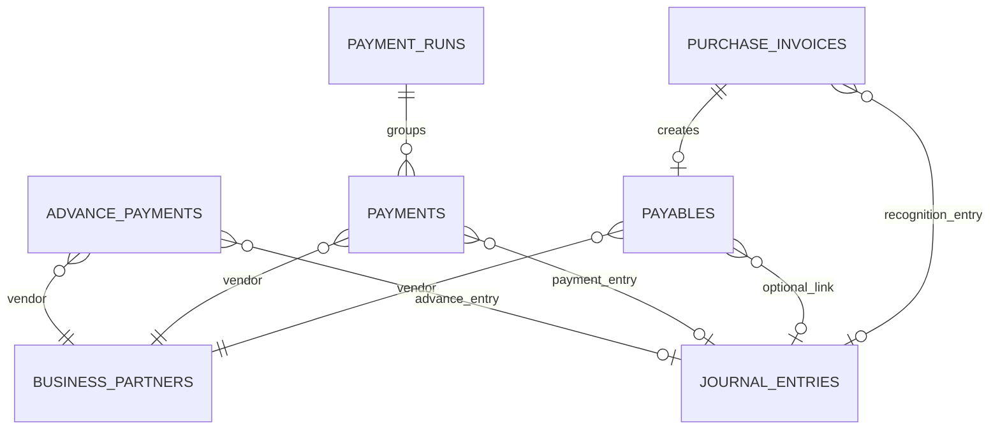
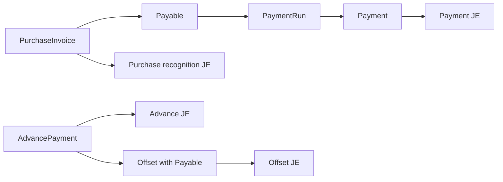

# payable schema

## 1. 한눈에 보는 구조

## 2. 핵심 엔티티

### 2.1 `purchase_invoices`

매입 인보이스 헤더다.

주요 컬럼:

- `invoice_no`
- `vendor_code`
- `issue_date`
- `due_date`
- `total_amount`
- `tax_amount`
- `net_amount`
- `status`
- `journal_entry_id`
- `description`
- `created_by`

상태값:

- `RECEIVED`
- `APPROVED`
- `PARTIAL_PAID`
- `PAID`
- `OVERDUE`

### 2.2 `payables`

매입채무 오픈아이템이다.

주요 컬럼:

- `purchase_invoice_invoice_no`
- `purchase_invoice_vendor_code`
- `vendor_code`
- `original_amount`
- `outstanding_amount`
- `due_date`
- `status`
- `journal_entry_id`

상태값:

- `OPEN`
- `PARTIAL_PAID`
- `PAID`
- `OVERDUE`

### 2.3 `payment_runs`

지급 배치 단위다.

주요 컬럼:

- `run_date`
- `description`
- `status`
- `created_by`

상태값:

- `INITIATED`
- `PROCESSING`
- `COMPLETED`
- `FAILED`

### 2.4 `payments`

실제 지급 레코드다.

주요 컬럼:

- `payment_date`
- `vendor_code`
- `amount`
- `bank_account`
- `reference_no`
- `status`
- `journal_entry_id`
- `payment_run_id`

상태값:

- `INITIATED`
- `APPROVED`
- `COMPLETED`
- `FAILED`
- `CANCELLED`

### 2.5 `advance_payments`

선급금 레코드다.

주요 컬럼:

- `vendor_code`
- `payment_date`
- `amount`
- `outstanding_amount`
- `description`
- `status`
- `journal_entry_id`

상태값:

- `ACTIVE`
- `OFFSET`
- `REFUNDED`

## 3. 데이터 흐름 관점

## 4. 초보자용 해석

- `PurchaseInvoice`는 증빙/청구서다.
- `Payable`은 아직 안 갚은 채무다.
- `PaymentRun`은 여러 지급을 묶는 배치다.
- `Payment`는 실제 지급 한 건이다.
- `AdvancePayment`는 먼저 준 돈이다.
