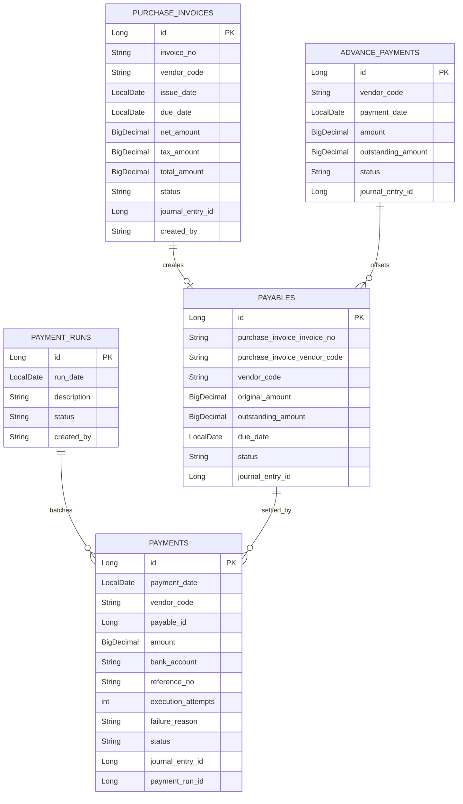

# payable schema

## 핵심 ERD

## 상태 전이

### Payable

| 상태 | 의미 | 주요 진입 조건 |
| --- | --- | --- |
| `OPEN` | 아직 지급이 시작되지 않은 채무 | 인보이스 등록 후 채무 생성 |
| `PARTIAL_PAID` | 일부 지급 또는 일부 상계 후 잔액 존재 | `Payable.applyPayment`, `Payable.applyOffset` |
| `PAID` | 잔액이 0인 채무 | 지급/상계 후 잔액 0 |
| `OVERDUE` | 지급기일이 지난 미지급 채무 | `updatePayableStatus(asOfDate)` |

### Payment

| 상태 | 의미 | 주요 진입 조건 |
| --- | --- | --- |
| `INITIATED` | 지급 후보 생성 | 지급 런 생성 |
| `APPROVED` | 지급 승인 상태 | 향후 승인 프로세스 확장 지점 |
| `FAILED` | 지급 시도 실패 | `PaymentExecutionPort` 실패 응답 |
| `COMPLETED` | 외부 지급 성공 및 채무 차감 완료 | 지급 어댑터 성공 응답 |

### AdvancePayment

| 상태 | 의미 |
| --- | --- |
| `ACTIVE` | 아직 상계 가능한 선급금 잔액이 있음 |
| `OFFSET` | 전액 상계됨 |
| `REFUNDED` | 환불 처리 확장 지점 |

## 업무 식별자와 외부 참조

- `vendorCode`: 공급업체를 가리키는 master-data 거래처 코드.
- `purchaseInvoiceNo` + `purchaseInvoiceVendorCode`: 채무가 어떤 인보이스에서 생겼는지 추적하는 원천 문서 식별자.
- `payableId`: 지급이 정확히 어떤 채무를 차감하는지 가리키는 내부 ID.
- `journalEntryId`: 원장 전표 ID. 현재 전표 초안 생성 결과와 연결할 확장 지점이다.
- `referenceNo`: 은행 지급 또는 로컬 지급 어댑터가 반환한 외부 추적 번호.

## 계정 매핑 설정

`ConfiguredPayableAccountMappingAdapter`는 아래 Spring 설정값을 사용한다. 설정이 없으면 기본값을 쓴다.

| 설정 키 | 기본값 | 사용 업무 |
| --- | --- | --- |
| `account.payable.account-mapping.purchase-expense-account-code` | `50100` | 매입 인식 비용 차변 |
| `account.payable.account-mapping.input-vat-account-code` | `13500` | 매입부가세 차변 |
| `account.payable.account-mapping.accounts-payable-account-code` | `21100` | 매입채무 대변 또는 지급/상계 차변 |
| `account.payable.account-mapping.cash-account-code` | `10100` | 지급/선급금 현금 또는 예금 대변 |
| `account.payable.account-mapping.advance-account-code` | `13100` | 선급금 차변 또는 상계 대변 |

각 계정 코드는 `MasterDataQueryPort.findAccountSubject`로 존재 여부를 확인한다. 로컬 테스트나 호스트 앱 실행 시 master-data 테스트 데이터에 위 계정이 없으면 전표 생성 단계에서 실패한다.

## API/Core 입력 경계

- 요청 DTO는 `payable:api`에 있으며 HTTP JSON 필드와 Bean Validation 메시지를 표현한다.
- core command는 `payable:core/application/port/in`에 있으며 API와 Batch가 공통으로 사용하는 업무 입력값이다.
- 응답 DTO는 API 계약을 안정화하기 위해 도메인/JPA 엔티티를 그대로 외부에 노출하지 않는다.

## 정합성 체크 포인트

- 금액 필드는 `BigDecimal`이며 도메인 메서드에서 0 이하 금액과 잔액 초과 금액을 막는다.
- 지급 성공 전에는 채무 잔액을 줄이지 않는다.
- 지급 실패는 `Payment.failureReason`과 `executionAttempts`에 남겨 재시도 판단에 사용한다.
- 같은 공급업체의 같은 인보이스 번호는 유니크 제약과 서비스 중복 검사로 보호한다.
- 지급 런은 공급업체/금액 재검색이 아니라 `payableId`로 차감 대상을 고정한다.
