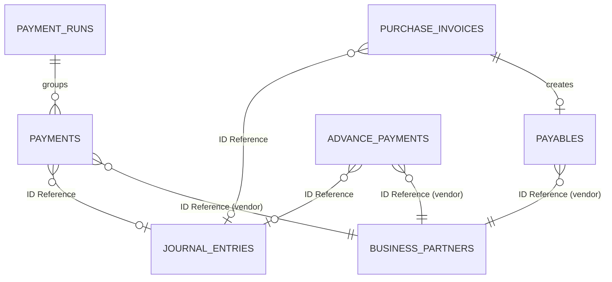

# Payable Schema

## 1. 한눈에 보는 구조 (JPA & ID-based Reference)

`payable` 모듈의 데이터베이스 스키마는 헥사고날 아키텍처에 맞추어 다른 바운디드 컨텍스트(예: 마스터 데이터, 원장)와 외래키(FK) 대신 ID 기반의 참조를 사용합니다.

## 2. 핵심 엔티티 및 SCD2 관점

### 2.1 `purchase_invoices` (매입 인보이스)
- `invoice_no` (PK)
- `vendor_code` (ID Reference)
- `issue_date`, `due_date`
- `total_amount`, `net_amount`
- `status`
- `journal_entry_id` (ID Reference)

### 2.2 `payables` (매입채무)
- `id` (PK)
- `purchase_invoice_invoice_no`
- `vendor_code` (ID Reference)
- `original_amount`, `outstanding_amount` (잔액 관리)
- `due_date`, `status`
- `journal_entry_id` (ID Reference)

### 2.3 `payment_runs` & `payments` (지급 런 및 개별 지급)
- `payment_run_id` (PK)
- `payments` 엔티티는 `payment_run_id`를 FK로 가집니다.
- 실제 지급 계좌나 조건은 과거와 달라질 수 있으므로(SCD2 고려), 당시 지급 시점의 거래처 정보 및 은행 계좌 상태를 스냅샷 혹은 이력 데이터와 연계할 수 있는 구조를 취합니다.
- `vendor_code` (ID Reference)
- `journal_entry_id` (ID Reference)

### 2.4 `advance_payments` (선급금)
- `id` (PK)
- `vendor_code` (ID Reference)
- `amount`, `outstanding_amount`
- `status`
- `journal_entry_id` (ID Reference)

## 3. 데이터 아키텍처 설계 의의

- **독립성 강화:** `vendor_code`와 `journal_entry_id`는 물리적 조인(Join) 대상이 아닙니다. 필요한 경우 아웃바운드 포트를 통해 API로 조합(Aggregation)하여 화면에 제공합니다.
- 도커라이징된 각 마이크로서비스가 독립적인 DB 스키마를 갖출 수 있는 핵심 기반이 됩니다.