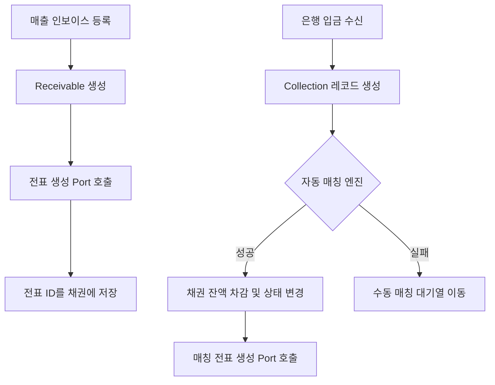
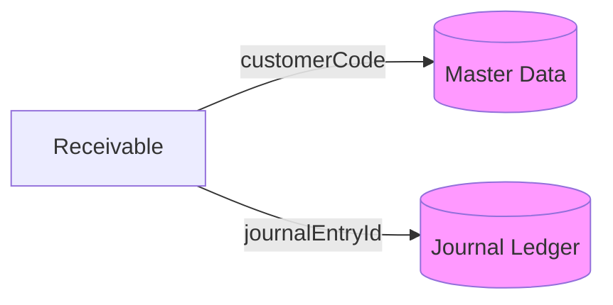
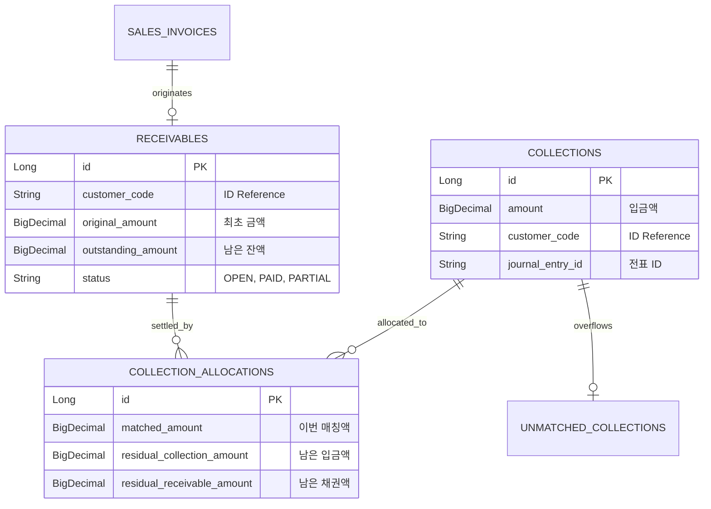

# 📈 Receivable Service (매출채권 관리)

`receivable` 모듈은 회사가 물건을 팔고 아직 받지 못한 돈(외상값)을 관리하고, 고객의 입금(수납) 내역과 짝을 맞춰 채권을 지워나가는(매칭) 프로세스를 담당합니다.

상세 문서는 [receivable/docs/README.md](./docs/README.md)에서 순서대로 읽을 수 있습니다. 기존 문서 인덱스는 삭제하지 않고 `receivable/docs/archive`에 보존했습니다.

---

## 1. 🐣 초보자를 위한 개념 설명 (Beginner Guide)

**매출채권(Receivable)은 '친구에게 물건을 팔고 수첩에 적어둔 외상 장부'와 같습니다.**
1. **매출 인식:** 청구서(인보이스)를 보내고 수첩에 "나중에 100원 받을 거 있음"이라고 적습니다. (채권 생성)
2. **수납 발생:** 친구가 내 통장에 100원을 입금합니다. (수납 레코드 생성)
3. **매칭(Matching):** 통장에 찍힌 100원이 "아, 아까 그 청구서에 대한 거네!"라고 수첩에서 선을 그어 지우는 작업입니다.
4. **미매칭(Unmatched):** 돈은 들어왔는데 누군지, 왜 보냈는지 몰라 수첩 옆에 따로 적어둔 상태입니다.

---

## 2. 🔄 프로세스 흐름 (Process Flow)

### 📌 매출 및 수납 통합 파이프라인
인보이스 발행부터 입금 매칭, 원장 전표 기표까지의 헥사고날 아키텍처 흐름입니다.



### 📌 아키텍처 원칙: ID 기반 참조
모든 외부 데이터(고객, 전표 등)는 엔티티 직접 연결 대신 **String ID(Code)**로 관리합니다.



---

## 3. 📊 데이터 모델 (Schema)

채권 관리와 입금 대조를 위한 핵심 테이블 구조입니다.



---

## 4. 로컬 실행 및 검증 방법

`receivable`은 `core/api/batch` 구조로 실행됩니다. `core`가 매출채권/수납/매칭 업무 규칙을 갖고, `api`와 `batch`는 Spring Boot 실행 진입점으로 `core`를 참조합니다.

**PowerShell 검증 명령:**

```powershell
.\gradlew :receivable:core:test --console=plain --max-workers=1 --no-daemon
```

**빠른 컴파일 확인:**

```powershell
.\gradlew :receivable:core:compileJava :receivable:api:compileJava :receivable:batch:compileJava --console=plain --max-workers=1 --no-daemon
```

**H2 local 실행:**

```powershell
.\gradlew :receivable:api:bootRun --console=plain --max-workers=1
.\gradlew :receivable:batch:bootRun --console=plain --max-workers=1
```

**실제 Spring Batch Job 실행:**

```powershell
.\gradlew :receivable:batch:bootRun --args="--spring.batch.job.enabled=true --spring.batch.job.name=receivableAutoMatchingJob" --console=plain --max-workers=1
```

**IntelliJ 실행 순서:**
1. 루트 프로젝트를 Gradle 프로젝트로 엽니다.
2. Project SDK와 Gradle JVM을 JDK 17로 맞춥니다.
3. 테스트는 `receivable > core > Tasks > verification > test`를 실행합니다.
4. API 서버는 Gradle task `:receivable:api:bootRun`, Batch 컨텍스트는 `:receivable:batch:bootRun`을 실행합니다.

**연동 주의사항:**
- 수납(Collection) 기록 시 `journal-ledger`의 전표 생성이 동반됩니다.
- 채권 연령 분석(Aging) 등 대량 조회 시 `LedgerQueryPort`를 활용하여 원장 데이터와 대조하세요.
- 자동 매칭은 참조번호를 우선하고, 만기일 허용 범위와 금액을 보조 조건으로 사용합니다. 같은 신뢰도의 후보가 여러 건이면 임의 매칭하지 않고 수동 확인 상태로 남깁니다.
- 부분 매칭은 `Collection.matchedAmount`와 `CollectionAllocation`에 누적 배분액 및 양쪽 잔액을 명시적으로 기록합니다.

## 5. 문서 읽기 순서

- [docs/beginner-guide.md](./docs/beginner-guide.md): 매출채권/수납/매칭 개념.
- [docs/process-flow.md](./docs/process-flow.md): API, 서비스, 도메인, 자동 매칭 정책, 전표 포트 흐름.
- [docs/schema.md](./docs/schema.md): 테이블, 상태, 계정 매핑 설정.
- [docs/local-run.md](./docs/local-run.md): IntelliJ와 Gradle 로컬 검증 방법.

## 프로파일과 DB 계약

- `local`: H2 PostgreSQL mode + 전용 Flyway V1 + Hibernate `validate`; Gradle `bootRun`과 실행 JAR을 모두 지원합니다.
- `dev`/`prod`: PostgreSQL + 런타임 migration/DDL 비활성화; release-time `migration-runner`가 스키마를 소유합니다. `prod`는 TLS 호스트 검증을 강제합니다.
- 실제 PostgreSQL 검증은 승인 환경에서 남아 있으며, 원격 서비스 어댑터는 Issue #264에서 추적합니다.
