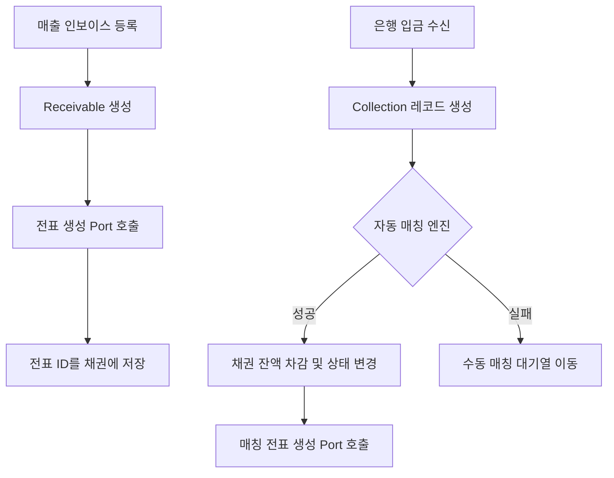
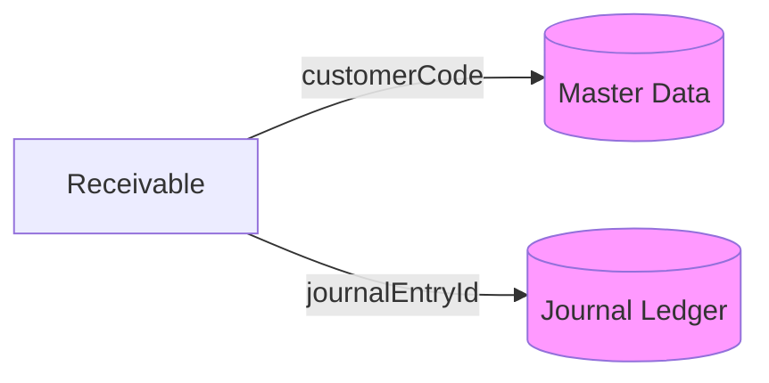
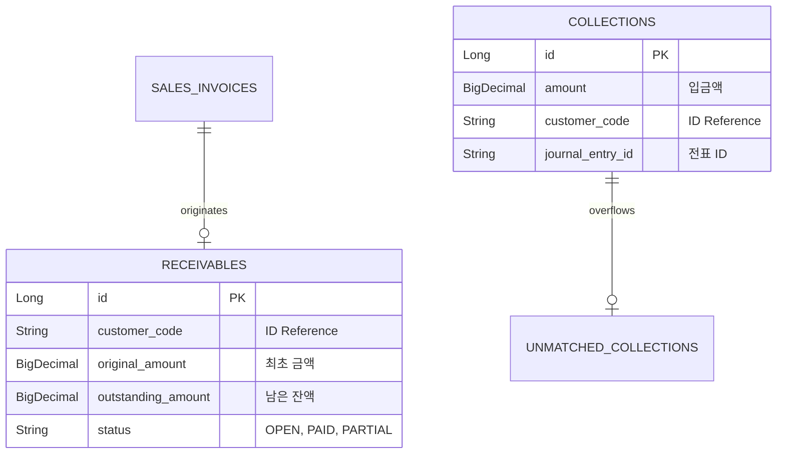

# 📈 Receivable Service (매출채권 관리)

`receivable` 모듈은 회사가 물건을 팔고 아직 받지 못한 돈(외상값)을 관리하고, 고객의 입금(수납) 내역과 짝을 맞춰 채권을 지워나가는(매칭) 프로세스를 담당합니다.

---

## 1. 🐣 초보자를 위한 개념 설명 (Beginner Guide)

**매출채권(Receivable)은 '친구에게 물건을 팔고 수첩에 적어둔 외상 장부'와 같습니다.**
1. **매출 인식:** 청구서(인보이스)를 보내고 수첩에 "나중에 100원 받을 거 있음"이라고 적습니다. (채권 생성)
2. **수납 발생:** 친구가 내 통장에 100원을 입금합니다. (수납 레코드 생성)
3. **매칭(Matching):** 통장에 찍힌 100원이 "아, 아까 그 청구서에 대한 거네!"라고 수첩에서 선을 그어 지우는 작업입니다.
4. **미매칭(Unmatched):** 돈은 들어왔는데 누군지, 왜 보냈는지 몰라 수첩 옆에 따로 적어둔 상태입니다.

---

## 2. 🔄 프로세스 흐름 (Process Flow)

### 📌 매출 및 수납 통합 파이프라인
인보이스 발행부터 입금 매칭, 원장 전표 기표까지의 헥사고날 아키텍처 흐름입니다.



### 📌 아키텍처 원칙: ID 기반 참조
모든 외부 데이터(고객, 전표 등)는 엔티티 직접 연결 대신 **String ID(Code)**로 관리합니다.



---

## 3. 📊 데이터 모델 (Schema)

채권 관리와 입금 대조를 위한 핵심 테이블 구조입니다.



---

## 4. 🐳 실행 및 연동 방법

**실행 명령:**
```bash
docker-compose up -d receivable
```

**연동 주의사항:**
- 수납(Collection) 기록 시 `journal-ledger`의 전표 생성이 동반됩니다.
- 채권 연령 분석(Aging) 등 대량 조회 시 `LedgerQueryPort`를 활용하여 원장 데이터와 대조하세요.
