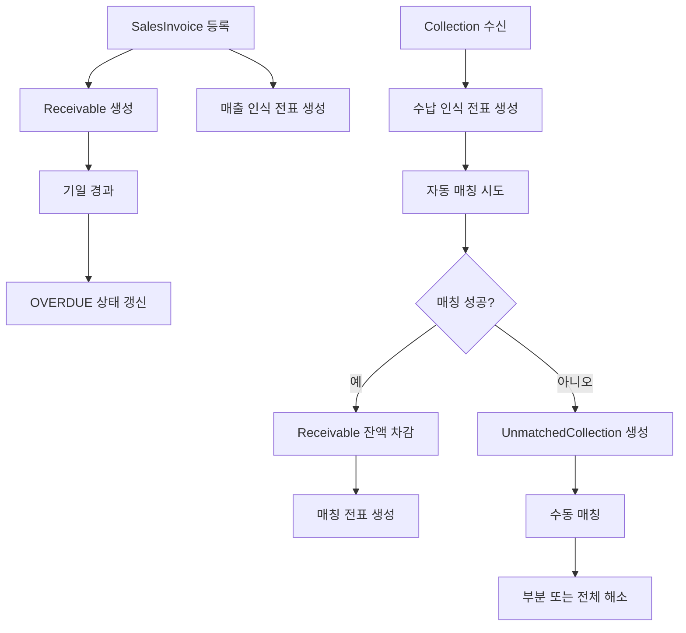

# receivable process flow

## 1. 이 모듈이 하는 일

`receivable`은 매출을 채권으로 인식하고, 돈이 들어오면 수납을 기록하고, 미수채권과 매칭하는 모듈이다.

핵심 책임:

- 매출 인보이스 등록
- 미수채권 생성
- 수납 기록
- 자동 매칭
- 수동 매칭
- 미매칭 수납 관리
- 매출/수납 관련 전표 생성

## 2. 전체 흐름도

## 3. 매출 인식 흐름

### 3.1 매출 인보이스 등록

- 진입점: `POST /api/sales/invoices`
- 서비스: `SalesService.createSalesInvoice`

처리:

1. 고객 존재 여부 확인
2. `SalesInvoice` 저장
3. 동일 금액의 `Receivable` 생성
4. 매출 인식 전표 생성

생성 분개:

- 차변: 매출채권 `11100`
- 대변: 매출 `40100`
- 대변: 부가세예수금 `22100`

## 4. 수납과 매칭 흐름

### 4.1 수납 수신

- 진입점: `POST /api/collections`
- 서비스: `CollectionService.receivePayment`

처리:

1. 고객 존재 여부 확인
2. `Collection` 저장
3. 수납 인식 전표 생성
4. 자동 매칭 시도

생성 분개:

- 차변: 현금/예금 `10100`
- 대변: AR Clearing `21100`

### 4.2 자동 매칭

- 서비스: `CollectionService.attemptAutoMatching`
- 규칙:
  - `REFERENCE_NO_EXACT`
  - `CUSTOMER_CODE`
  - `AMOUNT_EXACT`
  - `AMOUNT_FUZZY`
  - `VIRTUAL_ACCOUNT`

현재 동작:

- 우선순위가 높은 활성 규칙부터 적용
- 고객의 `OPEN` 채권을 순회하며 일치 여부 확인
- 성공 시 `processSuccessfulMatch` 실행
- 실패 시 `UnmatchedCollection` 생성

### 4.3 성공 매칭 후 처리

- `Receivable.outstandingAmount` 감소
- `Receivable` 상태를 `PAID` 또는 `PARTIAL_PAID`로 변경
- `SalesInvoice` 상태도 함께 갱신
- 매칭 전표 생성

생성 분개:

- 차변: AR Clearing `21100`
- 대변: 매출채권 `11100`

### 4.4 수동 매칭

- 진입점: `POST /api/collections/manual-match`
- 서비스: `CollectionService.manualMatchCollection`

특징:

- 부분 매칭도 가능
- 일부만 매칭되면 남은 수납 금액으로 새 `Collection`과 새 `UnmatchedCollection`을 만든다
- 원래 수납은 `PARTIAL_MATCHED`로 바뀔 수 있다

## 5. 상태 갱신 흐름

- 매출채권 연체 갱신: `POST /api/sales/receivables/update-status/{asOfDate}`
- 수금 예정일이 지난 채권은 `OVERDUE`로 변경
- 관련 인보이스도 `OVERDUE`로 바뀔 수 있음

## 6. 드릴다운 연계

- `ReceivableSourceDocumentProvider`가 원천 문서 제공자 역할을 한다
- 지원 타입:
  - `O2C_AR`
  - `SALES`
  - `SALES_INVOICE`

즉, `journal-ledger`에서 lineage를 통해 매출 인보이스 원문으로 내려갈 수 있다.

## 7. 초보자가 꼭 기억할 포인트

- 수납과 매출채권 감소는 같은 전표가 아니다.
- 먼저 수납을 인식하고, 그 다음 채권과 매칭해 AR을 줄인다.
- 미매칭 수납은 실패가 아니라 "아직 어디에 붙일지 모르는 돈"이다.
- 자동 매칭 규칙 품질이 운영 효율을 크게 좌우한다.
