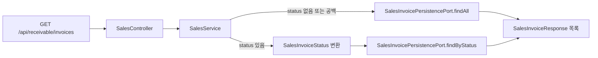
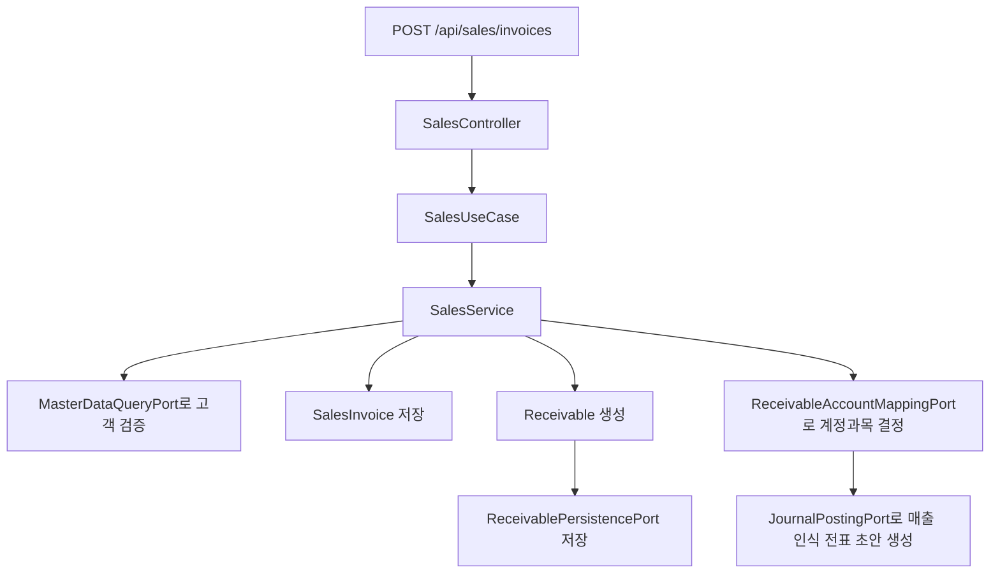

# receivable process flow

## API 입구

`receivable:api`를 실행하면 아래 엔드포인트를 사용할 수 있다. `SalesController`는 기존 `/api/sales`와 프런트엔드 호환 경로인 `/api/receivable`을 같은 기능의 별칭으로 제공한다.

| 컨트롤러 | 메서드 | 경로 | 역할 |
| --- | --- | --- | --- |
| `SalesController` | `POST` | `/api/sales/invoices`, `/api/receivable/invoices` | 매출 인보이스를 등록하고 채권 및 매출 인식 전표를 만든다. |
| `SalesController` | `GET` | `/api/sales/invoices`, `/api/receivable/invoices` | 전체 인보이스 또는 `status`와 일치하는 인보이스를 조회한다. |
| `SalesController` | `GET` | `/api/sales/invoices/{id}`, `/api/receivable/invoices/{id}` | ID로 인보이스 한 건을 조회한다. |
| `SalesController` | `POST` | `/api/sales/receivables/update-status/{asOfDate}`, `/api/receivable/receivables/update-status/{asOfDate}` | 기준일 이전 미수 채권을 연체 상태로 갱신한다. |
| `CollectionController` | `POST` | `/api/collections` | 고객 입금을 수납으로 기록하고 수납 인식 전표를 만든다. |
| `CollectionController` | `POST` | `/api/collections/{collectionId}/auto-match` | 특정 수납을 열린 채권 후보와 자동 매칭한다. |
| `CollectionController` | `GET` | `/api/collections/unmatched` | 자동 매칭되지 않은 수납 목록을 조회한다. |
| `CollectionController` | `POST` | `/api/collections/manual-match` | 사용자가 지정한 채권에 수동으로 수납액을 배분한다. |

## 매출 인보이스 조회 흐름



- `status`는 선택값이다. 생략하거나 공백이면 전체를 반환한다.
- 값이 있으면 앞뒤 공백과 대소문자를 정규화한 뒤 `ISSUED`, `PAID`, `PARTIAL_PAID`, `OVERDUE`, `CANCELLED` 중 하나로 조회한다.
- 지원하지 않는 상태는 HTTP `400 Bad Request`, 존재하지 않는 `{id}`는 `404 Not Found`를 반환한다.
- 조회 서비스는 read-only 트랜잭션이며 도메인 모델을 변경하지 않는다. 같은 요청을 다시 실행해도 조회 결과 외의 상태 변화는 없다.

초보자 예시: `GET /api/receivable/invoices?status=paid`는 수금 완료 인보이스 목록을 반환한다. `GET /api/receivable/invoices/10`은 10번 인보이스 한 건을 반환하며, 10번이 없으면 404가 된다. 기존 클라이언트는 동일하게 `/api/sales` 경로를 사용할 수 있다.

## 매출 인보이스 등록 흐름



핵심 정합성 포인트:

- 고객 코드는 `master-data`에서 검증한다.
- 인보이스 총액은 공급가액과 세액의 합으로 만들어진다.
- 채권은 인보이스 총액과 만기일을 기준으로 열린 상태로 생성된다.
- 전표 생성에 필요한 매출채권, 매출, 매출부가세 계정이 존재해야 한다.

## 수납과 매칭 흐름

```mermaid
flowchart TD
    A[POST /api/collections] --> B[CollectionService.receivePayment]
    B --> C[고객 검증]
    C --> D[Collection 저장]
    D --> E[수납 인식 전표 초안 생성]

    F[POST /api/collections/{id}/auto-match] --> G[Collection 조회]
    G --> H[고객별 열린 Receivable 조회]
    H --> I[CollectionMatchingPolicyPort.selectMatch]
    I -->|단일 후보| J[processMatch]
    I -->|없음 또는 중복 후보| K[Collection UNMATCHED]
    J --> L[Receivable.applyCollection]
    J --> M[Collection.applyAllocation]
    L --> N[CollectionAllocation 저장]
    M --> N
    N --> O[SalesInvoice 상태 갱신]
    O --> P[AR Clearing 전표 초안 생성]
```

자동 매칭은 안전을 우선한다. 후보가 여러 개면 임의로 하나를 고르지 않고 미매칭 상태로 남긴다. 잘못된 채권을 닫는 것보다 사람이 확인하도록 남기는 편이 고객 잔액과 감사 추적에 안전하다.

## 자동 매칭 정책

`ReferenceFirstCollectionMatchingPolicy`는 아래 순서로 후보를 좁힌다.

1. 채권 잔액이 0보다 크고, 수납 미배분액보다 크거나 같은 후보만 남긴다.
2. `Collection.referenceNo`가 있으면 인보이스 번호와 대소문자 무시 비교를 먼저 한다.
3. 참조번호 단일 후보가 없으면 만기일과 수납일 차이가 7일 이내인 단일 후보를 찾는다.
4. 그래도 없으면 채권 잔액과 수납 미배분액이 정확히 같은 단일 후보를 찾는다.
5. 모든 단계에서 후보가 2건 이상이면 `Optional.empty()`를 반환해 수동 확인으로 남긴다.

## 전표 유형과 차대변

| 업무 | 전표 유형 | 차변 | 대변 |
| --- | --- | --- | --- |
| 매출 인식 | `SALES_RECOGNITION` | 매출채권 | 매출, 매출부가세 |
| 수납 인식 | `COLLECTION_RECOGNITION` | 현금/예금 | AR Clearing |
| 채권 반제 | `AR_CLEARING` | AR Clearing | 매출채권 |

## 부분 매칭 흐름

부분 매칭은 한 번의 입금이 여러 청구서를 갚거나, 한 청구서를 여러 번 나누어 갚을 때 필요하다.

- `Collection.matchedAmount`: 지금까지 배분된 누적 수납액.
- `Collection.getUnallocatedAmount()`: 아직 어떤 채권에도 배분되지 않은 입금 잔액.
- `Receivable.outstandingAmount`: 아직 회수되지 않은 채권 잔액.
- `CollectionAllocation`: 이번 매칭 금액과 매칭 직후 양쪽 잔액을 남기는 감사 이력.
