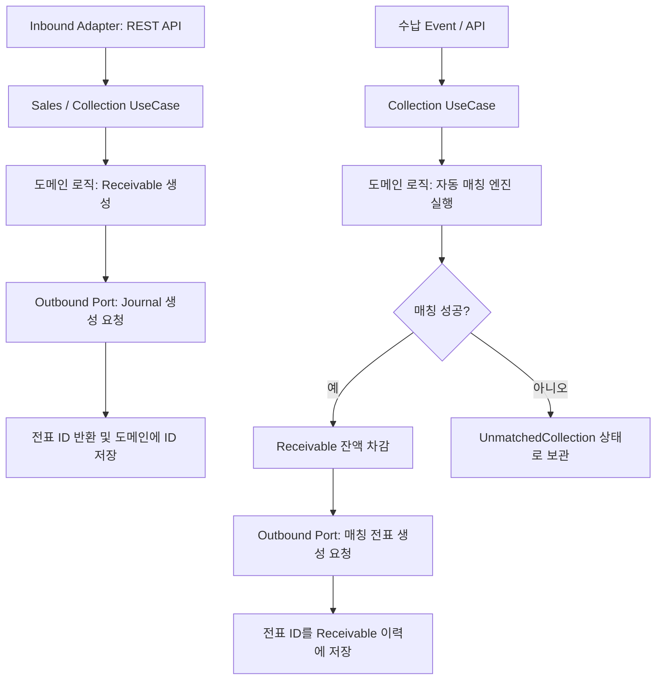

# Receivable Process Flow

## 1. 이 모듈이 하는 일 (Hexagonal Architecture 중심)

이 모듈은 매출 발생부터 채권 회수까지의 과정을 헥사고날 아키텍처(Ports and Adapters) 원칙에 따라 처리합니다.
내부 도메인 로직은 외부(웹, DB, 타 도메인)와 완벽히 격리되어 있습니다.

핵심 책임:
- 매출 인보이스 및 미수채권 도메인 관리
- 수납 기록 및 자동/수동 매칭 로직 (Core Domain)
- 원장 모듈과의 느슨한 연동 (Outbound Port 및 ID 기반 참조)

## 2. 전체 흐름도

## 3. 매출 및 수납 인식 상세 흐름

### 3.1 매출 인보이스 등록
- **Port:** `CreateSalesInvoiceUseCase`
- **로직:** 인보이스를 도메인 엔티티로 저장하고, 동일 금액의 `Receivable`을 생성.
- **외부 연동:** `JournalPostingPort`를 통해 매출 인식 전표를 생성하고, 리턴받은 `journalEntryId`를 JPA 엔티티에 저장합니다. (ID-based Reference)

### 3.2 수납과 매칭
- **Port:** `RecordCollectionUseCase`
- **로직:** 은행 입금 내역을 `Collection` 도메인 엔티티로 저장.
- 자동 매칭 시도 시 우선순위 규칙에 따라 고객의 `OPEN` 상태 채권과 대조합니다.
- 매칭 성공 시 잔액을 줄이고 상태를 변경하며, 전표 생성 포트를 호출합니다.
- 매칭 실패 시 `UnmatchedCollection`을 생성하여 수동 매칭 대기열로 넘깁니다.

## 4. 인프라 및 아키텍처 특징

- **ID 기반 참조:** 모든 회계 전표 및 고객 정보(Business Partner) 등 다른 바운디드 컨텍스트의 데이터는 객체 연관관계(`@ManyToOne`)를 맺지 않고 식별자(ID 문자열 또는 숫자)로만 참조합니다.
- **다단계 도커 (Multi-stage Docker):** 런타임 최적화를 위해 빌드 스테이지와 실행 스테이지가 분리된 도커 이미지 상에서 동작합니다.
- **SCD2:** 만약 매칭 규칙이나 고객 정책이 변경될 경우, 기존 데이터 정합성을 위해 과거 이력을 보존하는 설계 원칙을 적용합니다.