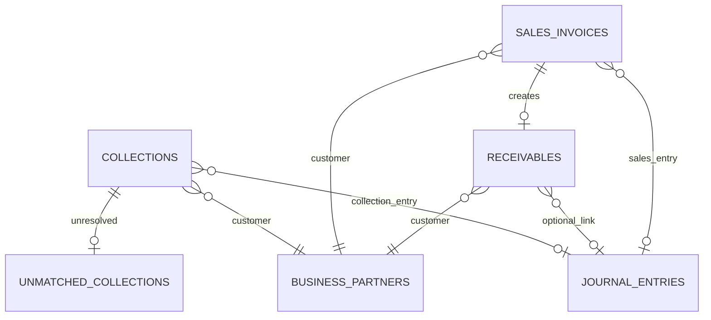
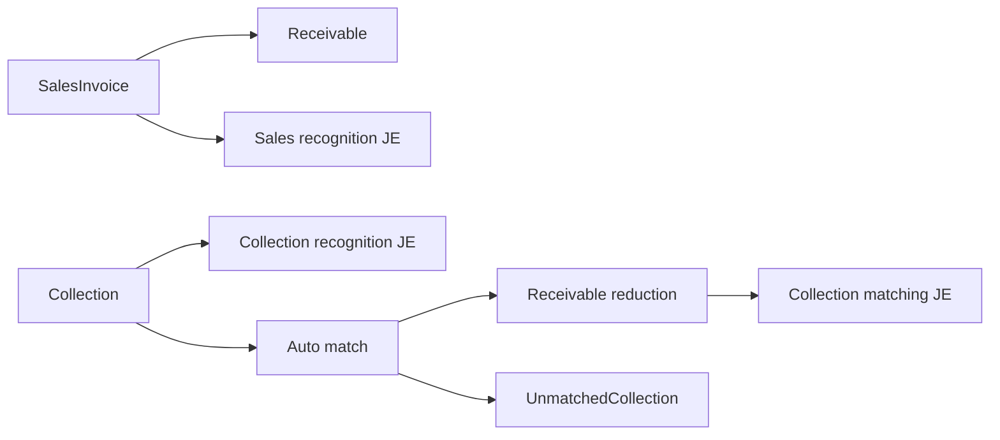

# receivable schema

## 1. 한눈에 보는 구조

## 2. 핵심 엔티티

### 2.1 `sales_invoices`

매출 인보이스 헤더다.

주요 컬럼:

- `invoice_no`
- `customer_code`
- `issue_date`
- `due_date`
- `total_amount`
- `tax_amount`
- `net_amount`
- `status`
- `journal_entry_id`
- `description`
- `created_by`

상태값:

- `ISSUED`
- `PAID`
- `PARTIAL_PAID`
- `OVERDUE`
- `CANCELLED`

### 2.2 `receivables`

미수채권 오픈아이템이다.

주요 컬럼:

- `sales_invoice_id`
- `customer_code`
- `original_amount`
- `outstanding_amount`
- `due_date`
- `status`
- `journal_entry_id`

상태값:

- `OPEN`
- `PARTIAL_PAID`
- `PAID`
- `OVERDUE`

### 2.3 `collections`

실제 입금/수납 레코드다.

주요 컬럼:

- `collection_date`
- `customer_code`
- `amount`
- `bank_account`
- `virtual_account`
- `reference_no`
- `status`
- `journal_entry_id`

상태값:

- `RECEIVED`
- `MATCHED`
- `PARTIAL_MATCHED`
- `UNMATCHED`
- `CANCELLED`

### 2.4 `matching_rules`

자동 매칭 규칙이다.

주요 컬럼:

- `rule_name`
- `priority`
- `match_criteria`
- `tolerance_amount`
- `is_active`

기준값:

- `REFERENCE_NO_EXACT`
- `CUSTOMER_CODE`
- `AMOUNT_EXACT`
- `AMOUNT_FUZZY`
- `VIRTUAL_ACCOUNT`

### 2.5 `unmatched_collections`

자동 매칭에 실패한 수납 큐다.

주요 컬럼:

- `collection_id`
- `reason`
- `status`
- `resolved_by`
- `resolved_at`

상태값:

- `PENDING`
- `RESOLVED`
- `IGNORED`

## 3. 데이터 흐름 관점

## 4. 초보자용 해석

- `SalesInvoice`는 청구서다.
- `Receivable`은 아직 못 받은 돈이다.
- `Collection`은 실제 들어온 돈이다.
- `MatchingRule`은 들어온 돈을 어느 채권에 붙일지 정하는 규칙이다.
- `UnmatchedCollection`은 아직 붙일 곳을 못 찾은 입금 보관함이다.
