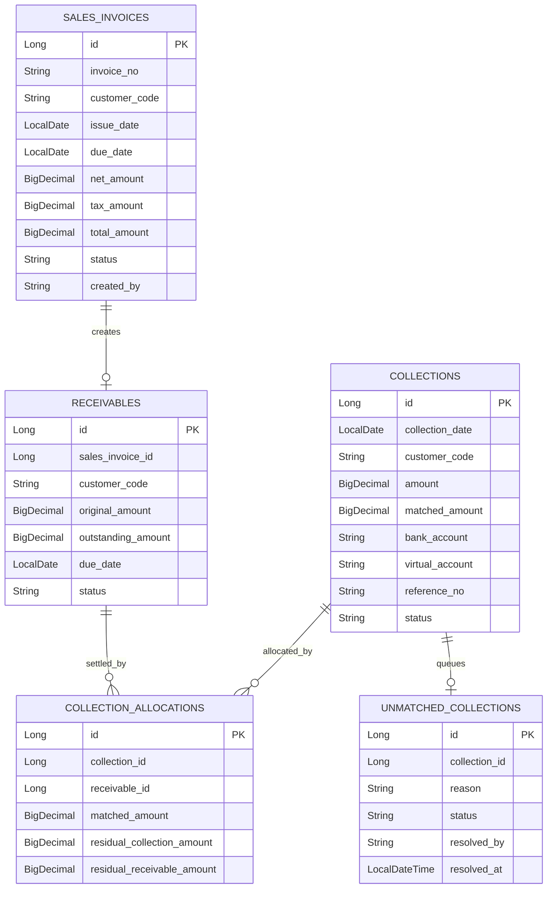

# receivable schema

## 핵심 ERD

## 상태 전이

### Receivable

| 상태 | 의미 | 주요 진입 조건 |
| --- | --- | --- |
| `OPEN` | 아직 수납되지 않은 채권 | 인보이스 등록 후 채권 생성 |
| `PARTIAL_PAID` | 일부 수납 후 잔액 존재 | `Receivable.applyCollection` |
| `PAID` | 잔액이 0인 채권 | 수납 후 잔액 0 |
| `OVERDUE` | 수금기일이 지난 미수 채권 | `updateReceivableStatus(asOfDate)` |

### Collection

| 상태 | 의미 | 주요 진입 조건 |
| --- | --- | --- |
| `RECEIVED` | 입금만 기록되고 아직 채권과 매칭되지 않음 | 수납 등록 |
| `PARTIAL_MATCHED` | 입금액 중 일부만 채권에 배분됨 | `Collection.applyAllocation` 후 미배분액 존재 |
| `MATCHED` | 입금액 전액이 채권에 배분됨 | 미배분액 0 |
| `UNMATCHED` | 자동 매칭 실패로 수동 확인 필요 | 후보 없음 또는 중복 후보 |
| `CANCELLED` | 취소 처리 확장 지점 | 운영 취소 프로세스 |

### SalesInvoice

| 상태 | 의미 |
| --- | --- |
| `ISSUED` | 고객에게 발행됨 |
| `PARTIAL_PAID` | 연결 채권이 일부 수납됨 |
| `PAID` | 연결 채권이 모두 수납됨 |
| `OVERDUE` | 수금기일 경과 |
| `CANCELLED` | 취소됨 |

## 계정 매핑 설정

`ConfiguredReceivableAccountMappingAdapter`는 아래 Spring 설정값을 사용한다. 설정이 없으면 기본값을 쓴다.

| 설정 키 | 기본값 | 사용 업무 |
| --- | --- | --- |
| `account.receivable.account-mapping.accounts-receivable-account-code` | `11100` | 매출 인식 매출채권 차변, 반제 대변 |
| `account.receivable.account-mapping.revenue-account-code` | `40100` | 매출 인식 매출 대변 |
| `account.receivable.account-mapping.output-vat-account-code` | `22100` | 매출부가세 대변 |
| `account.receivable.account-mapping.cash-account-code` | `10100` | 수납 인식 현금/예금 차변 |
| `account.receivable.account-mapping.ar-clearing-account-code` | `21100` | 수납 인식 대변, 반제 차변 |

각 계정 코드는 `MasterDataQueryPort.findAccountSubject`로 존재 여부를 확인한다. 테스트 더블이나 호스트 앱의 master-data 초기 데이터가 이 계정들을 제공해야 전표 생성이 성공한다.

## 정합성 체크 포인트

- 금액 필드는 `BigDecimal`이며 도메인 메서드에서 0 이하 금액과 잔액 초과 금액을 막는다.
- 자동 매칭은 단일 후보일 때만 수행한다.
- 부분 매칭은 `Collection.matchedAmount`와 `CollectionAllocation`에 모두 남긴다.
- 수납 인식과 채권 반제는 분리된 전표 유형으로 남아 현금 입금과 채권 감소를 추적할 수 있다.
- `customerCode`는 외부 customer 엔티티 직접 참조가 아니라 master-data 코드 참조다.
