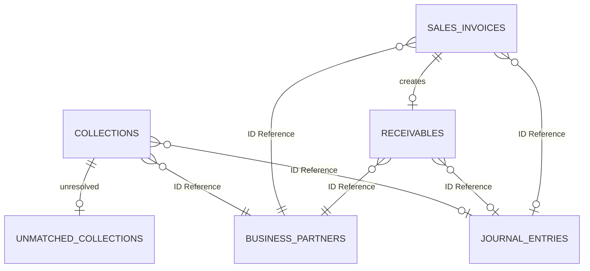

# Receivable Schema

## 1. 한눈에 보는 구조 (JPA & ID-based Reference)

데이터베이스 스키마는 헥사고날 아키텍처에 맞추어 결합도를 최소화하도록 설계되었습니다. 다른 마이크로서비스(예: 원장, 파트너)의 엔티티는 외래키(FK) 대신 식별자(ID)만 가집니다.

## 2. 핵심 엔티티 및 SCD2 적용 지점

### 2.1 `sales_invoices` (매출 인보이스)
- `invoice_no` (PK)
- `customer_code` (ID Reference - 외부 시스템 고객 ID)
- `issue_date`, `due_date`
- `total_amount`, `net_amount`
- `status`
- `journal_entry_id` (ID Reference - 회계 시스템 전표 ID)

### 2.2 `receivables` (미수채권)
- `sales_invoice_id` (FK)
- `customer_code` (ID Reference)
- `original_amount`, `outstanding_amount`
- `due_date`, `status`
- `journal_entry_id` (ID Reference)

### 2.3 `collections` (수납)
- `id` (PK)
- `collection_date`, `amount`
- `customer_code` (ID Reference)
- `status`
- `journal_entry_id` (ID Reference)

### 2.4 `matching_rules` (자동 매칭 규칙)
- **SCD2 대상:** 매칭 규칙이 변경되었을 때 과거에 처리된 매칭 내역의 정합성을 보장하기 위해, 레코드를 덮어쓰지 않고 `valid_from`, `valid_to`를 활용하여 이력을 관리합니다.
- `id` (PK)
- `rule_name`, `priority`, `match_criteria`
- `is_active`, `valid_from`, `valid_to` (SCD2 필드)

## 3. 초보자용 해석 및 아키텍처 의미

- **물리적 제약 제거:** `customer_code`나 `journal_entry_id`에 데이터베이스 외래키(Foreign Key) 제약 조건이 없습니다. 이는 서비스가 분리(MSA)되거나 도커 컨테이너가 독립적으로 배포될 때 테이블 간 락(Lock)이나 강결합을 방지하기 위함입니다.
- 잔액(`outstanding_amount`)은 이벤트나 매칭 결과에 의해 지속적으로 계산 및 업데이트됩니다.