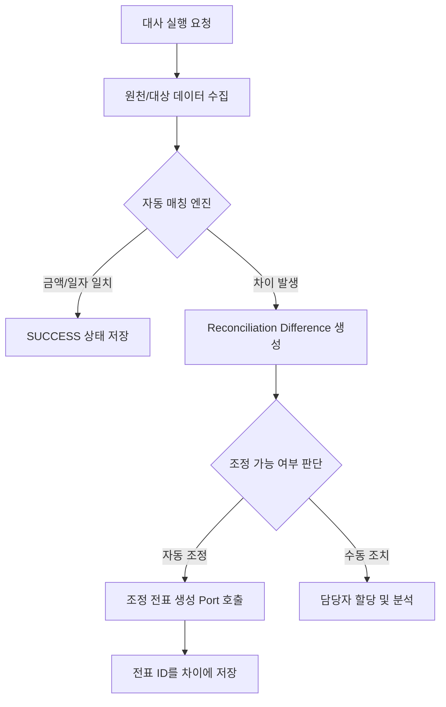
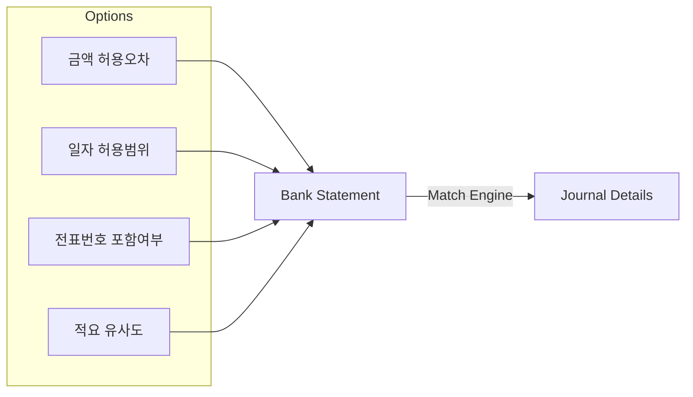
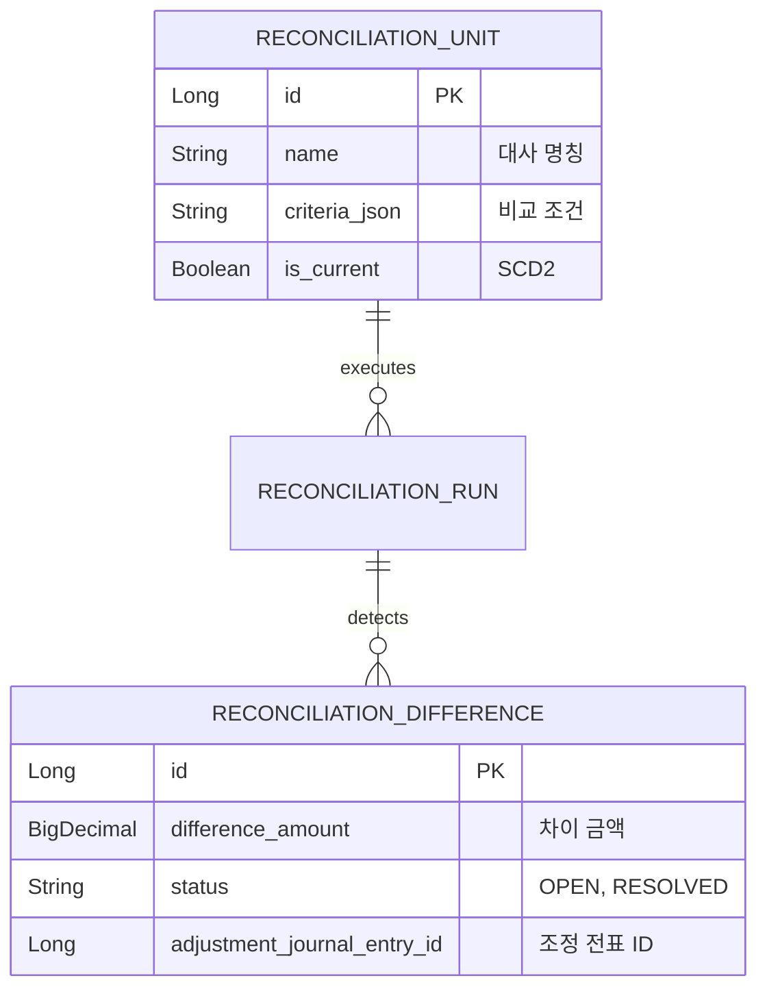

# ⚖️ Reconciliation Service (대사 및 차이 관리)

`reconciliation` 모듈은 두 개 이상의 장부(예: 은행 내역 vs 회계 장부)를 비교하여 금액이 일치하는지 확인하고, 발생하는 차이를 추적하여 해소하는 프로세스를 담당합니다.

---

## 1. 🐣 초보자를 위한 개념 설명 (Beginner Guide)

**대사(Reconciliation)는 '가계부와 내 통장 잔액이 맞는지 맞춰보는 일'입니다.**
1. **대사 단위:** "A은행 대사", "카드 매출 대사" 처럼 비교할 묶음을 말합니다.
2. **자동 매칭:** 사람이 일일이 대조하지 않고, 시스템이 금액과 날짜를 보고 "이건 이거네!" 하고 자동으로 짝을 맞추는 기능입니다.
3. **차이(Difference):** 대조해봤는데 어느 한쪽이 비거나 금액이 다른 경우입니다. (예: 수수료 500원 차이)
4. **조정 분개:** 차이가 났을 때 이를 장부에 반영해서 맞춰주기 위해 시스템이 자동으로 끊어주는 추가 전표입니다.

---

## 2. 🔄 프로세스 흐름 (Process Flow)

### 📌 대사 실행 및 차이 처리 라이프사이클
대사 실행부터 엔진의 매칭, 그리고 최종 조정 전표 생성까지의 흐름입니다.



### 📌 자동 매칭 엔진 (Match Options)
단순 금액 외에도 전표번호, 적요 유사도 등을 조합하여 정교하게 매칭합니다.



---

## 3. 📊 데이터 모델 (Schema)

대사 설정, 실행 이력, 그리고 발견된 차이를 체계적으로 관리합니다.



---

## 4. 🧭 로컬 실행 및 연동 방법

현재 `reconciliation`은 standalone Spring Boot 애플리케이션이 아니라 `java-library` 모듈입니다.
따라서 `docker-compose up -d reconciliation`이나 `:reconciliation:bootRun`으로 바로 띄우는 구조가 아니며, 로컬에서는 Gradle 테스트와 컴파일로 모듈 단위 검증을 합니다.

**PowerShell 검증 명령:**
```powershell
.\gradlew :reconciliation:test --console=plain --max-workers=1 --no-daemon
```

**IntelliJ 실행 순서:**
1. 루트 프로젝트를 Gradle 프로젝트로 연다.
2. Gradle JVM을 JDK 17로 맞춘다.
3. Run Configuration에서 `Reconciliation Module Tests`를 실행한다.
4. API를 HTTP로 호출하려면 reconciliation 패키지를 스캔하는 호스트 Spring Boot 앱을 별도로 구성한다.

**연동 주의사항:**
- 대사 대상 데이터 조회 시 `JournalQueryPort`를 사용합니다.
- 조정 분개 생성 시 `ReconciliationAdjustmentPolicy`가 적용된 `JournalPostingPort`를 통해 처리됩니다.
- 표준 실행 생명주기는 `ReconciliationUnit -> ReconciliationRun -> ReconciliationDifference`입니다.
- 단계별 진단 결과는 `ReconciliationStageResult`로 표준 Run에 연결되며, 과거의 병렬 Aggregate 모델은 사용하지 않습니다.
- 상세 문서는 [docs/README.md](./docs/README.md)에서 `beginner-guide`, `process-flow`, `schema`, `local-run` 순서로 확인합니다.
