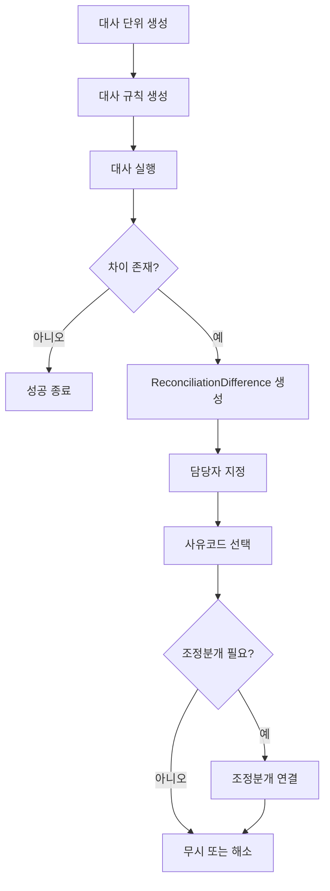
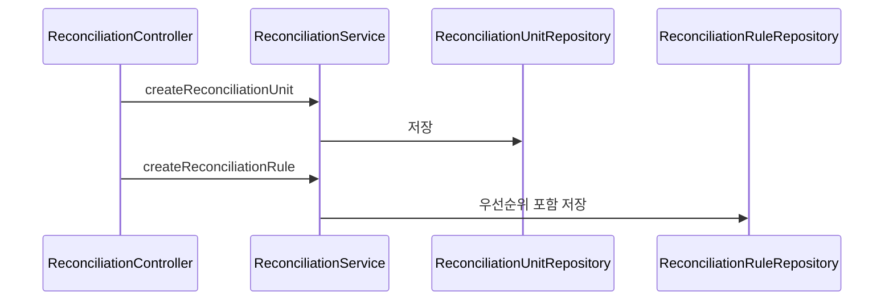
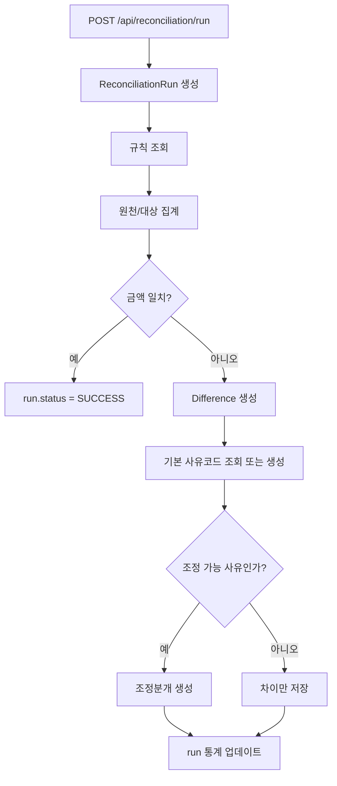
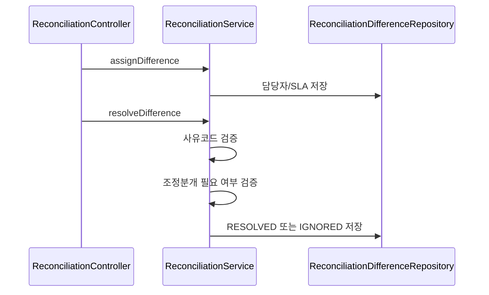
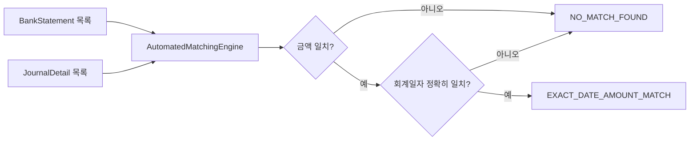
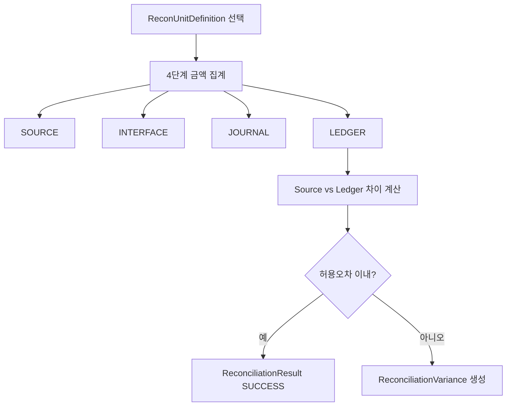

# Reconciliation Process Flow

## 1. 전체 흐름

## 2. 단위와 규칙 준비

설명:
- 먼저 어떤 종류의 대사를 할지 정의합니다.
- 예: 은행대사, GL-보조원장 대사, 원천-총계정원장 대사
- 규칙은 우선순위가 낮은 숫자부터 먼저 적용됩니다.

## 3. 메인 대사 실행 흐름

설명:
- 메인 흐름은 `ReconciliationUnit.criteriaJson`의 `sourceAmount`, `sourceCount`를 원천 집계값으로 사용합니다.
- 대상 집계값은 `JournalQueryPort`로 기준일 전표와 상세를 조회한 뒤 차변 상세의 `baseAmount` 또는 `amount`를 합산합니다.
- 금액이 다르면 `AMOUNT_MISMATCH` 차이를 한 건 생성합니다.
- 기본 사유코드는 `GENERIC_MISMATCH`입니다.
- 자동 생성되는 `GENERIC_MISMATCH`는 조정분개를 만들지 않습니다.
- 조정 가능한 사유코드로 조정분개를 만들려면 `criteriaJson`에 `adjustmentDebitAccountCode`, `adjustmentCreditAccountCode`를 설정해야 합니다.
- 조정분개 생성은 `JournalPostingPort.createDraftEntry`로 위임하고, 생성된 전표 ID를 차이에 연결합니다.

## 4. 차이 담당자 배정과 해소

핵심 규칙:
- 조정 가능한 사유코드라면 조정분개 링크가 반드시 있어야 합니다.
- 최종 상태는 `RESOLVED` 또는 `IGNORED`만 허용됩니다.

## 5. 자동 매칭 엔진 흐름

설명:
- 현재 구현은 설명문구 비교나 허용일수 오차를 쓰지 않습니다.
- 그래서 조금만 어긋나도 매칭 실패가 날 수 있습니다.

## 6. 심화 대사 흐름

설명:
- `ReconManagerService`는 SOURCE -> INTERFACE -> JOURNAL -> LEDGER 4단계 대사를 모델링합니다.
- SOURCE/INTERFACE는 `ReconUnitDefinition.matchingRulesJson`에 명시된 집계값을 사용합니다.
- JOURNAL은 `JournalQueryPort`로 기준일 전표 상세를 조회한 뒤 차변 상세 금액을 집계합니다.
- LEDGER는 `LedgerQueryPort`로 GL 잔액을 조회해 집계합니다.
- `ledgerAmountBasis`는 기본 `DEBIT`이며, `CREDIT`, `ENDING_BALANCE`, `ABS_ENDING_BALANCE`도 사용할 수 있습니다.

## 7. 현재 구현상 주의점

- 메인 대사와 심화 대사 모델이 통합되지 않았습니다.
- 메인 흐름의 대상 금액은 `JournalQueryPort` 기반이지만, 원천 금액은 아직 `criteriaJson`에 명시된 집계값을 사용합니다.
- 심화 흐름의 SOURCE/INTERFACE 단계는 아직 외부 원천 시스템 조회가 아니라 `matchingRulesJson` 명시값 기반입니다.
- 자동 매칭 조건이 단순합니다.
- 삭제 API에는 연관 데이터 정리 TODO가 남아 있습니다.
