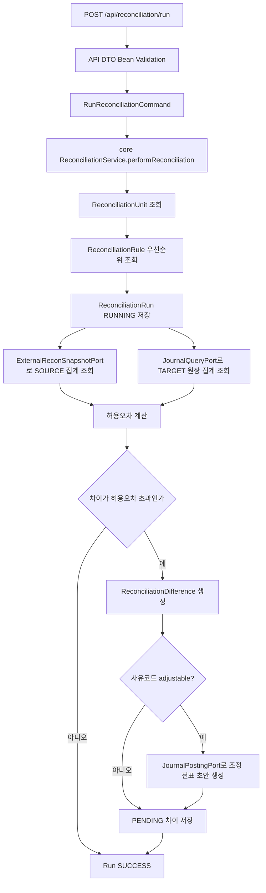
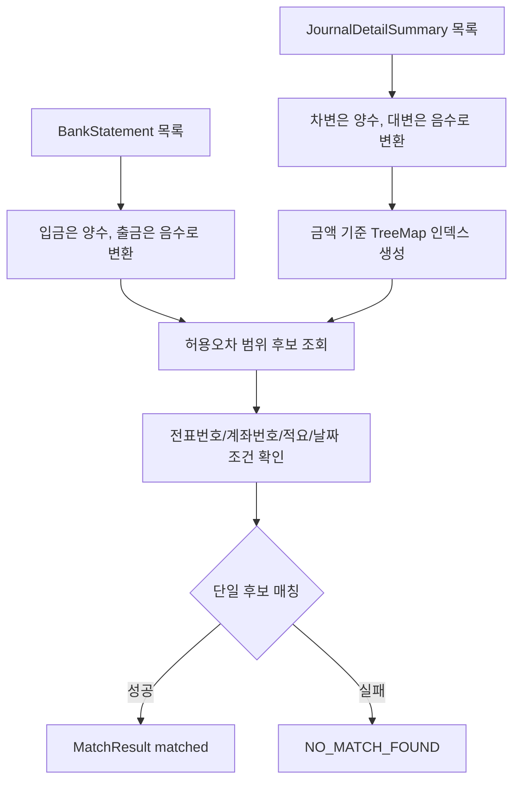
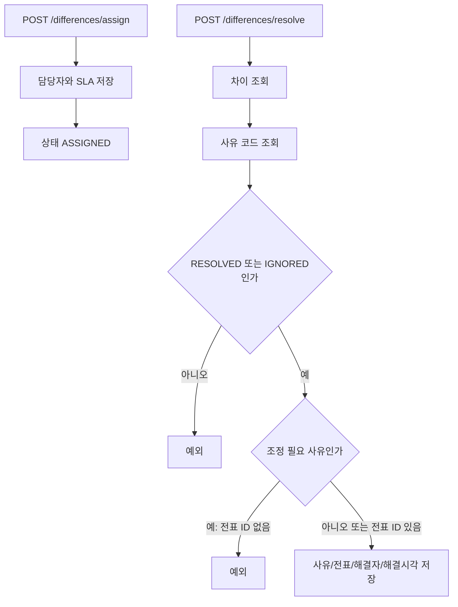

# reconciliation process flow

## API 입구

현재 `reconciliation`은 `core/api/batch` 구조다. 아래 API는 `reconciliation:api`의 `ReconciliationController`가 노출하고, 요청 DTO는 Bean Validation 후 core command로 변환된다. core 서비스는 HTTP request/response 타입을 직접 알지 않는다.

| 컨트롤러 | 메서드 | 경로 | 역할 |
| --- | --- | --- | --- |
| `ReconciliationController` | `POST` | `/api/reconciliation/units` | 대사 단위를 생성한다. |
| `ReconciliationController` | `GET` | `/api/reconciliation/units` | 대사 단위 목록을 조회한다. |
| `ReconciliationController` | `GET` | `/api/reconciliation/units/{id}` | 대사 단위를 단건 조회한다. |
| `ReconciliationController` | `PUT` | `/api/reconciliation/units/{id}` | 대사 단위를 수정한다. |
| `ReconciliationController` | `DELETE` | `/api/reconciliation/units/{id}` | 대사 단위를 비활성화한다. |
| `ReconciliationController` | `POST` | `/api/reconciliation/rules` | 대사 규칙을 생성한다. |
| `ReconciliationController` | `GET` | `/api/reconciliation/units/{unitId}/rules` | 단위별 규칙을 조회한다. |
| `ReconciliationController` | `PUT` | `/api/reconciliation/rules/{id}` | 대사 규칙을 수정한다. |
| `ReconciliationController` | `DELETE` | `/api/reconciliation/rules/{id}` | 대사 규칙을 `isActive=false`로 논리 비활성화한다. 과거 실행 이력의 판단 근거를 보존한다. |
| `ReconciliationController` | `POST` | `/api/reconciliation/reason-codes` | 차이 사유 코드를 생성한다. |
| `ReconciliationController` | `GET` | `/api/reconciliation/reason-codes` | 차이 사유 코드 목록을 조회한다. |
| `ReconciliationController` | `GET` | `/api/reconciliation/reason-codes/{id}` | 차이 사유 코드를 단건 조회한다. |
| `ReconciliationController` | `PUT` | `/api/reconciliation/reason-codes/{id}` | 차이 사유 코드를 수정한다. |
| `ReconciliationController` | `DELETE` | `/api/reconciliation/reason-codes/{id}` | 차이 사유 코드를 비활성화한다. |
| `ReconciliationController` | `POST` | `/api/reconciliation/run` | 대사를 실행한다. `X-Audit-User` 헤더를 실행자로 기록한다. |
| `ReconciliationController` | `POST` | `/api/reconciliation/differences/assign` | 차이를 담당자에게 배정한다. |
| `ReconciliationController` | `POST` | `/api/reconciliation/differences/resolve` | 차이를 해결 또는 무시 처리한다. |
| `ReconciliationController` | `GET` | `/api/reconciliation/runs/{runId}/differences` | 실행별 차이 목록을 조회한다. |

## API/core command 경계

초보자 관점에서는 HTTP 요청과 업무 명령을 분리해서 보면 쉽다.

1. API 계층은 JSON 요청을 DTO로 받고 Bean Validation으로 필수값과 형식을 먼저 확인한다.
2. DTO는 `RunReconciliationCommand`, `ReconciliationUnitCommand`, `ReconciliationRuleCommand`, `DifferenceReasonCodeCommand`, `AssignDifferenceCommand`, `ResolveDifferenceCommand` 중 하나로 변환된다.
3. core `ReconciliationService`는 command만 받아 도메인 엔티티를 만들거나 상태를 바꾼다. 그래서 core는 `@RestController`, `@RequestBody`, `jakarta.validation` 같은 HTTP 기술을 몰라도 된다.
4. Batch도 같은 command를 사용하므로 API 실행과 Batch 실행의 업무 입력 모양이 크게 어긋나지 않는다.

## 대사 실행 흐름

원천 집계는 `RECON_EXTERNAL_STAGE_RECORD`를 기준으로 `unitId`, `stageCode`, `reconciliationDate`, 상품, 통화, 법인 조건을 적용한다. 대상 집계는 `criteriaJson`의 `targetAccountCode`와 `targetSide`를 읽어 원장 상세 집계를 조회한다.

## criteriaJson 주요 키

| 키 | 용도 |
| --- | --- |
| `sourceProductCode` | 원천 스냅샷 상품 필터 |
| `sourceCurrencyCode` | 원천 스냅샷 통화 필터 |
| `legalEntityCode` | 원천 스냅샷 법인 필터 |
| `targetAccountCode` | 대상 원장 계정코드 |
| `targetSide` | 원장 정상 잔액 방향. `DEBIT` 또는 `CREDIT` |
| `adjustmentCurrencyCode` | 조정 전표 통화. 없으면 `KRW` |
| `adjustmentDebitAccountCode` | 조정 전표 차변 계정 |
| `adjustmentCreditAccountCode` | 조정 전표 대변 계정 |

조정 가능한 사유 코드를 사용할 때는 조정 계정 두 개가 반드시 있어야 한다. `ReconciliationAdjustmentPolicy`가 이 정책을 fail-closed로 검증한다.

## 자동 매칭 엔진 흐름

`AutomatedMatchingEngine`은 상세 라인 매칭 컴포넌트다. 현재 `performReconciliation`의 요약 대사 흐름과는 별도이며, 은행 명세-전표 상세 매칭 테스트에서 검증된다.

## 차이 배정과 해결 흐름

조정 전표가 필요한 사유 코드는 `adjustmentJournalEntryId`가 있어야 완료할 수 있다. 이미 자동 조정 전표가 만들어진 차이는 기존 전표 ID를 유지한다.
