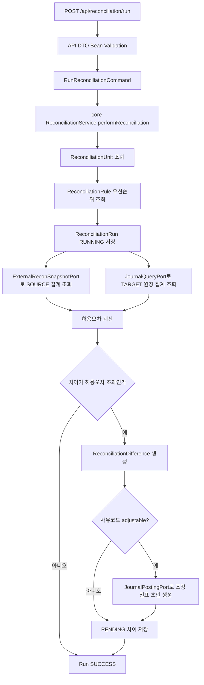
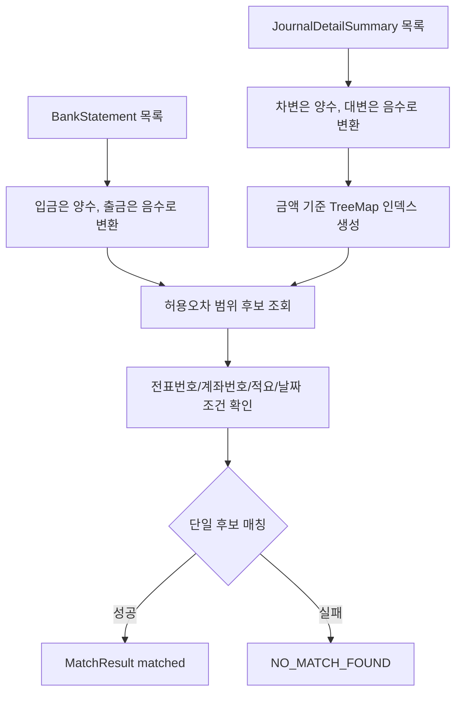
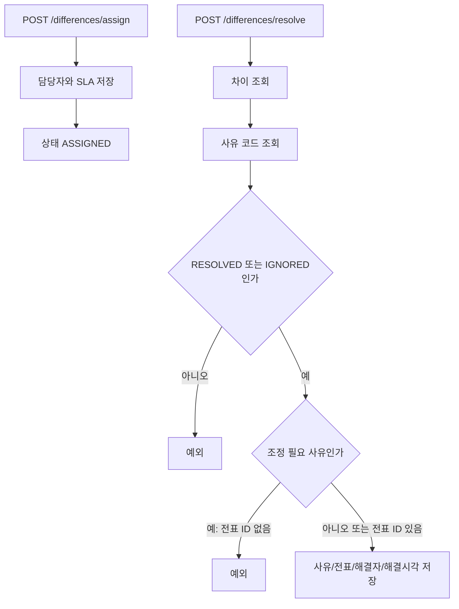

# reconciliation process flow

## API 입구

현재 `reconciliation`은 `core/api/batch` 구조다. 아래 API는 `reconciliation:api`의 `ReconciliationController`가 노출하고, 요청 DTO는 Bean Validation 후 core command로 변환된다. core 서비스는 HTTP request/response 타입을 직접 알지 않는다.

| 컨트롤러 | 메서드 | 경로 | 역할 |
| --- | --- | --- | --- |
| `ReconciliationController` | `POST` | `/api/reconciliation/units` | 대사 단위를 생성한다. |
| `ReconciliationController` | `GET` | `/api/reconciliation/units` | 대사 단위 목록을 조회한다. |
| `ReconciliationController` | `GET` | `/api/reconciliation/units/{id}` | 대사 단위를 단건 조회한다. |
| `ReconciliationController` | `PUT` | `/api/reconciliation/units/{id}` | 대사 단위를 수정한다. |
| `ReconciliationController` | `DELETE` | `/api/reconciliation/units/{id}` | 대사 단위를 비활성화한다. |
| `ReconciliationController` | `POST` | `/api/reconciliation/rules` | 대사 규칙을 생성한다. |
| `ReconciliationController` | `GET` | `/api/reconciliation/units/{unitId}/rules` | 단위별 규칙을 조회한다. |
| `ReconciliationController` | `PUT` | `/api/reconciliation/rules/{id}` | 대사 규칙을 수정한다. |
| `ReconciliationController` | `DELETE` | `/api/reconciliation/rules/{id}` | 대사 규칙을 `isActive=false`로 논리 비활성화한다. 과거 실행 이력의 판단 근거를 보존한다. |
| `ReconciliationController` | `POST` | `/api/reconciliation/reason-codes` | 차이 사유 코드를 생성한다. |
| `ReconciliationController` | `GET` | `/api/reconciliation/reason-codes` | 차이 사유 코드 목록을 조회한다. |
| `ReconciliationController` | `GET` | `/api/reconciliation/reason-codes/{id}` | 차이 사유 코드를 단건 조회한다. |
| `ReconciliationController` | `PUT` | `/api/reconciliation/reason-codes/{id}` | 차이 사유 코드를 수정한다. |
| `ReconciliationController` | `DELETE` | `/api/reconciliation/reason-codes/{id}` | 차이 사유 코드를 비활성화한다. |
| `ReconciliationController` | `POST` | `/api/reconciliation/run` | 대사를 실행한다. `X-Audit-User` 헤더를 실행자로 기록한다. |
| `ReconciliationController` | `POST` | `/api/reconciliation/differences/assign` | 차이를 담당자에게 배정한다. |
| `ReconciliationController` | `POST` | `/api/reconciliation/differences/resolve` | 차이를 해결 또는 무시 처리한다. |
| `ReconciliationController` | `GET` | `/api/reconciliation/runs/{runId}/differences` | 실행별 차이 목록을 조회한다. |
| `InterBranchBankingController` | `GET` | `/api/finance/banking/inter-branch/dashboard` | 본지점 대사 화면에 변경 불가능한 현재 스냅샷을 반환한다. |
| `InterBranchBankingController` | `POST` | `/api/finance/banking/inter-branch/auto-match` | 아직 core 실행 계약이 없어 HTTP 501과 `matchedCount=0`, `status=NOT_EXECUTED`를 반환하며 대사 상태를 변경하지 않는다. |

### 본지점 뱅킹 API의 현재 경계

본지점 대사 화면 계약은 프론트엔드가 안정적으로 연동할 수 있도록 모든 숫자와 목록 필드를 항상 반환한다. 현재는 조회 가능한 본지점 전용 core 포트가 없으므로 dashboard가 0 금액, 0 건수, 빈 거래 목록인 결정적 스냅샷을 반환한다. 금액과 비율은 `BigDecimal`로 표현한다.

`POST /auto-match`도 실제 매칭 엔진이나 저장소를 호출하지 않는다. HTTP 501과 응답의 `NOT_EXECUTED`는 요청을 수신했지만 기능이 구현되지 않아 금융 대사 상태는 바뀌지 않았다는 뜻이다. 따라서 `response.ok`를 확인하는 프론트엔드는 실행 실패로 처리한다. 향후 core 유즈케이스가 정의되면 API 계층은 그 결과를 DTO로 변환하되, 매칭 판단과 상태 변경은 core에 둔다. 같은 요청을 재실행해도 현재는 외부 상태를 쓰지 않으며 항상 동일한 0건 결과를 반환한다.

## API/core command 경계

초보자 관점에서는 HTTP 요청과 업무 명령을 분리해서 보면 쉽다.

1. API 계층은 JSON 요청을 DTO로 받고 Bean Validation으로 필수값과 형식을 먼저 확인한다.
2. DTO는 `RunReconciliationCommand`, `ReconciliationUnitCommand`, `ReconciliationRuleCommand`, `DifferenceReasonCodeCommand`, `AssignDifferenceCommand`, `ResolveDifferenceCommand` 중 하나로 변환된다.
3. core `ReconciliationService`는 command만 받아 도메인 엔티티를 만들거나 상태를 바꾼다. 그래서 core는 `@RestController`, `@RequestBody`, `jakarta.validation` 같은 HTTP 기술을 몰라도 된다.
4. Batch도 같은 command를 사용하므로 API 실행과 Batch 실행의 업무 입력 모양이 크게 어긋나지 않는다.

## 대사 실행 흐름

원천 집계는 `RECON_EXTERNAL_STAGE_RECORD`를 기준으로 `unitId`, `stageCode`, `reconciliationDate`, 상품, 통화, 법인 조건을 적용한다. 대상 집계는 `criteriaJson`의 `targetAccountCode`와 `targetSide`를 읽어 원장 상세 집계를 조회한다.

### 개발서버의 실제 원장 조회

원격 연동이 활성화되면 `HttpReconciliationJournalAdapter`가 기존 Journal API의 `GET /api/journals?startDate=...&endDate=...`를 호출한다. 이 API는 `JournalEntryService.getJournalEntriesByDate`에서 회계일자 범위를 조회하고 `JournalApiDto.View.lines`에 상세 라인을 함께 반환한다. 어댑터는 응답에서 양끝을 포함한 회계일자, `POSTED`, 대상 계정, 차대 구분을 적용한다. 아직 전기되지 않은 FX 평가·충당금 `DRAFT` 전표는 대사 금액에 포함하지 않는다.

집계는 선택된 상세 라인 수와 기준통화 금액의 합계다. `BigDecimal`을 사용하며 `baseAmount`가 없는 과거 라인만 `amount`로 대체한다. 이는 기존 `JournalDetailRepository` 집계의 `SUM(COALESCE(baseAmount, amount))`와 같은 기준이다. 예를 들어 원천이 1건·1,000원이고 같은 회계일자의 전기된 대상 계정 차변이 1건·1,000원이면 실제 데이터로 대조한다. 고정된 0건·0원이나 임의의 차이 사유로 성공을 만들지 않는다.

상세 대사도 같은 기간 응답에서 요청 계정의 전기된 라인을 추출해 ID, 회계일자, 전표번호, 금액, 부서·거래처·적요를 전달한다. Journal 상세 조회 포트는 차변과 대변을 모두 반환하며, core 실행 서비스가 `criteriaJson.targetSide`(생략 시 `DEBIT`)와 일치하는 라인만 매칭 엔진에 넘긴다. 반대 방향 라인은 매칭 후보나 차이 참조 목록에 포함하지 않는다. 개별 ID 조회는 전표번호 경로와 구분되는 `/api/journals/by-id/{id}`를 사용한다.

예를 들어 `targetAccountCode=11000`, `targetSide=DEBIT`인 기준일에 은행 원천 100원 두 건과 같은 계정의 차변 100원·대변 100원이 각각 있으면, 대상은 차변 한 건뿐이다. 한 원천은 `MISSING_TARGET` 차이로 남고 실행 결과의 미대사 건수·금액은 저장된 차이와 같은 매칭 결과를 따른다. `CREDIT` 설정에서는 방향이 반대로 적용된다. 원천과 대상 각각의 집계 건수·금액이 실제 건별 목록과 다르면 실행에서 예외가 나며 `SUCCESS`를 확정하거나 차이·조정 전표를 저장하지 않는다. 대상 금액은 기준통화 금액(`baseAmount`, 없으면 `amount`)으로 비교한다. 실패 후 같은 날짜의 재시도가 가능하고, 정상 `SUCCESS` 실행은 재실행 시 기존 결과를 반환한다.

금액 조회에서 정상 응답 `[]`는 실제 0건이다. HTTP 오류(404 포함), 리다이렉트, 비어 있거나 잘못된 JSON, 필수 정보가 없는 전기된 라인, 중복 ID는 예외로 처리하여 대사를 중단한다. 리다이렉트는 따라가지 않으며 외부 응답 본문·헤더·원인 예외를 오류에 담지 않는다. 기존 일반 전표 목록/번호 조회의 빈 값·404 처리 계약은 유지하지만, 대사 금액 계산은 이 느슨한 목록 메서드를 사용하지 않는다.

현재 기간 조회 API에는 페이지 구분이 없어 해당 기간의 전표와 라인을 한 번에 메모리에 읽는다. 전표마다 추가 HTTP 요청을 하지 않지만, 대용량 운영 처리에는 제공자 측 집계/페이지 조회와 일관된 스냅샷 계약이 필요하다. 개발서버에서는 합성 데이터와 하루 단위 범위로 검증한다. 조회와 대사 저장은 서로 다른 서비스 트랜잭션이므로 동일 시점의 분산 스냅샷까지 보장하지 않는다.

`HttpReconciliationJournalFinancialQueryTest`는 실제 POSTED/날짜/계정/차대 필터, 큰 소수 금액과 기준금액 대체, 상세 매핑, 중복·누락 응답, HTTP 오류 및 실제 HTTP 리다이렉트 차단을 검증한다. 실행 명령은 `./gradlew :reconciliation:core:test :reconciliation:api:test :reconciliation:batch:test --max-workers=1 --no-daemon --console=plain`이며, 실기동 결과는 [업무 배치 개발서버 검증 가이드](../../docs/guides/business-batch-dev-verification.md)와 해당 실행 기록에서 확인한다.

## criteriaJson 주요 키

| 키 | 용도 |
| --- | --- |
| `sourceProductCode` | 원천 스냅샷 상품 필터 |
| `sourceCurrencyCode` | 원천 스냅샷 통화 필터 |
| `legalEntityCode` | 원천 스냅샷 법인 필터 |
| `targetAccountCode` | 대상 원장 계정코드 |
| `targetSide` | 원장 정상 잔액 방향. `DEBIT` 또는 `CREDIT` |
| `adjustmentCurrencyCode` | 조정 전표 통화. 없으면 `KRW` |
| `adjustmentDebitAccountCode` | 조정 전표 차변 계정 |
| `adjustmentCreditAccountCode` | 조정 전표 대변 계정 |

조정 가능한 사유 코드를 사용할 때는 조정 계정 두 개가 반드시 있어야 한다. `ReconciliationAdjustmentPolicy`가 이 정책을 fail-closed로 검증한다.

## 자동 매칭 엔진 흐름

`AutomatedMatchingEngine`은 상세 라인 매칭 컴포넌트다. 현재 `performReconciliation`의 요약 대사 흐름과는 별도이며, 은행 명세-전표 상세 매칭 테스트에서 검증된다.

## 차이 배정과 해결 흐름

조정 전표가 필요한 사유 코드는 `adjustmentJournalEntryId`가 있어야 완료할 수 있다. 이미 자동 조정 전표가 만들어진 차이는 기존 전표 ID를 유지한다.
