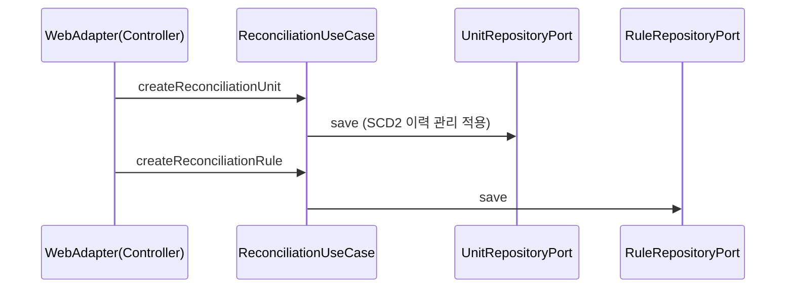

# Reconciliation Process Flow

## 1. 전체 흐름 (Hexagonal Architecture 기반)

이 모듈은 헥사고날 아키텍처(Ports and Adapters)를 적용하여, 대사 엔진 코어가 인바운드/아웃바운드 어댑터와 분리되어 작동합니다. 외부 모듈(전표 등) 참조는 객체 대신 ID를 사용합니다.

```mermaid
flowchart TD
    A[Inbound: REST API] --> B[대사 유스케이스 / Service]
    B --> C[대사 단위 및 규칙 조회]
    C --> D[Outbound Port: 원천/대상 데이터 조회]
    D --> E[대사 엔진 로직 수행]
    E --> F{차이 존재?}
    F -- 아니오 --> G[성공 상태 저장]
    F -- 예 --> H[ReconciliationDifference 생성]
    H --> I[Outbound Port: 담당자 할당 및 메일 발송]
    H --> J{조정분개 필요?}
    J -- 예 --> K[Outbound Port: JournalPostingPort로 분개 요청]
    K --> L[전표 ID(ID-based reference) 반환받아 차이 기록에 연결]
    J -- 아니오 --> M[차이 상태 업데이트]
    M --> N[Outbound Port: DB에 저장]
```

## 2. 단위와 규칙 준비



## 3. 메인 대사 실행 흐름

```mermaid
flowchart TD
    A[POST /api/reconciliation/run] --> B[ReconciliationRun 생성]
    B --> C[규칙 조회]
    C --> D[원천 데이터: API 등 Outbound Port 경유]
    C --> E[대상 데이터: JournalQueryPort를 통한 ID 조회]
    D & E --> F[대사 엔진 (Core Domain)]
    F --> G{금액 차이 허용오차 이내?}
    G -- 예 --> H[run.status = SUCCESS]
    G -- 아니오 --> I[Difference 생성]
    I --> J{조정 가능 사유인가?}
    J -- 예 --> K[JournalPostingPort.createDraftEntry 호출]
    K --> L[반환된 전표 ID를 Difference에 매핑]
    J -- 아니오 --> M[차이 내역만 저장]
    L & M --> N[run 통계 업데이트 및 저장]
```

설명:
- 메인 흐름에서 원천/대상 데이터는 헥사고날의 아웃바운드 포트를 통해 조회합니다.
- `JournalQueryPort`로 기준일 전표와 상세를 조회한 뒤 비교합니다.
- 금액 차이가 허용오차를 초과하면 차이를 생성하며, 조정분개는 모듈간 결합도를 낮추기 위해 `JournalPostingPort`로 위임하여 **ID 기반 참조(journalEntryId)**로 연결합니다.
- 자동 조정분개 계정은 `ReconciliationAdjustmentPolicy`가 검증합니다. 조정 가능한 대사 단위는 `criteriaJson`에 `adjustmentDebitAccountCode`, `adjustmentCreditAccountCode`를 명시해야 하며, 누락 시 숨은 기본 계정을 사용하지 않고 실패합니다.

## 4. 자동 매칭 조건

`AutomatedMatchingEngine` 기본 호출은 기존 호환성을 위해 금액과 회계일자가 정확히 일치해야 합니다.
`MatchOptions`를 사용하면 다음 조건을 조합할 수 있습니다.

- 금액 허용오차
- 일자 허용일수
- 전표번호가 은행 적요에 포함되는지
- 전표 헤더/라인 적요가 은행 적요에 포함되는지
- 은행 계좌번호와 전표 요약 계좌번호가 일치하는지

계좌번호는 하이픈 등 구분자를 제거하고 비교합니다.

## 5. 차이 담당자 배정과 해소

- 조정 가능한 사유코드라면 조정분개 링크가 반드시 있어야 하며, 이는 헥사고날 원칙에 따라 엔티티 연관이 아닌 전표 ID(Long/String)로 저장됩니다.

## 6. 런타임 및 인프라 (Multi-stage Docker)

- 위 과정은 모두 Multi-stage Docker 환경에서 컴파일된 최적화 이미지 기반으로 컨테이너 내에서 실행됩니다.
- 포트/어댑터 간의 데이터 이동은 외부 시스템(예: Kafka, REST)을 통해 유연하게 확장될 수 있도록 설계되었습니다.
