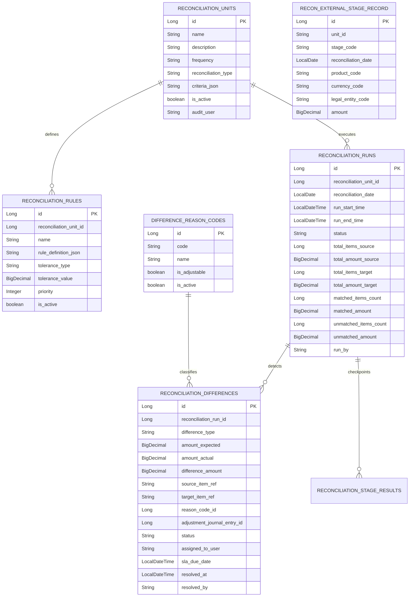

# reconciliation schema

## 핵심 ERD

## 상태

| 모델 | 상태 | 의미 |
| --- | --- | --- |
| `ReconciliationRun` | `RUNNING` | 대사 실행 중 |
| `ReconciliationRun` | `SUCCESS` | 대사 실행 완료 |
| `ReconciliationRun` | `FAILED` | 실행 중 예외 발생 |
| `ReconciliationRun` | `PARTIAL` | 부분 완료 확장 지점 |
| `ReconciliationDifference` | `PENDING` | 차이 처리 대기 |
| `ReconciliationDifference` | `ASSIGNED` | 담당자 배정 |
| `ReconciliationDifference` | `IN_REVIEW` | 검토 중 |
| `ReconciliationDifference` | `RESOLVED` | 해결 완료 |
| `ReconciliationDifference` | `IGNORED` | 업무적으로 무시 처리 |

## 기준정보 보존 정책

- `ReconciliationUnit` 삭제 API는 실제 삭제가 아니라 `isActive=false`로 바꾼다.
- `DifferenceReasonCode` 삭제 API도 `isActive=false`로 바꾼다.
- `ReconciliationRule` 삭제 API는 현재 물리 삭제이며, 대사 실행 이력 추적을 위해 논리 비활성화로 전환해야 한다. 코드에 `@todo`로 남겼다.

## 외부 참조

- `ExternalReconSnapshotPort`: 외부 원천 단계 집계 조회.
- `JournalQueryPort`: 대상 원장 집계와 조정 전표 존재 확인.
- `JournalPostingPort`: 조정 전표 초안 생성.

조정 전표 생성 시 현재 source document id가 시간 기반이다. 장애 재시도 시 중복 조정 전표가 생길 수 있어 run/difference 기준 멱등 키로 바꿔야 한다.
